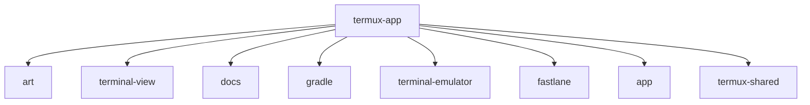

# 基础信息

|      |      |
|------|------|
| 名称 | termux-app |
| 编码语言 | .java |
| 代码路径 | termux-app |
| 概述说明 | Termux终端模拟器核心组件：终端渲染、手势交互、文本选择、会话管理、文件系统访问及测试验证。 |

# 说明

```markdown
## 概述

该代码模块是Termux Android终端模拟器的完整实现，由四个核心子模块组成协同工作：

1. **终端视图系统**：负责终端内容渲染、用户交互和文本选择功能
2. **终端模拟引擎**：实现完整的终端控制序列处理和进程管理
3. **文件系统访问**：基于Storage Access Framework的安全文件管理
4. **测试验证体系**：确保核心功能正确性的测试组件

模块采用分层架构设计：
- 底层：JNI接口与系统交互，处理进程管理和文件操作
- 中层：终端协议解析、状态管理和安全控制
- 上层：用户界面渲染、交互处理和辅助功能

## 主要业务场景

### 1. 终端会话全生命周期管理
- 通过伪终端(PTY)创建和管理子进程
- 处理ANSI控制序列(CSI/OSC/DCS)解析执行
- 维护屏幕缓冲区、滚动历史和光标状态
- 管理DEC私有模式切换和窗口大小调整

### 2. 终端显示与交互
- 多样式文本渲染（ANSI颜色/粗体/斜体/下划线）
- 复合手势处理（缩放/滚动/长按选择）
- 双向文本选择与系统剪贴板集成
- 键盘输入映射与鼠标事件报告

### 3. 安全文件系统操作
- 限定在Termux主目录内的CRUD操作
- 通过DocumentsProvider实现标准文件访问
- 路径规范化处理防止目录遍历攻击
- 文件类型检测与缩略图生成

### 4. 跨版本兼容与优化
- 反射机制处理PopupWindow兼容性问题
- 延迟加载优化性能关键路径
- 自适应不同Android API级别

### 5. 测试验证
- 应用基础信息合规性检查
- 核心组件单元测试(termux-shared)
- 测试框架功能验证

### 6. 辅助功能支持
- 无障碍服务内容访问
- 浮动工具栏和上下文菜单
- 动态布局适应软键盘
- 响铃通知和终端标题管理
```


### 包内部结构视图



该流程图展示了termux-app项目的目录结构，包含8个直接子目录/模块：art、terminal-view、docs、gradle、terminal-emulator、fastlane、app和termux-shared。所有节点均为一级子目录，没有更深层级的嵌套关系，完整呈现了该项目的顶层组织结构。

# 文件列表 File List

| 名称   | 类型  | 说明 |
|-------|------|-------------|
| [terminal-view](terminal-view/src/main/java/com/_module.md) | folder | PopupWindowCompatGingerbread类通过反射设置和获取PopupWindow布局类型。Termux终端应用包含文本选择、渲染和交互组件，支持手势操作和终端会话管理。 |
| [termux-shared](termux-shared/src/main/java/com/_module.md) | folder | Android单元测试类ExampleInstrumentedTest，测试应用包名是否为com.termux.shared.test。Termux核心组件含通知系统、终端功能、系统集成等模块。 |
| [app](app/src/main/java/com/_module.md) | folder | Termux文件系统管理类，支持查询增删文件及目录操作，确保主目录安全访问。核心模块含终端会话管理、文件处理、命令执行等系统功能。 |
| [terminal-emulator](terminal-emulator/src/main/java/com/_module.md) | folder | 终端模拟器类处理输入输出，支持控制序列、鼠标事件、编码转换等功能。 |


