# 基础信息

|      |      |
|------|------|
| 名称 | com |
| 编码语言 | .java |
| 代码路径 | termux-app/app/src/main/java/com |
| 包名 | termux-app.app.src.main.java.com |
| 概述说明 | Termux文件系统管理类，支持查询增删文件及目录操作，确保主目录安全访问。核心模块含终端会话管理、文件处理、命令执行等系统功能。 |

# 说明

```markdown
## 概述

该代码模块是Termux Android应用的文件系统访问核心组件，基于Android的Storage Access Framework实现。通过`TermuxDocumentsProvider`类提供安全的文件管理能力，主要功能包括：文件系统操作（查询/创建/删除）、文档内容访问、路径转换及权限控制。模块严格限定操作范围在Termux主目录内，防止越权访问，同时支持文件类型检测和缩略图生成等扩展功能。

## 主要业务场景

1. **文件系统访问控制**
   - 通过继承`DocumentsProvider`实现标准内容提供者接口
   - 使用`MatrixCursor`处理文档查询结果集
   - 内置路径转换工具方法确保所有操作限定在Termux主目录

2. **文档操作支持**
   - 实现CRUD操作（create/read/update/delete）
   - 处理文件名冲突的自动解决机制
   - 支持设置文件写入和删除标志位

3. **文件类型处理**
   - 自动检测文件MIME类型
   - 提供缩略图生成功能（支持图像类文件）
   - 通过文档投影列规范元数据输出格式

4. **安全防护机制**
   - 强制所有操作在`$HOME`目录内执行
   - 实现路径规范化处理防止目录遍历攻击
   - 验证客户端请求的合法性

5. **跨应用文件共享**
   - 作为SAF提供者响应外部应用的文件请求
   - 支持通过Content URI打开文件流
   - 处理第三方应用的文件搜索请求

6. **根目录管理**
   - 定义默认根目录结构
   - 维护文档ID与物理路径的映射关系
   - 实现根目录查询接口
```


### 包内部结构视图

```mermaid
graph TD
    termux --> filepicker
    termux --> app
    termux --> models
    termux --> api
    termux --> terminal
    termux --> event
    filepicker --> TermuxDocumentsProvider.java
    app --> TermuxOpenReceiver.java
    app --> TermuxApplication.java
    app --> TermuxInstaller.java
    app --> TermuxActivity.java
    app --> TermuxService.java
    app --> RunCommandService.java
    app --> activities
    app --> fragments
    app --> terminal
    activities --> HelpActivity.java
    activities --> SettingsActivity.java
    fragments --> settings
    settings --> TermuxTaskerPreferencesFragment.java
    settings --> TermuxAPIPreferencesFragment.java
    settings --> TermuxPreferencesFragment.java
    settings --> TermuxFloatPreferencesFragment.java
    settings --> TermuxWidgetPreferencesFragment.java
    settings --> termux_widget
    settings --> termux_float
    settings --> termux_api
    settings --> termux_tasker
    settings --> termux
    termux_widget --> DebuggingPreferencesFragment.java
    termux_float --> DebuggingPreferencesFragment.java
    termux_api --> DebuggingPreferencesFragment.java
    termux_tasker --> DebuggingPreferencesFragment.java
    termux --> DebuggingPreferencesFragment.java
    termux --> TerminalViewPreferencesFragment.java
    termux --> TerminalIOPreferencesFragment.java
    models --> UserAction.java
    api --> file
    file --> FileReceiverActivity.java
    terminal --> TermuxTerminalSessionActivityClient.java
    terminal --> TermuxTerminalViewClient.java
    terminal --> TermuxTerminalSessionServiceClient.java
    terminal --> TermuxActivityRootView.java
    terminal --> TermuxSessionsListViewController.java
    terminal --> io
    io --> FullScreenWorkAround.java
    io --> KeyboardShortcut.java
    io --> TerminalToolbarViewPager.java
    io --> TermuxTerminalExtraKeys.java
    event --> SystemEventReceiver.java
```



该流程图展示了Termux应用的Java代码层级结构，从顶层包com/termux开始，逐步展开其子模块和文件。主要包含app核心模块、filepicker文件选择器、models数据模型、api接口、terminal终端控制以及event事件处理等分支。其中app模块结构最为复杂，包含activities、fragments/settings等多级子目录，settings下又细分了termux、termux_widget等不同功能的配置片段。终端模块(terminal)则包含会话控制、视图交互和IO处理等组件。整体结构清晰展示了Termux应用的功能模块划分和代码组织方式。

# 文件列表 File List

| 名称   | 类型  | 说明 |
|-------|------|-------------|
| [termux](termux/_module.md) | package | Termux文件系统管理类，支持查询增删文件及目录操作，确保主目录安全访问。核心模块含终端会话管理、文件处理、命令执行等系统功能。 |


