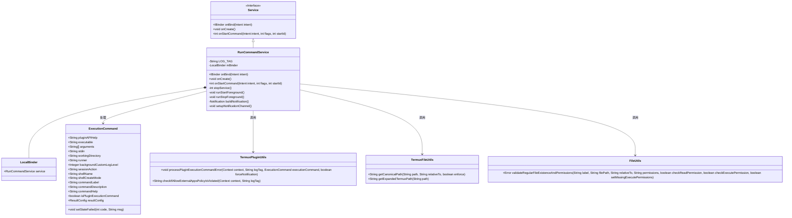
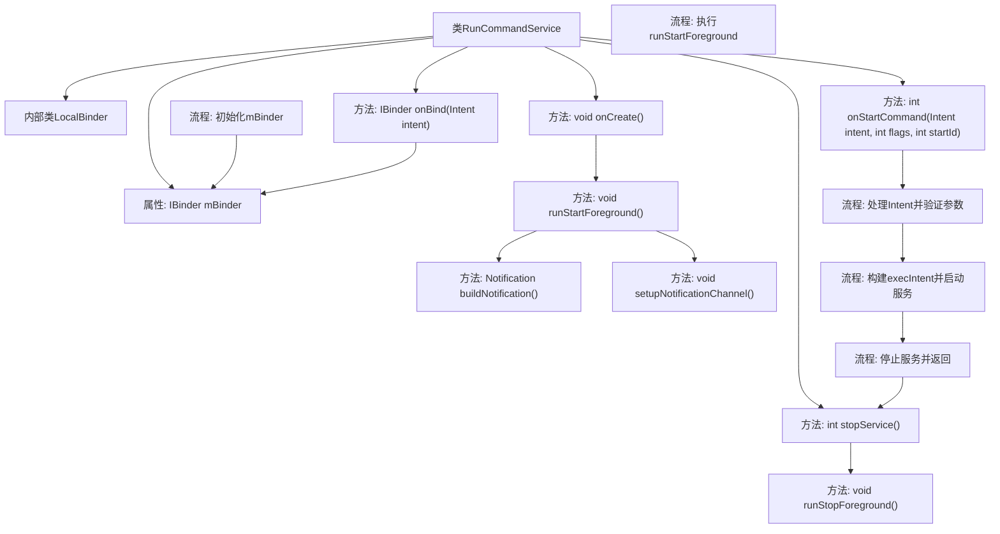

# 基础信息

|      |      |
|------|------|
| 名称 | RunCommandService |
| 编码语言 | .java |
| 代码路径 | termux-app/app/src/main/java/com/termux/app/RunCommandService.java |
| 包名 | com.termux.app |
| 依赖项 | ['android.app.Notification', 'android.app.NotificationManager', 'android.app.Service', 'android.content.Intent', 'android.net.Uri', 'android.os.Binder', 'android.os.Build', 'android.os.IBinder', 'com.termux.R', 'com.termux.shared.data.DataUtils', 'com.termux.shared.data.IntentUtils', 'com.termux.shared.termux.plugins.TermuxPluginUtils', 'com.termux.shared.termux.file.TermuxFileUtils', 'com.termux.shared.file.filesystem.FileType', 'com.termux.shared.errors.Errno', 'com.termux.shared.errors.Error', 'com.termux.shared.termux.TermuxConstants', 'com.termux.shared.termux.TermuxConstants.TERMUX_APP.RUN_COMMAND_SERVICE', 'com.termux.shared.termux.TermuxConstants.TERMUX_APP.TERMUX_SERVICE', 'com.termux.shared.file.FileUtils', 'com.termux.shared.logger.Logger', 'com.termux.shared.notification.NotificationUtils', 'com.termux.shared.shell.command.ExecutionCommand', 'com.termux.shared.shell.command.ExecutionCommand.Runner'] |
| 概述说明 | RunCommandService是Android服务，处理执行命令请求，验证参数后转发给TermuxService执行，支持前台通知。 |

# 说明

RunCommandService是一个Android服务，用于执行外部传入的命令。它通过Intent接收命令参数，验证权限和路径后，将命令转发给TermuxService处理。服务包含前台通知功能，支持Android O及以上版本。主要功能包括：验证命令路径、工作目录权限，处理参数中的特殊字符，设置执行模式（前台/后台），管理结果输出配置。服务在完成命令传递后自动停止，确保资源释放。

# 类列表 Class Summary

| 名称   | 类型  | 说明 |
|-------|------|-------------|
| RunCommandService | class | Android服务类，处理命令执行请求，验证参数并转发至Termux服务。 |

## 类 RunCommandService

|      |      |
|------|------|
| 访问范围 | public |
| 类型 | class |
| 名称 | RunCommandService |
| 说明 | Android服务类，处理命令执行请求，验证参数并转发至Termux服务。 |

### UML类图

该代码实现了一个Android服务`RunCommandService`，用于处理外部应用通过Intent发送的命令执行请求。服务通过`onStartCommand`方法解析Intent参数，验证权限和路径有效性，构建`ExecutionCommand`对象，最终将命令转发给`TermuxService`执行。包含前台服务通知管理、路径规范化处理、权限校验等关键功能模块，通过多个工具类协作完成完整的命令执行流程。

### 内部方法调用关系图

这段代码实现了一个Android服务RunCommandService，主要用于处理来自外部应用的命令执行请求。服务通过onBind()提供Binder接口，在onCreate()初始化前台通知，核心逻辑在onStartCommand()中完成：验证Intent参数、构建ExecutionCommand对象、检查文件权限、处理符号链接，最后通过TermuxService执行命令。过程中涉及严格的错误检查和权限验证，确保安全性和稳定性，并通过前台通知保持服务存活。

### 字段列表 Field List

| 名称  | 类型  | 说明 |
|-------|-------|------|
| mBinder = new RunCommandService.LocalBinder() | IBinder | 私有Binder实例mBinder初始化为LocalBinder。 |
| LOG_TAG = "RunCommandService" | String | 日志标签为"RunCommandService"。 |

### 方法列表 Method List

| 名称  | 类型  | 说明 |
|-------|-------|------|
| runStartForeground | void | 安卓O及以上版本启动前台服务并设置通知。 |
| onBind | IBinder | 重写onBind方法，返回mBinder。 |
| onStartCommand | int | 处理Intent命令，验证参数并执行服务。 |
| buildNotification | Notification | 构建通知：静默模式，无时间戳，自定义图标和背景色。 |
| onCreate | void | Android生命周期方法onCreate内调用日志记录和前台服务启动。 |
| runStopForeground | void | 停止前台服务（仅限Android O及以上版本）。 |
| stopService | int | 停止服务并返回非粘性状态。 |
| setupNotificationChannel | void | 为Android O及以上版本创建低优先级通知渠道。 |

