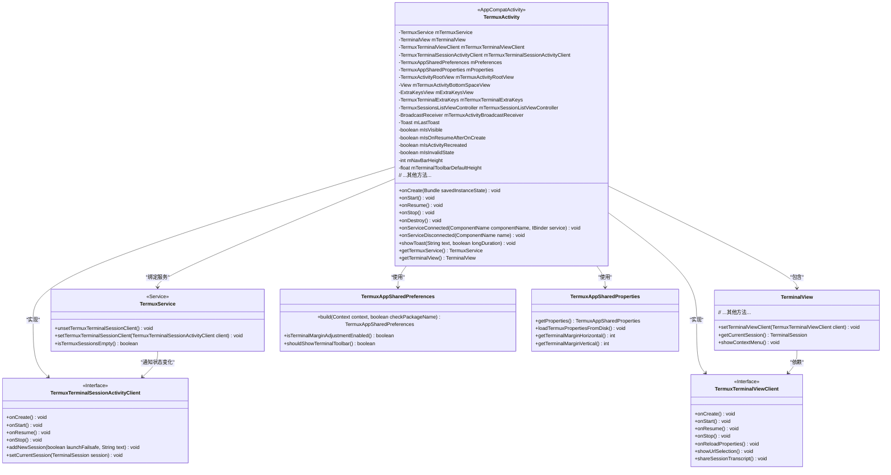

# 基础信息

|      |      |
|------|------|
| 名称 | TermuxActivity |
| 编码语言 | .java |
| 代码路径 | termux-app/app/src/main/java/com/termux/app/TermuxActivity.java |
| 包名 | com.termux.app |
| 依赖项 | ['android.annotation.SuppressLint', 'android.app.AlertDialog', 'android.content.ActivityNotFoundException', 'android.content.BroadcastReceiver', 'android.content.ComponentName', 'android.content.Context', 'android.content.Intent', 'android.content.IntentFilter', 'android.content.ServiceConnection', 'android.net.Uri', 'android.os.Bundle', 'android.os.IBinder', 'android.view.ContextMenu', 'android.view.ContextMenu.ContextMenuInfo', 'android.view.Gravity', 'android.view.Menu', 'android.view.MenuItem', 'android.view.View', 'android.view.ViewGroup', 'android.view.WindowManager', 'android.widget.EditText', 'android.widget.ImageButton', 'android.widget.ListView', 'android.widget.RelativeLayout', 'android.widget.Toast', 'com.termux.R', 'com.termux.app.api.file.FileReceiverActivity', 'com.termux.app.terminal.TermuxActivityRootView', 'com.termux.app.terminal.TermuxTerminalSessionActivityClient', 'com.termux.app.terminal.io.TermuxTerminalExtraKeys', 'com.termux.shared.activities.ReportActivity', 'com.termux.shared.activity.ActivityUtils', 'com.termux.shared.activity.media.AppCompatActivityUtils', 'com.termux.shared.data.IntentUtils', 'com.termux.shared.android.PermissionUtils', 'com.termux.shared.data.DataUtils', 'com.termux.shared.termux.TermuxConstants', 'com.termux.shared.termux.TermuxConstants.TERMUX_APP.TERMUX_ACTIVITY', 'com.termux.app.activities.HelpActivity', 'com.termux.app.activities.SettingsActivity', 'com.termux.shared.termux.crash.TermuxCrashUtils', 'com.termux.shared.termux.settings.preferences.TermuxAppSharedPreferences', 'com.termux.app.terminal.TermuxSessionsListViewController', 'com.termux.app.terminal.io.TerminalToolbarViewPager', 'com.termux.app.terminal.TermuxTerminalViewClient', 'com.termux.shared.termux.extrakeys.ExtraKeysView', 'com.termux.shared.termux.interact.TextInputDialogUtils', 'com.termux.shared.logger.Logger', 'com.termux.shared.termux.TermuxUtils', 'com.termux.shared.termux.settings.properties.TermuxAppSharedProperties', 'com.termux.shared.termux.theme.TermuxThemeUtils', 'com.termux.shared.theme.NightMode', 'com.termux.shared.view.ViewUtils', 'com.termux.terminal.TerminalSession', 'com.termux.terminal.TerminalSessionClient', 'com.termux.view.TerminalView', 'com.termux.view.TerminalViewClient', 'androidx.annotation.NonNull', 'androidx.annotation.Nullable', 'androidx.appcompat.app.AppCompatActivity', 'androidx.drawerlayout.widget.DrawerLayout', 'androidx.viewpager.widget.ViewPager', 'java.util.Arrays'] |
| 概述说明 | TermuxActivity是Android终端模拟器主界面，管理服务连接、会话及UI交互。 |

# 说明

TermuxActivity是Termux应用的主活动类，继承自AppCompatActivity并实现ServiceConnection接口。它负责管理终端会话、UI交互及服务绑定等核心功能。主要组件包括TermuxService连接、TerminalView终端显示、ExtraKeysView额外按键控制、会话列表管理及样式配置。活动处理生命周期事件（onCreate/onStart/onResume等），维护终端会话状态，提供上下文菜单（URL选择、分享转录、样式调整等），并支持存储权限请求。通过广播接收器实现样式重载和崩溃通知，使用SharedPreferences管理用户偏好设置。活动还包含工具栏控制、键盘切换、会话创建等功能，并通过属性文件动态调整UI边距和主题。

# 类列表 Class Summary

| 名称   | 类型  | 说明 |
|-------|------|-------------|
| TermuxActivity | class | TermuxActivity是Android终端模拟器主界面，管理服务连接、会话控制及UI交互。 |

## 类 TermuxActivity

|      |      |
|------|------|
| 访问范围 | public final |
| 类型 | class |
| 名称 | TermuxActivity |
| 说明 | TermuxActivity是Android终端模拟器主界面，管理服务连接、会话控制及UI交互。 |

### UML类图

这段类图展示了Termux终端模拟器应用的核心架构。TermuxActivity作为主Activity，继承AppCompatActivity并实现ServiceConnection接口，负责UI展示和与后台服务的交互。它通过TermuxService管理终端会话，使用TerminalView显示终端内容，并通过TermuxTerminalViewClient和TermuxTerminalSessionActivityClient两个接口处理视图和会话的逻辑。类图中还包含了配置管理类TermuxAppSharedPreferences和TermuxAppSharedProperties，它们分别处理应用偏好设置和属性配置。整体设计体现了清晰的模块划分和职责分离，通过接口实现松耦合。

### 内部方法调用关系图

流程图描述：该流程图展示了TermuxActivity的核心结构和主要交互流程。作为Android终端模拟器的主界面，它通过ServiceConnection与后台服务TermuxService绑定，管理TerminalView的显示和用户交互。关键流程包括服务绑定初始化、UI组件设置、生命周期管理、工具栏操作和广播处理。活动通过多个客户端类（如TermuxTerminalViewClient）协调终端视图、会话管理和快捷键功能，同时处理存储权限请求和样式配置变更。所有交互都围绕维护终端会话状态和响应用户操作展开。

时序图描述：此时序图详细描述了TermuxActivity与关键组件的交互时序。活动启动后立即绑定TermuxService，在服务连接成功后初始化终端视图和客户端。在完整的生命周期中，客户端会同步终端视图的状态变化。最终在销毁时释放服务绑定，确保资源正确回收。整个过程体现了Android组件生命周期与终端模拟器特殊需求的结合。

### 字段列表 Field List

| 名称  | 类型  | 说明 |
|-------|-------|------|
| CONTEXT_MENU_REPORT_ID = 9 | int | 私有常量，菜单举报项ID为9。 |
| mIsVisible | boolean | 私有布尔变量mIsVisible |
| mTermuxTerminalExtraKeys | TermuxTerminalExtraKeys | Termux终端额外按键设置变量。 |
| mExtraKeysView | ExtraKeysView | 声明ExtraKeysView类型的mExtraKeysView变量 |
| CONTEXT_MENU_TOGGLE_KEEP_SCREEN_ON = 6 | int | 私有静态常量：屏幕常亮菜单项ID为6。 |
| CONTEXT_MENU_STYLING_ID = 5 | int | 私有静态常量CONTEXT_MENU_STYLING_ID值为5。 |
| mTermuxActivityBottomSpaceView | View | 底部空间视图控件 |
| mTermuxSessionListViewController | TermuxSessionsListViewController | Termux会话列表控制器实例 |
| CONTEXT_MENU_KILL_PROCESS_ID = 4 | int | 私有常量：终止进程菜单项ID为4。 |
| CONTEXT_MENU_HELP_ID = 7 | int | 私有常量CONTEXT_MENU_HELP_ID值为7。 |
| mTermuxActivityRootView | TermuxActivityRootView | Termux活动根视图变量声明 |
| ARG_ACTIVITY_RECREATED = "activity_recreated" | String | 私有常量字符串，标识活动是否重建。 |
| mLastToast | Toast | 声明Toast变量mLastToast |
| ARG_TERMINAL_TOOLBAR_TEXT_INPUT = "terminal_toolbar_text_input" | String | 私有静态常量定义终端工具栏文本输入参数键。 |
| mIsActivityRecreated = false | boolean | 成员变量mIsActivityRecreated标记活动是否重建，初始值为false。 |
| mTermuxActivityBroadcastReceiver = new TermuxActivityBroadcastReceiver() | BroadcastReceiver | 私有广播接收器TermuxActivityBroadcastReceiver实例化。 |
| CONTEXT_MENU_RESET_TERMINAL_ID = 3 | int | 私有常量：重置终端菜单ID=3 |
| CONTEXT_MENU_AUTOFILL_PASSWORD = 2 | int | 私有静态常量，密码自动填充菜单值为2。 |
| mProperties | TermuxAppSharedProperties | 私有TermuxAppSharedProperties属性mProperties |
| mPreferences | TermuxAppSharedPreferences | 私有Termux应用共享偏好项mPreferences |
| CONTEXT_MENU_AUTOFILL_USERNAME = 11 | int | 私有常量：上下文菜单自动填充用户名ID为11。 |
| mTermuxTerminalSessionActivityClient | TermuxTerminalSessionActivityClient | Termux终端会话活动客户端实例 |
| CONTEXT_MENU_SHARE_TRANSCRIPT_ID = 1 | int | 私有常量，分享转录菜单ID为1。 |
| CONTEXT_MENU_SELECT_URL_ID = 0 | int | 私有常量CONTEXT_MENU_SELECT_URL_ID值为0 |
| mTermuxTerminalViewClient | TermuxTerminalViewClient | Termux终端视图客户端实例 |
| mTerminalView | TerminalView | 终端视图变量声明 |
| CONTEXT_MENU_SETTINGS_ID = 8 | int | 私有静态常量设置菜单ID为8。 |
| mTerminalToolbarDefaultHeight | float | 私有浮点变量，存储终端工具栏默认高度。 |
| CONTEXT_MENU_SHARE_SELECTED_TEXT = 10 | int | 私有常量，分享选中文本的上下文菜单ID为10。 |
| mNavBarHeight | int | 私有整型变量mNavBarHeight |
| mTermuxService | TermuxService | Termux服务实例变量声明 |
| mIsInvalidState | boolean | 私有布尔变量，标记无效状态。 |
| LOG_TAG = "TermuxActivity" | String | TermuxActivity的日志标签常量 |
| mIsOnResumeAfterOnCreate = false | boolean | 私有布尔变量，标记是否在onCreate后执行了onResume。 |

### 方法列表 Method List

| 名称  | 类型  | 说明 |
|-------|-------|------|
| getTermuxService | TermuxService | 获取TermuxService实例的方法，返回mTermuxService成员变量。 |
| setExtraKeysView | void | 设置额外按键视图。 |
| getTermuxTerminalSessionClient | TermuxTerminalSessionActivityClient | 获取Termux终端会话客户端实例。 |
| saveTerminalToolbarTextInput | void | 保存终端工具栏文本输入到Bundle，非空时存储。 |
| setToggleKeyboardView | void | 设置键盘切换按钮的点击和长按功能：点击切换软键盘并关闭抽屉，长按切换终端工具栏。 |
| getTermuxTerminalViewClient | TermuxTerminalViewClient | 获取Termux终端视图客户端实例。 |
| getTermuxActivityBottomSpaceView | View | 获取Termux活动底部空间视图 |
| setSettingsButtonView | void | 设置按钮点击跳转至设置界面。 |
| isActivityRecreated | boolean | 方法返回活动是否被重建的布尔值。 |
| onCreate | void | 初始化Termux应用，加载配置，设置UI，启动服务并绑定，处理异常状态。 |
| isTerminalToolbarTextInputViewSelected | boolean | 检查终端工具栏文本输入视图是否选中。 |
| showKillSessionDialog | void | 显示终止会话确认对话框，用户确认后结束会话。 |
| getCurrentSession | TerminalSession | 获取当前终端会话，若视图存在则返回会话，否则返回空。 |
| getPreferences | TermuxAppSharedPreferences | 获取TermuxAppSharedPreferences实例的方法。 |
| finishActivityIfNotFinishing | void | 防止重复调用finish()方法，检查未结束则结束活动。 |
| getTerminalToolbarViewPager | ViewPager | 获取终端工具栏视图页控件 |
| getProperties | TermuxAppSharedProperties | 获取TermuxAppSharedProperties属性对象。 |
| setNewSessionButtonView | void | 设置新会话按钮：点击创建默认会话，长按输入名称创建命名会话或安全模式会话。 |
| onStart | void | 重写onStart方法，处理可见性、会话和视图客户端的启动，注册广播接收器。 |
| toggleTerminalToolbar | void | 切换终端工具栏显示状态，更新视图并处理焦点。 |
| setTerminalToolbarHeight | void | 设置终端工具栏高度，根据按键矩阵长度和缩放因子调整。 |
| setTerminalToolbarView | void | 初始化终端工具栏视图，设置可见性、高度及适配器。 |
| onResetTerminalSession | void | 重置终端会话并显示提示，通知客户端。 |
| setTermuxSessionsListView | void | 初始化Termux会话列表视图，设置适配器和点击监听器。 |
| onBackPressed | void | 返回时关闭抽屉或结束活动 |
| getTermuxActivityRootView | TermuxActivityRootView | 获取Termux活动根视图的方法。 |
| isOnResumeAfterOnCreate | boolean | 方法返回是否在onCreate后执行了onResume。 |
| getTerminalToolbarDefaultHeight | float | 获取终端工具栏默认高度的方法。 |
| setTermuxTerminalViewAndClients | void | 初始化终端视图及客户端，设置会话和视图交互。 |
| isVisible | boolean | 方法返回布尔值mIsVisible，表示可见性状态。 |
| getTerminalView | TerminalView | 获取终端视图对象的方法。 |
| setMargins | void | 设置RelativeLayout的水平和垂直边距。 |
| onRequestPermissionsResult | void | 重写权限请求结果处理，记录日志并检查存储权限请求。 |
| termuxSessionListNotifyUpdated | void | 方法通知Termux会话列表视图更新数据。 |
| setActivityTheme | void | 设置活动主题，更新夜间模式并应用。 |
| addTermuxActivityRootViewGlobalLayoutListener | void | 为Termux活动根视图添加全局布局监听器。 |
| showStylingDialog | void | 启动样式设置对话框，失败时提示安装。 |
| reloadProperties | void | 私有方法reloadProperties加载磁盘属性并通知视图客户端更新。 |
| onServiceDisconnected | void | 重写方法：服务断开时记录日志并结束活动。 |
| getExtraKeysView | ExtraKeysView | 获取额外按键视图的方法。 |
| onContextMenuClosed | void | 重写onContextMenuClosed方法，处理菜单关闭事件并调用父类及终端视图方法。注意返回键触发两次的问题。 |
| requestStoragePermission | void | 请求存储权限并设置符号链接，成功或失败显示提示。 |
| onServiceConnected | void | 服务连接时初始化会话，检查空会话启动引导或新增会话，更新终端客户端。 |
| updateTermuxActivityStyling | void | 更新Termux终端样式，发送广播通知并可选重建活动。 |
| onContextItemSelected | boolean | 处理上下文菜单项：选择URL、分享、自动填充、重置终端、终止进程、样式设置、保持屏幕常亮、帮助、设置和报告问题。 |
| getNavBarHeight | int | 获取导航栏高度的方法，返回整型值mNavBarHeight。 |
| getTermuxTerminalExtraKeys | TermuxTerminalExtraKeys | 获取Termux终端额外按键配置 |
| onCreateOptionsMenu | boolean | 重写菜单创建方法，显示终端上下文菜单。 |
| onSaveInstanceState | void | 重写onSaveInstanceState方法，保存状态并记录日志。 |
| removeTermuxActivityRootViewGlobalLayoutListener | void | 移除Termux活动根视图的全局布局监听器。 |
| onActivityResult | void | 重写onActivityResult方法，处理权限请求结果并记录日志。 |
| isTerminalViewSelected | boolean | 检查终端工具栏视图是否选中第一项。 |
| onDestroy | void | 重写onDestroy方法，释放服务引用并解绑，忽略异常。 |
| onCreateContextMenu | void | 创建上下文菜单，包含选择URL、分享、自动填充、重置终端、进程管理、样式设置等功能。 |
| getDrawer | DrawerLayout | 获取DrawerLayout实例，ID为drawer_layout。 |
| onResume | void | 重写onResume方法，记录日志并检查状态后调用客户端onResume，最后检查崩溃日志并重置标志位。 |
| onStop | void | 重写onStop方法，处理可见性、客户端停止、移除监听器和关闭抽屉。 |
| showToast | void | 显示顶部Toast，可设时长，空文本不处理。 |
| toggleKeepScreenOn | void | 切换屏幕常亮状态，更新视图和偏好设置。 |
| registerTermuxActivityBroadcastReceiver | void | 注册Termux活动广播接收器，监听应用崩溃、重载样式和权限请求动作。 |
| unregisterTermuxActivityBroadcastReceiver | void | 取消Termux活动广播接收器注册 |
| fixTermuxActivityBroadcastReceiverIntent | void | 修复Termux广播接收器意图，处理存储重载请求并更新权限操作。 |
| reloadActivityStyling | void | 重载活动样式，更新属性、边距、工具栏高度，必要时重建活动。 |
| startTermuxActivity | void | 启动Termux活动，传入上下文参数。 |
| newInstance | Intent | 创建TermuxActivity的Intent并设置NEW_TASK标志。 |

