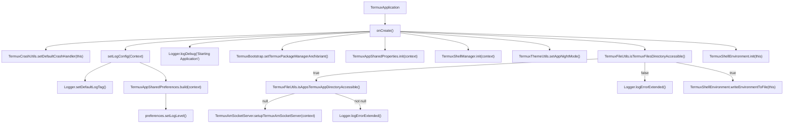

# 基础信息

|      |      |
|------|------|
| 名称 | TermuxApplication |
| 编码语言 | .java |
| 代码路径 | termux-app/app/src/main/java/com/termux/app/TermuxApplication.java |
| 包名 | com.termux.app |
| 依赖项 | ['android.app.Application', 'android.content.Context', 'com.termux.BuildConfig', 'com.termux.shared.errors.Error', 'com.termux.shared.logger.Logger', 'com.termux.shared.termux.TermuxBootstrap', 'com.termux.shared.termux.TermuxConstants', 'com.termux.shared.termux.crash.TermuxCrashUtils', 'com.termux.shared.termux.file.TermuxFileUtils', 'com.termux.shared.termux.settings.preferences.TermuxAppSharedPreferences', 'com.termux.shared.termux.settings.properties.TermuxAppSharedProperties', 'com.termux.shared.termux.shell.command.environment.TermuxShellEnvironment', 'com.termux.shared.termux.shell.am.TermuxAmSocketServer', 'com.termux.shared.termux.shell.TermuxShellManager', 'com.termux.shared.termux.theme.TermuxThemeUtils'] |
| 概述说明 | Termux应用初始化，设置日志、崩溃处理、文件目录检查及环境配置。 |

# 说明

TermuxApplication类继承自Application，在onCreate方法中完成应用初始化。设置默认崩溃处理器和日志配置，启动日志记录。初始化Termux包管理器和变体，加载共享属性及Shell管理器。配置夜间模式主题。检查并确保Termux文件目录可访问，若可访问则设置AM Socket服务器。最后初始化Shell环境常量并写入环境文件。日志配置从共享偏好设置中加载并设置当前日志级别。整个过程包含错误处理和日志记录。

# 类列表 Class Summary

| 名称   | 类型  | 说明 |
|-------|------|-------------|
| TermuxApplication | class | Termux应用初始化，设置崩溃处理、日志配置、共享属性、Shell管理、夜间模式及文件目录检查。 |

## 类 TermuxApplication

|      |      |
|------|------|
| 访问范围 | public |
| 类型 | class |
| 名称 | TermuxApplication |
| 说明 | Termux应用初始化，设置崩溃处理、日志配置、共享属性、Shell管理、夜间模式及文件目录检查。 |

### UML类图

```mermaid
classDiagram
    class Application {
        <<Interface>>
    }

    class TermuxApplication {
        -String LOG_TAG
        +onCreate()
        +setLogConfig(Context context)
    }

    class TermuxCrashUtils {
        +setDefaultCrashHandler(TermuxApplication app)
    }

    class Logger {
        +logDebug(String message)
        +logInfo(String tag, String message)
        +logErrorExtended(String tag, String message)
        +setDefaultLogTag(String tag)
    }

    class TermuxBootstrap {
        +setTermuxPackageManagerAndVariant(String variant)
    }

    class TermuxAppSharedProperties {
        +init(Context context) TermuxAppSharedProperties
        +getNightMode() int
    }

    class TermuxShellManager {
        +init(Context context) TermuxShellManager
    }

    class TermuxThemeUtils {
        +setAppNightMode(int mode)
    }

    class TermuxFileUtils {
        +isTermuxFilesDirectoryAccessible(TermuxApplication app, boolean createIfNotExists, boolean checkExecuteAccess) Error
        +isAppsTermuxAppDirectoryAccessible(boolean createIfNotExists, boolean checkExecuteAccess) Error
    }

    class TermuxAmSocketServer {
        +setupTermuxAmSocketServer(Context context)
    }

    class TermuxShellEnvironment {
        +init(TermuxApplication app)
        +writeEnvironmentToFile(TermuxApplication app)
    }

    class TermuxAppSharedPreferences {
        +build(Context context) TermuxAppSharedPreferences
        +getLogLevel() int
        +setLogLevel(String levelName, int logLevel)
    }

    Application <|-- TermuxApplication
    TermuxApplication --> TermuxCrashUtils : 依赖
    TermuxApplication --> Logger : 依赖
    TermuxApplication --> TermuxBootstrap : 依赖
    TermuxApplication --> TermuxAppSharedProperties : 依赖
    TermuxApplication --> TermuxShellManager : 依赖
    TermuxApplication --> TermuxThemeUtils : 依赖
    TermuxApplication --> TermuxFileUtils : 依赖
    TermuxApplication --> TermuxAmSocketServer : 依赖
    TermuxApplication --> TermuxShellEnvironment : 依赖
    TermuxApplication --> TermuxAppSharedPreferences : 依赖
```

这段代码是Termux应用的Application类实现，主要负责应用启动时的初始化工作。类图展示了TermuxApplication继承自Application接口，并依赖多个工具类完成以下功能：设置崩溃处理器、日志配置、包管理器初始化、共享属性管理、Shell管理器初始化、夜间模式设置、文件目录检查、Socket服务器设置以及Shell环境初始化等。整个初始化流程严谨，包含错误处理和日志记录，确保应用基础功能正常运作。

### 内部方法调用关系图

该流程图展示了TermuxApplication类的初始化流程。首先调用onCreate()方法，依次设置崩溃处理器、日志配置、调试日志输出、包管理器变量、共享属性、Shell管理器、夜间模式等。然后检查文件目录可访问性，根据结果执行不同操作：可访问时建立Socket服务器并初始化Shell环境，不可访问时记录错误。最后在目录可访问时写入环境变量到文件。整个流程涉及多个工具类和配置项的初始化，确保应用基础功能正常运行。

### 字段列表 Field List

| 名称  | 类型  | 说明 |
|-------|-------|------|
| LOG_TAG = "TermuxApplication" | String | 私有静态常量LOG_TAG值为TermuxApplication |

### 方法列表 Method List

| 名称  | 类型  | 说明 |
|-------|-------|------|
| onCreate | void | 应用初始化：设置崩溃处理、日志配置、包管理器、共享属性、Shell管理、夜间模式及文件目录检查。 |
| setLogConfig | void | 设置Termux应用日志配置，包括标签和级别。 |

