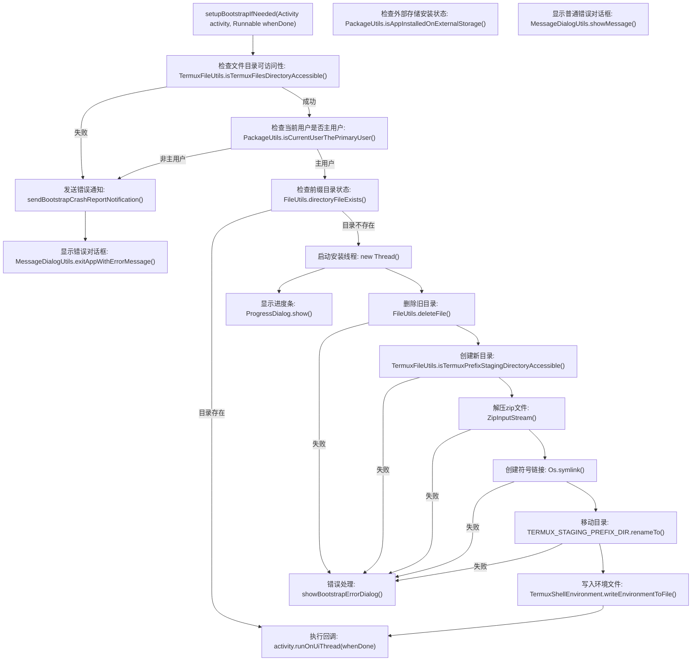
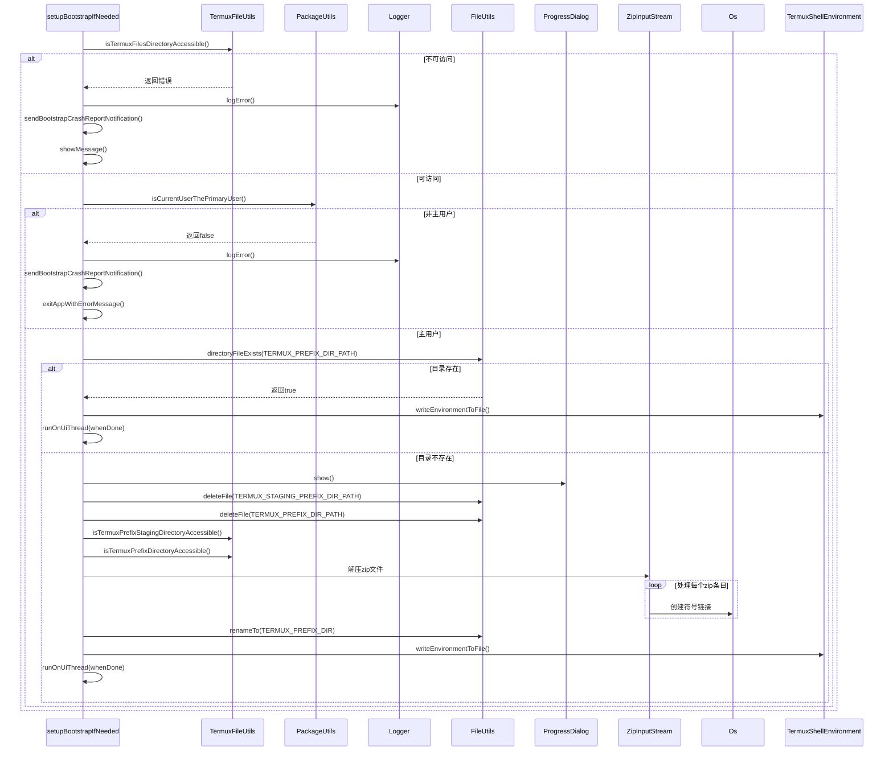

# 基础信息

|      |      |
|------|------|
| 名称 | TermuxInstaller |
| 编码语言 | .java |
| 代码路径 | termux-app/app/src/main/java/com/termux/app/TermuxInstaller.java |
| 包名 | com.termux.app |
| 依赖项 | ['android.app.Activity', 'android.app.AlertDialog', 'android.app.ProgressDialog', 'android.content.Context', 'android.os.Build', 'android.os.Environment', 'android.system.Os', 'android.util.Pair', 'android.view.WindowManager', 'com.termux.R', 'com.termux.shared.file.FileUtils', 'com.termux.shared.termux.crash.TermuxCrashUtils', 'com.termux.shared.termux.file.TermuxFileUtils', 'com.termux.shared.interact.MessageDialogUtils', 'com.termux.shared.logger.Logger', 'com.termux.shared.markdown.MarkdownUtils', 'com.termux.shared.errors.Error', 'com.termux.shared.android.PackageUtils', 'com.termux.shared.termux.TermuxConstants', 'com.termux.shared.termux.TermuxUtils', 'com.termux.shared.termux.shell.command.environment.TermuxShellEnvironment', 'java.io.BufferedReader', 'java.io.ByteArrayInputStream', 'java.io.File', 'java.io.FileOutputStream', 'java.io.InputStreamReader', 'java.util.ArrayList', 'java.util.List', 'java.util.zip.ZipEntry', 'java.util.zip.ZipInputStream', 'com.termux.shared.termux.TermuxConstants.TERMUX_PREFIX_DIR', 'com.termux.shared.termux.TermuxConstants.TERMUX_PREFIX_DIR_PATH', 'com.termux.shared.termux.TermuxConstants.TERMUX_STAGING_PREFIX_DIR', 'com.termux.shared.termux.TermuxConstants.TERMUX_STAGING_PREFIX_DIR_PATH'] |
| 概述说明 | Termux安装器类，处理引导设置、存储链接和错误处理。 |

# 说明

TermuxInstaller类负责Termux应用的引导安装和存储链接设置。主要功能包括检查文件目录可访问性，验证用户权限，处理错误情况，删除并重新创建前缀目录，解压引导包并设置符号链接。若安装失败会显示错误对话框并发送崩溃报告。setupStorageSymlinks方法创建指向外部存储目录的符号链接，包括共享、下载、图片等目录。整个过程通过线程异步执行，包含详细的日志记录和错误处理机制。

# 类列表 Class Summary

| 名称   | 类型  | 说明 |
|-------|------|-------------|
| TermuxInstaller | class | Termux安装器类，处理引导设置、存储链接和错误处理。 |

## 类 TermuxInstaller

|      |      |
|------|------|
| 访问范围 | final |
| 类型 | class |
| 名称 | TermuxInstaller |
| 说明 | Termux安装器类，处理引导设置、存储链接和错误处理。 |

### UML类图

```mermaid
classDiagram
    class TermuxInstaller {
        -String LOG_TAG
        +setupBootstrapIfNeeded(Activity activity, Runnable whenDone) void
        +showBootstrapErrorDialog(Activity activity, Runnable whenDone, String message) void
        -sendBootstrapCrashReportNotification(Activity activity, String message) void
        +setupStorageSymlinks(Context context) void
        -ensureDirectoryExists(File directory) Error
        +loadZipBytes() byte[]
        +getZip() byte[]
    }

    class TermuxFileUtils {
        <<static>>
        +isTermuxFilesDirectoryAccessible(Activity activity, boolean createDirectory, boolean setPermissions) Error
        +isTermuxPrefixDirectoryEmpty() boolean
        +isTermuxPrefixStagingDirectoryAccessible(boolean createDirectory, boolean setPermissions) Error
        +isTermuxPrefixDirectoryAccessible(boolean createDirectory, boolean setPermissions) Error
    }

    class FileUtils {
        <<static>>
        +directoryFileExists(String path, boolean followSymlinks) boolean
        +fileExists(String path, boolean followSymlinks) boolean
        +deleteFile(String fileDescription, String path, boolean isDirectory) Error
        +clearDirectory(String dirDescription, String path) Error
        +createDirectoryFile(String path) Error
    }

    class PackageUtils {
        <<static>>
        +isCurrentUserThePrimaryUser(Activity activity) boolean
        +isAppInstalledOnExternalStorage(Activity activity) boolean
    }

    class Logger {
        <<static>>
        +logError(String tag, String message) void
        +logInfo(String tag, String message) void
        +logErrorExtended(String tag, String message) void
        +getStackTracesMarkdownString(String label, String[] stackTraces) String
        +getStackTracesStringArray(Exception e) String[]
        +logErrorAndShowToast(Context context, String tag, String message) void
        +logStackTraceWithMessage(String tag, String message, Exception e) void
    }

    class MessageDialogUtils {
        <<static>>
        +exitAppWithErrorMessage(Activity activity, String title, String message) void
        +showMessage(Activity activity, String title, String message, DialogInterface.OnDismissListener listener) void
    }

    class TermuxCrashUtils {
        <<static>>
        +sendCrashReportNotification(Context context, String tag, String title, String message, String reportString, boolean addInstallInfo, boolean addDeviceInfo, TermuxUtils.AppInfoMode appInfoMode, boolean isBootstrapError) void
    }

    class TermuxShellEnvironment {
        <<static>>
        +writeEnvironmentToFile(Activity activity) void
    }

    class MarkdownUtils {
        <<static>>
        +getMarkdownCodeForString(String string, boolean addQuotes) String
    }

    class TermuxUtils {
        <<static>>
        +getTermuxDebugMarkdownString(Activity activity) String
        +enum AppInfoMode
    }

    TermuxInstaller --> TermuxFileUtils : 依赖
    TermuxInstaller --> FileUtils : 依赖
    TermuxInstaller --> PackageUtils : 依赖
    TermuxInstaller --> Logger : 依赖
    TermuxInstaller --> MessageDialogUtils : 依赖
    TermuxInstaller --> TermuxCrashUtils : 依赖
    TermuxInstaller --> TermuxShellEnvironment : 依赖
    TermuxInstaller --> MarkdownUtils : 依赖
    TermuxInstaller --> TermuxUtils : 依赖
    TermuxCrashUtils --> TermuxUtils : 依赖
```

这段代码是Termux应用的安装器类，主要负责引导安装、存储链接设置和错误处理。TermuxInstaller类通过检查文件目录可访问性、用户权限和存储状态，确保应用正确安装。它依赖多个工具类如TermuxFileUtils进行文件操作、PackageUtils检查安装状态、Logger记录日志，以及TermuxCrashUtils处理崩溃报告。整个系统通过严格的错误检查和多线程操作确保安装过程的可靠性，同时支持外部存储链接创建和调试信息收集。

### 内部方法调用关系图

这段代码是Termux应用的引导安装程序，主要功能包括：验证文件目录访问权限、检查用户权限状态、清理旧目录结构、解压新的引导程序包、创建必要的符号链接，并在完成后执行回调。流程图中详细展示了从权限检查到最终安装完成的完整逻辑链，包含所有错误处理路径。时序图则通过交互形式展示了各模块间的调用关系，特别是多线程环境下的异步操作处理。整个安装过程具有完善的错误恢复机制，能通过通知和对话框及时反馈问题。

### 字段列表 Field List

| 名称  | 类型  | 说明 |
|-------|-------|------|
| LOG_TAG = "TermuxInstaller" | String | 私有常量LOG_TAG值为TermuxInstaller |

### 方法列表 Method List

| 名称  | 类型  | 说明 |
|-------|-------|------|
| setupBootstrapIfNeeded | void | 检查Termux文件目录权限，若非主用户或目录不可访问则报错；否则安装引导包并设置符号链接。 |
| setupStorageSymlinks | void | 创建存储符号链接，处理错误并记录日志。 |
| sendBootstrapCrashReportNotification | void | 发送Termux启动错误通知，包含插件应用信息以辅助调试。 |
| showBootstrapErrorDialog | void | 显示引导错误弹窗，记录错误并通知用户。提供重试或退出选项。 |
| ensureDirectoryExists | Error | 检查目录存在性，不存在则创建。 |
| loadZipBytes | byte[] | 加载库并返回ZIP字节数据 |
| getZip | byte[] | 获取压缩数据的原生静态方法。 |

