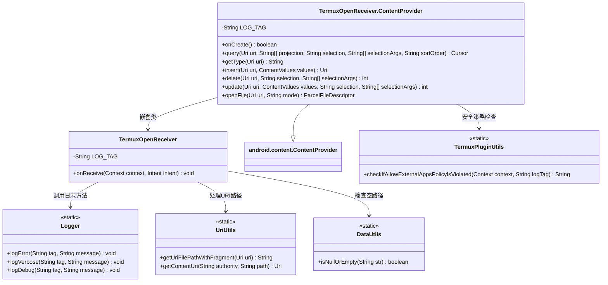
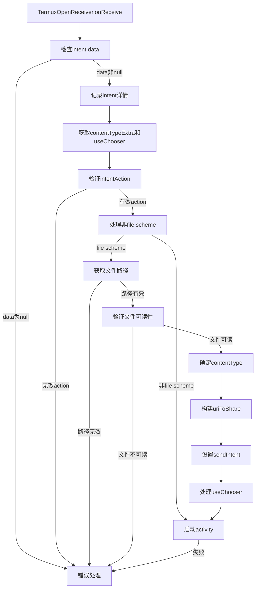
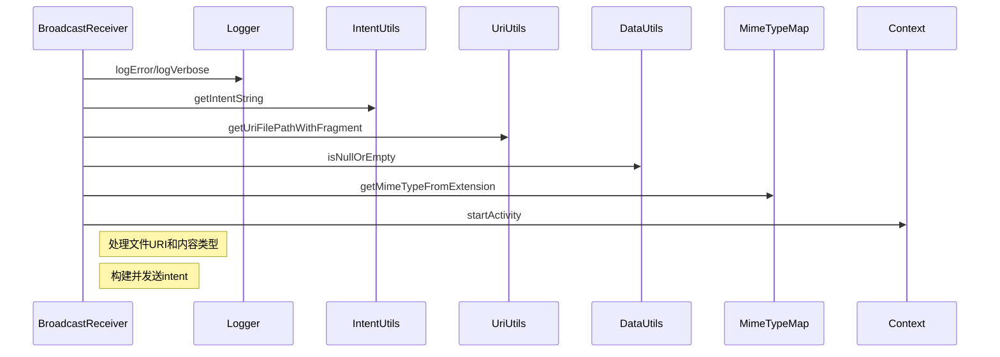

# 基础信息

|      |      |
|------|------|
| 名称 | TermuxOpenReceiver |
| 编码语言 | .java |
| 代码路径 | termux-app/app/src/main/java/com/termux/app/TermuxOpenReceiver.java |
| 包名 | com.termux.app |
| 依赖项 | ['android.content.ActivityNotFoundException', 'android.content.BroadcastReceiver', 'android.content.ContentValues', 'android.content.Context', 'android.content.Intent', 'android.database.Cursor', 'android.database.MatrixCursor', 'android.net.Uri', 'android.os.Environment', 'android.os.ParcelFileDescriptor', 'android.provider.MediaStore', 'android.webkit.MimeTypeMap', 'com.termux.shared.termux.plugins.TermuxPluginUtils', 'com.termux.shared.data.DataUtils', 'com.termux.shared.data.IntentUtils', 'com.termux.shared.net.uri.UriUtils', 'com.termux.shared.logger.Logger', 'com.termux.shared.net.uri.UriScheme', 'com.termux.shared.termux.TermuxConstants', 'java.io.File', 'java.io.FileNotFoundException', 'java.io.IOException', 'androidx.annotation.NonNull'] |
| 概述说明 | Termux广播接收器处理文件打开和分享请求，支持URI解析、内容类型检测和权限检查。 |

# 说明

TermuxOpenReceiver是一个广播接收器，用于处理文件打开和分享请求。它检查Intent数据，验证URI有效性，并根据不同操作类型（如ACTION_VIEW或ACTION_SEND）创建相应Intent。对于非文件URI，直接启动对应应用；对于本地文件，生成内容URI并设置MIME类型，可选择使用选择器。ContentProvider辅助类提供文件查询功能，包括文件名、大小等元数据，并通过严格路径检查和权限控制确保安全性，防止未授权修改关键配置文件。

# 类列表 Class Summary

| 名称   | 类型  | 说明 |
|-------|------|-------------|
| TermuxOpenReceiver | class | Termux广播接收器处理文件共享和内容提供逻辑。 |

## 类 TermuxOpenReceiver

|      |      |
|------|------|
| 访问范围 | public |
| 类型 | class |
| 名称 | TermuxOpenReceiver |
| 说明 | Termux广播接收器处理文件共享和内容提供逻辑。 |

### UML类图

类图描述：该图展示了一个Android广播接收器TermuxOpenReceiver及其嵌套内容提供者ContentProvider的结构。接收器主要处理URI数据打开请求，通过Logger记录日志，使用UriUtils处理路径转换，依赖DataUtils进行空值检查。内容提供者继承自Android基础类，实现文件查询和打开功能，通过TermuxPluginUtils进行安全策略验证。整体设计体现了模块化分工，核心类通过工具类辅助完成特定功能。

### 内部方法调用关系图

该流程图描述了TermuxOpenReceiver处理广播intent的完整流程，从接收intent开始，经过数据验证、路径处理、内容类型确定，到最后启动相应activity或处理错误。时序图展示了主要组件间的交互关系，重点突出了日志记录、工具类调用和上下文操作等关键步骤。整个过程严格检查数据有效性，确保文件可访问性，并正确处理各种内容类型和URI方案。

### 字段列表 Field List

| 名称  | 类型  | 说明 |
|-------|-------|------|
| LOG_TAG = "TermuxOpenReceiver" | String | 私有静态终态字符串LOG_TAG值为TermuxOpenReceiver |

### 方法列表 Method List

| 名称  | 类型  | 说明 |
|-------|-------|------|
| onReceive | void | 处理Intent数据，验证URI和文件路径，根据类型启动对应应用或分享文件。 |

