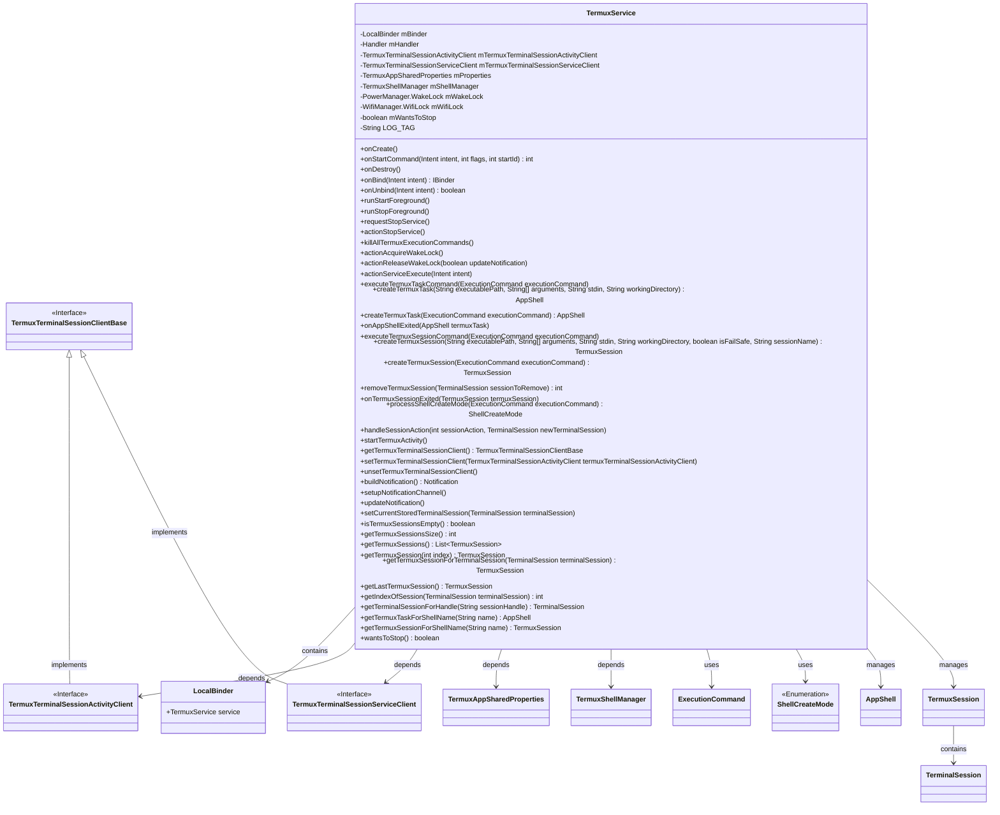
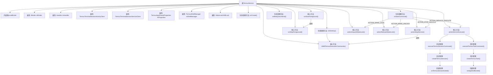

# 基础信息

|      |      |
|------|------|
| 名称 | TermuxService |
| 编码语言 | .java |
| 代码路径 | termux-app/app/src/main/java/com/termux/app/TermuxService.java |
| 包名 | com.termux.app |
| 依赖项 | ['android.annotation.SuppressLint', 'android.app.Notification', 'android.app.NotificationManager', 'android.app.PendingIntent', 'android.app.Service', 'android.content.Context', 'android.content.Intent', 'android.content.res.Resources', 'android.net.wifi.WifiManager', 'android.os.Binder', 'android.os.Build', 'android.os.Handler', 'android.os.IBinder', 'android.os.PowerManager', 'androidx.annotation.NonNull', 'androidx.annotation.Nullable', 'com.termux.R', 'com.termux.app.event.SystemEventReceiver', 'com.termux.app.terminal.TermuxTerminalSessionActivityClient', 'com.termux.app.terminal.TermuxTerminalSessionServiceClient', 'com.termux.shared.termux.plugins.TermuxPluginUtils', 'com.termux.shared.data.IntentUtils', 'com.termux.shared.net.uri.UriUtils', 'com.termux.shared.errors.Errno', 'com.termux.shared.shell.ShellUtils', 'com.termux.shared.shell.command.runner.app.AppShell', 'com.termux.shared.termux.settings.properties.TermuxAppSharedProperties', 'com.termux.shared.termux.shell.command.environment.TermuxShellEnvironment', 'com.termux.shared.termux.shell.TermuxShellUtils', 'com.termux.shared.termux.TermuxConstants', 'com.termux.shared.termux.TermuxConstants.TERMUX_APP.TERMUX_ACTIVITY', 'com.termux.shared.termux.TermuxConstants.TERMUX_APP.TERMUX_SERVICE', 'com.termux.shared.termux.settings.preferences.TermuxAppSharedPreferences', 'com.termux.shared.termux.shell.TermuxShellManager', 'com.termux.shared.termux.shell.command.runner.terminal.TermuxSession', 'com.termux.shared.termux.terminal.TermuxTerminalSessionClientBase', 'com.termux.shared.logger.Logger', 'com.termux.shared.notification.NotificationUtils', 'com.termux.shared.android.PermissionUtils', 'com.termux.shared.data.DataUtils', 'com.termux.shared.shell.command.ExecutionCommand', 'com.termux.shared.shell.command.ExecutionCommand.Runner', 'com.termux.shared.shell.command.ExecutionCommand.ShellCreateMode', 'com.termux.terminal.TerminalEmulator', 'com.termux.terminal.TerminalSession', 'com.termux.terminal.TerminalSessionClient', 'java.util.ArrayList', 'java.util.List'] |
| 概述说明 | TermuxService是Android后台服务，管理终端会话和任务，支持唤醒锁、通知控制及插件命令执行，提供绑定接口供Activity交互。 |

# 说明

TermuxService是一个Android服务类，负责管理Termux应用的终端会话和后台任务。它实现了AppShellClient和TermuxSessionClient接口，处理会话和任务的创建、销毁及状态回调。服务包含本地绑定器、唤醒锁管理、通知控制等功能，支持通过Intent执行命令，并维护会话和任务列表。服务生命周期中会处理资源清理，包括终止所有执行命令和释放锁。提供前台服务通知显示会话/任务状态，支持唤醒锁操作。通过TermuxTerminalSessionClientBase接口与活动交互，确保会话正确处理。包含会话管理方法如创建/移除会话、获取会话索引等，以及任务管理功能。

# 类列表 Class Summary

| 名称   | 类型  | 说明 |
|-------|------|-------------|
| TermuxService | class | TermuxService是Android后台服务，管理终端会话和任务，支持唤醒锁、通知控制及插件命令执行。 |

## 类 TermuxService

|      |      |
|------|------|
| 访问范围 | public final |
| 类型 | class |
| 名称 | TermuxService |
| 说明 | TermuxService是Android后台服务，管理终端会话和任务，支持唤醒锁、通知控制及插件命令执行。 |

### UML类图

这段类图展示了TermuxService的核心结构和关系。TermuxService作为Android服务，管理终端会话和后台任务，实现了AppShell和TermuxSession的客户端接口。它包含LocalBinder用于进程内通信，依赖TermuxAppSharedProperties和TermuxShellManager进行配置和会话管理，通过ExecutionCommand执行命令，并使用ShellCreateMode枚举控制会话创建模式。服务维护TermuxSession和AppShell列表，与TerminalSession交互，并通过TermuxTerminalSessionClientBase的两种实现处理会话客户端逻辑。

### 内部方法调用关系图

该流程图展示了TermuxService的核心结构和执行逻辑。这个Android服务类主要处理终端会话管理、后台任务执行和系统资源控制，包含四大功能模块：1) 生命周期管理（onCreate/onDestroy等）；2) 前台服务控制（通知栏交互）；3) 会话/任务处理（创建/销毁会话和任务）；4) 系统资源管理（WakeLock控制）。通过Handler机制实现线程安全，支持插件式命令执行，并严格管理进程间通信。服务状态通过Notification实时更新，异常情况处理包含完善的日志记录和资源释放机制。

### 字段列表 Field List

| 名称  | 类型  | 说明 |
|-------|-------|------|
| mBinder = new LocalBinder() | IBinder | 私有Binder实例初始化为LocalBinder |
| mHandler = new Handler() | Handler | 私有Handler实例mHandler初始化。 |
| mWantsToStop = false | boolean | 布尔变量mWantsToStop初始值为false |
| mTermuxTerminalSessionServiceClient = new TermuxTerminalSessionServiceClient(this) | TermuxTerminalSessionServiceClient | 私有终端会话服务客户端初始化。 |
| LOG_TAG = "TermuxService" | String | 私有常量LOG_TAG值为TermuxService |
| mShellManager | TermuxShellManager | 私有TermuxShellManager实例mShellManager。 |
| mWakeLock | PowerManager.WakeLock | 私有唤醒锁变量mWakeLock |
| mWifiLock | WifiManager.WifiLock | 私有WifiLock成员变量mWifiLock |
| mProperties | TermuxAppSharedProperties | 私有Termux共享属性变量mProperties |
| mTermuxTerminalSessionActivityClient | TermuxTerminalSessionActivityClient | 私有Termux终端会话活动客户端变量 |

### 方法列表 Method List

| 名称  | 类型  | 说明 |
|-------|-------|------|
| getTermuxTerminalSessionClient | TermuxTerminalSessionClientBase | 获取Termux终端会话客户端，优先返回活动客户端，否则返回服务端。 |
| runStopForeground | void | 停止前台服务并移除通知。 |
| wantsToStop | boolean | 检查是否想停止，返回布尔值mWantsToStop。 |
| onBind | IBinder | 重写onBind方法，记录日志并返回mBinder。 |
| getTermuxSessionsSize | int | 获取Termux会话数量 |
| killAllTermuxExecutionCommands | void | 终止所有Termux执行命令，清理会话、任务和待处理命令。 |
| startTermuxActivity | void | 安卓10+需悬浮窗权限启动前台活动，否则终端仅显示通知需手动点击。无权限时检查偏好设置并提示错误。 |
| processShellCreateMode | ShellCreateMode | 根据执行命令的shellCreateMode返回创建模式，处理错误情况。 |
| setCurrentStoredTerminalSession | void | 设置当前终端会话，若会话或偏好设置无效则退出。 |
| createTermuxSession | TermuxSession | 创建Termux会话，验证命令后执行，处理错误并更新会话列表和通知。 |
| isTermuxSessionsEmpty | boolean | 检查Termux会话是否为空。 |
| unsetTermuxTerminalSessionClient | void | 同步方法，取消终端会话客户端，更新所有会话并置空活动客户端。 |
| handleSessionAction | void | 处理会话动作：切换或保持当前会话，可选打开活动，默认强制切换并打开。 |
| buildNotification | Notification | 构建Termux通知：显示会话和任务数，设置优先级、图标、颜色，添加退出和唤醒锁操作。 |
| removeTermuxSession | int | 同步方法移除Termux会话，返回索引或-1。 |
| onTermuxSessionExited | void | Termux会话退出时处理插件结果并更新会话列表和通知。 |
| actionServiceExecute | void | 处理Intent执行命令，检查参数并执行Termux任务或会话。 |
| setupNotificationChannel | void | 创建通知渠道，仅适用于Android O及以上版本。 |
| onStartCommand | int | 服务启动时处理四种意图：停止、唤醒锁、解锁和执行命令，不自动重启。 |
| actionReleaseWakeLock | void | 释放持有的WakeLock和WifiLock，若需更新通知则执行，最后记录释放成功。 |
| onUnbind | boolean | 重写onUnbind方法，记录日志并清理客户端引用。 |
| createTermuxTask | AppShell | 创建Termux任务，返回AppShell实例，参数包括路径、参数、输入和工作目录。 |
| createTermuxTask | AppShell | 创建Termux任务，检查执行命令和运行器，执行失败处理错误，成功则更新通知。 |
| updateNotification | void | 更新通知：无会话任务时停止服务，否则发送通知。 |
| onCreate | void | 重写onCreate方法，初始化属性、Shell管理器，启动前台服务并注册包更新事件。 |
| actionAcquireWakeLock | void | 获取唤醒锁和WiFi锁，检查电池优化设置并更新通知。 |
| actionStopService | void | 停止服务操作：设置停止标志，终止命令并请求停止服务。 |
| executeTermuxSessionCommand | void | 执行Termux会话命令，处理会话创建和切换。 |
| executeTermuxTaskCommand | void | 执行Termux后台任务命令，处理shell名称和创建模式。 |
| requestStopService | void | 请求停止服务并结束自身。 |
| onAppShellExited | void | 重写应用退出回调，处理插件命令并更新通知。 |
| runStartForeground | void | 启动前台服务并设置通知。 |
| setTermuxTerminalSessionClient | void | 同步方法设置终端会话客户端并更新所有会话。 |
| createTermuxSession | TermuxSession | 创建Termux会话，设置执行命令参数并返回会话实例。 |
| onDestroy | void | 销毁时执行：日志记录、清理临时目录、释放锁、终止命令、退出处理、注销事件、停止前台服务。 |
| getTermuxSessions | List<TermuxSession> | 获取Termux会话列表的同步方法。 |
| getTermuxSession | TermuxSession | 获取指定索引的Termux会话，索引无效返回空。 |
| getTermuxSessionForTerminalSession | TermuxSession | 根据终端会话查找对应的Termux会话，找不到返回null。 |
| getLastTermuxSession | TermuxSession | 获取最后一个Termux会话，若无则返回空。 |
| getIndexOfSession | int | 同步方法获取终端会话索引，不存在返回-1。 |
| getTerminalSessionForHandle | TerminalSession | 同步方法通过句柄查找终端会话，未找到返回null。 |
| getTermuxTaskForShellName | AppShell | 同步方法根据名称查找Termux任务，未找到返回null。 |
| getTermuxSessionForShellName | TermuxSession | 同步方法，按名称查找并返回Termux会话，无则返回null。 |

