# 基础信息

|      |      |
|------|------|
| 名称 | app |
| 编码语言 | .java |
| 代码路径 | termux-app/app/src/main/java/com/termux/app |
| 包名 | termux-app.app.src.main.java.com.termux.app |
| 概述说明 | Termux核心模块：文件处理、应用初始化、安装管理、终端控制、服务运行、系统事件监听及偏好设置。 |

# 说明

```markdown
## 概述

该代码模块是Termux Android终端模拟应用的核心系统，提供完整的Linux环境交互解决方案。模块采用分层架构设计，包含终端会话管理、服务集成、UI交互、文件处理和系统事件响应等核心功能。主要组件包括广播接收器、应用服务、活动控制器及偏好管理系统，共同实现从底层命令执行到用户界面交互的全链路功能。

## 主要业务场景

1. **终端会话管理**
   - 通过`TermuxService`维护多会话生命周期（最大8个并发会话）
   - 支持会话创建/销毁、状态同步和异常处理
   - 提供`TermuxTerminalSessionClient`实现服务端通信
   - 包含`TermuxSessionsListViewController`进行可视化控制

2. **文件处理与共享**
   - `TermuxOpenReceiver`处理文件打开/分享请求
   - `FileReceiverActivity`管理文件下载和编辑
   - 严格的URI验证和内容提供者安全控制
   - 支持termux-file-editor和termux-url-opener调用

3. **应用初始化与安装**
   - `TermuxApplication`完成运行时配置（崩溃处理、日志系统等）
   - `TermuxInstaller`负责引导安装和存储链接设置
   - 异步执行安装流程，包含详细的错误恢复机制

4. **命令执行系统**
   - `RunCommandService`处理外部命令请求
   - 权限验证和参数处理
   - 前台服务通知管理
   - 工作目录权限控制

5. **系统事件响应**
   - `SystemEventReceiver`监听启动完成和应用变更事件
   - 自动更新环境文件和插件配置
   - 适配Android 8+的广播限制

6. **用户偏好管理**
   - 基于`PreferenceFragmentCompat`的配置系统
   - 支持核心应用和插件（Tasker/API/Float/Widget）的独立设置
   - 调试选项集中管理
   - 采用单例数据存储模式

7. **UI交互体系**
   - `TermuxActivity`实现主界面控制
   - 终端视图渲染和输入处理
   - 键盘适配和布局优化
   - 上下文菜单和样式配置

8. **帮助与设置**
   - `HelpActivity`集成维基文档浏览
   - `SettingsActivity`管理多模块配置
   - 动态控制功能可见性（基于应用安装状态）
```


### 包内部结构视图

```mermaid
graph TD
    app --> TermuxOpenReceiver.java
    app --> TermuxApplication.java
    app --> TermuxInstaller.java
    app --> TermuxActivity.java
    app --> TermuxService.java
    app --> RunCommandService.java
    app --> activities
    app --> fragments
    app --> models
    app --> api
    app --> terminal
    app --> event
    activities --> HelpActivity.java
    activities --> SettingsActivity.java
    fragments --> settings
    settings --> TermuxTaskerPreferencesFragment.java
    settings --> TermuxAPIPreferencesFragment.java
    settings --> TermuxPreferencesFragment.java
    settings --> TermuxFloatPreferencesFragment.java
    settings --> TermuxWidgetPreferencesFragment.java
    settings --> termux_widget
    settings --> termux_float
    settings --> termux_api
    settings --> termux_tasker
    settings --> termux
    termux_widget --> DebuggingPreferencesFragment.java
    termux_float --> DebuggingPreferencesFragment.java
    termux_api --> DebuggingPreferencesFragment.java
    termux_tasker --> DebuggingPreferencesFragment.java
    termux --> DebuggingPreferencesFragment.java
    termux --> TerminalViewPreferencesFragment.java
    termux --> TerminalIOPreferencesFragment.java
    models --> UserAction.java
    api --> file
    file --> FileReceiverActivity.java
    terminal --> TermuxTerminalSessionActivityClient.java
    terminal --> TermuxTerminalViewClient.java
    terminal --> TermuxTerminalSessionServiceClient.java
    terminal --> TermuxActivityRootView.java
    terminal --> TermuxSessionsListViewController.java
    terminal --> io
    io --> FullScreenWorkAround.java
    io --> KeyboardShortcut.java
    io --> TerminalToolbarViewPager.java
    io --> TermuxTerminalExtraKeys.java
    event --> SystemEventReceiver.java
```



该流程图展示了Termux应用的完整Java代码结构，从根目录app开始分为11个主要模块，包括核心类文件、活动、片段、模型等。其中fragments模块具有最复杂的层级关系，包含settings目录及其多个子模块，每个子模块都包含对应的偏好设置片段和调试片段。terminal模块也包含多层嵌套结构，特别是io子模块处理终端输入输出相关功能。整体结构清晰展现了Android应用的典型模块化设计。

# 文件列表 File List

| 名称   | 类型  | 说明 |
|-------|------|-------------|
| [TermuxActivity.java](TermuxActivity.md) | file | TermuxActivity是Android终端模拟器主界面，管理服务连接、会话及UI交互。 |
| [TermuxInstaller.java](TermuxInstaller.md) | file | Termux安装器类，处理引导设置、存储链接和错误处理。 |
| [TermuxApplication.java](TermuxApplication.md) | file | Termux应用初始化，设置日志、崩溃处理、文件目录检查及环境配置。 |
| [TermuxOpenReceiver.java](TermuxOpenReceiver.md) | file | Termux广播接收器处理文件打开和分享请求，支持URI解析、内容类型检测和权限检查。 |
| [RunCommandService.java](RunCommandService.md) | file | RunCommandService是Android服务，处理执行命令请求，验证参数后转发给TermuxService执行，支持前台通知。 |
| [TermuxService.java](TermuxService.md) | file | TermuxService是Android后台服务，管理终端会话和任务，支持唤醒锁、通知控制及插件命令执行，提供绑定接口供Activity交互。 |
| [fragments](fragments/_module.md) | package | Termux偏好设置模块，包含多个继承PreferenceFragmentCompat的片段及单例数据存储类，用于管理调试、终端视图等配置。 |
| [activities](activities/_module.md) | package | HelpActivity显示Termux维基页面WebView，处理链接和返回键。SettingsActivity管理应用设置，加载偏好项并支持返回导航。 |
| [event](event/_module.md) | package | 系统事件接收器，处理启动和包更新广播。 |
| [terminal](terminal/_module.md) | package | Termux终端核心类：会话管理、视图交互、服务控制、布局适配、列表控制及输入处理。 |
| [api](api/_module.md) | package | 处理文件接收和URL共享的Activity，支持编辑、保存和打开目录操作。 |
| [models](models/_module.md) | package | 输入内容为空，无法生成概要。请提供需要总结的具体信息。 |


