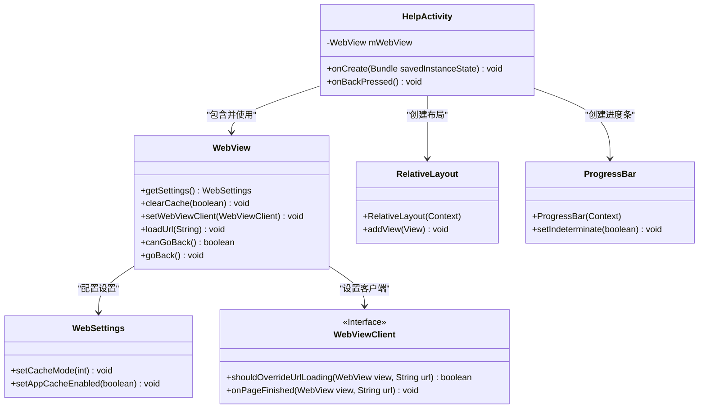
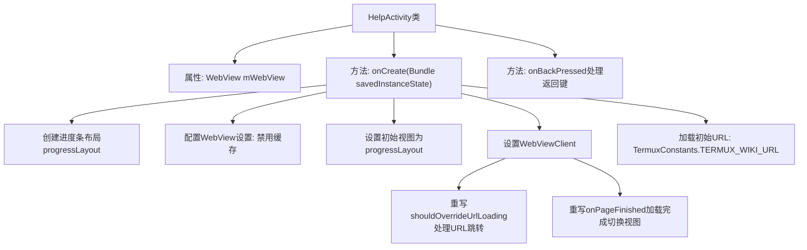

# 基础信息

|      |      |
|------|------|
| 名称 | HelpActivity |
| 编码语言 | .java |
| 代码路径 | termux-app/app/src/main/java/com/termux/app/activities/HelpActivity.java |
| 包名 | com.termux.app.activities |
| 依赖项 | ['android.content.ActivityNotFoundException', 'android.content.Intent', 'android.net.Uri', 'android.os.Bundle', 'android.view.ViewGroup', 'android.webkit.WebSettings', 'android.webkit.WebView', 'android.webkit.WebViewClient', 'android.widget.ProgressBar', 'android.widget.RelativeLayout', 'androidx.appcompat.app.AppCompatActivity', 'com.termux.shared.termux.TermuxConstants'] |
| 概述说明 | 帮助活动类，加载网页显示进度条，支持返回键导航。 |

# 说明

该代码定义了一个名为HelpActivity的Android应用活动类，继承自AppCompatActivity。主要功能是加载并显示一个WebView，用于浏览Termux维基页面。在加载过程中显示进度条，加载完成后切换至WebView视图。WebView配置为禁用缓存，并处理URL加载逻辑：内部链接直接加载，外部链接通过系统浏览器打开。当设备无浏览器时回退到WebView。用户按下返回键时优先处理WebView的返回导航，否则执行默认返回操作。

# 类列表 Class Summary

| 名称   | 类型  | 说明 |
|-------|------|-------------|
| HelpActivity | class | 帮助活动类，含WebView加载网页，显示进度条，处理返回键和链接跳转。 |

## 类 HelpActivity

|      |      |
|------|------|
| 访问范围 | public final |
| 类型 | class |
| 名称 | HelpActivity |
| 说明 | 帮助活动类，含WebView加载网页，显示进度条，处理返回键和链接跳转。 |

### UML类图

这段代码描述了一个Android的`HelpActivity`类，主要用于显示帮助文档的WebView界面。类图中展示了`HelpActivity`与`WebView`、`WebSettings`、`WebViewClient`等核心组件的关系，以及用于显示加载进度条的`RelativeLayout`和`ProgressBar`。`HelpActivity`通过`WebView`加载网页内容，并使用`WebViewClient`处理页面加载逻辑，同时通过`RelativeLayout`和`ProgressBar`实现加载中的进度显示。整个类图清晰地展示了各组件之间的依赖和协作关系。

### 内部方法调用关系图

流程图描述：该流程图展示了Android帮助页面的核心逻辑流程。首先在onCreate中初始化进度条布局和WebView，配置禁用缓存后设置初始视图。通过自定义WebViewClient处理URL跳转逻辑：匹配Wiki地址则内联显示，其他链接尝试系统打开；页面加载完成后切换至WebView视图。返回键优先处理WebView后退，否则执行默认行为。整个过程实现了带加载状态的网页浏览功能。

### 字段列表 Field List

| 名称  | 类型  | 说明 |
|-------|-------|------|
| mWebView | WebView | 声明WebView对象mWebView。 |

### 方法列表 Method List

| 名称  | 类型  | 说明 |
|-------|-------|------|
| onCreate | void | 创建WebView并加载URL，显示进度条，处理链接跳转和页面加载完成事件。 |
| onBackPressed | void | 重写返回逻辑：网页可后退则后退，否则执行默认返回操作。 |

