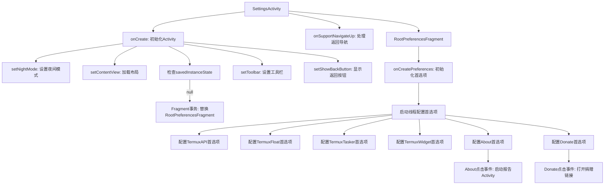

# 基础信息

|      |      |
|------|------|
| 名称 | SettingsActivity |
| 编码语言 | .java |
| 代码路径 | termux-app/app/src/main/java/com/termux/app/activities/SettingsActivity.java |
| 包名 | com.termux.app.activities |
| 依赖项 | ['android.content.Context', 'android.os.Bundle', 'android.os.Environment', 'androidx.annotation.NonNull', 'androidx.appcompat.app.AppCompatActivity', 'androidx.preference.Preference', 'androidx.preference.PreferenceFragmentCompat', 'com.termux.R', 'com.termux.shared.activities.ReportActivity', 'com.termux.shared.file.FileUtils', 'com.termux.shared.models.ReportInfo', 'com.termux.app.models.UserAction', 'com.termux.shared.interact.ShareUtils', 'com.termux.shared.android.PackageUtils', 'com.termux.shared.termux.settings.preferences.TermuxAPIAppSharedPreferences', 'com.termux.shared.termux.settings.preferences.TermuxFloatAppSharedPreferences', 'com.termux.shared.termux.settings.preferences.TermuxTaskerAppSharedPreferences', 'com.termux.shared.termux.settings.preferences.TermuxWidgetAppSharedPreferences', 'com.termux.shared.android.AndroidUtils', 'com.termux.shared.termux.TermuxConstants', 'com.termux.shared.termux.TermuxUtils', 'com.termux.shared.activity.media.AppCompatActivityUtils', 'com.termux.shared.theme.NightMode'] |
| 概述说明 | 设置活动初始化界面并加载首选项片段，动态配置可见性及处理点击事件。 |

# 说明

SettingsActivity是一个继承自AppCompatActivity的类，用于管理应用设置。在onCreate方法中，它初始化夜间模式、设置布局，并通过FragmentTransaction加载RootPreferencesFragment。该Fragment负责配置多个偏好设置项，包括Termux API、Termux Float、Termux Tasker、Termux Widget、关于和捐赠选项。每个偏好项的可见性取决于相关应用是否安装。关于选项会显示应用和设备信息，捐赠选项会根据APK发布渠道决定是否显示。Activity还支持导航返回操作。

# 类列表 Class Summary

| 名称   | 类型  | 说明 |
|-------|------|-------------|
| SettingsActivity | class | 设置活动初始化并加载根偏好片段，配置多个功能选项可见性及点击事件。 |

## 类 SettingsActivity

|      |      |
|------|------|
| 访问范围 | public |
| 类型 | class |
| 名称 | SettingsActivity |
| 说明 | 设置活动初始化并加载根偏好片段，配置多个功能选项可见性及点击事件。 |

### UML类图

```mermaid
classDiagram
    class SettingsActivity {
        +SettingsActivity()
        +void onCreate(Bundle savedInstanceState)
        +boolean onSupportNavigateUp()
    }

    class RootPreferencesFragment {
        -Context context
        +void onCreatePreferences(Bundle savedInstanceState, String rootKey)
        -void configureTermuxAPIPreference(Context context)
        -void configureTermuxFloatPreference(Context context)
        -void configureTermuxTaskerPreference(Context context)
        -void configureTermuxWidgetPreference(Context context)
        -void configureAboutPreference(Context context)
        -void configureDonatePreference(Context context)
    }

    class AppCompatActivityUtils {
        <<Interface>>
        +void setNightMode(Context context, String nightModeName, boolean recreate)
        +void setToolbar(Context context, int toolbarId)
        +void setShowBackButtonInActionBar(Context context, boolean show)
    }

    class NightMode {
        <<Interface>>
        +String getName()
    }

    class TermuxAPIAppSharedPreferences {
        +static TermuxAPIAppSharedPreferences build(Context context, boolean commit)
    }

    class TermuxFloatAppSharedPreferences {
        +static TermuxFloatAppSharedPreferences build(Context context, bool commit)
    }

    class TermuxTaskerAppSharedPreferences {
        +static TermuxTaskerAppSharedPreferences build(Context context, bool commit)
    }

    class TermuxWidgetAppSharedPreferences {
        +static TermuxWidgetAppSharedPreferences build(Context context, bool commit)
    }

    class TermuxUtils {
        <<Interface>>
        +String getAppInfoMarkdownString(Context context, AppInfoMode mode)
        +String getImportantLinksMarkdownString(Context context)
        +String getAPKRelease(String signingCertificateSHA256Digest)
    }

    class AndroidUtils {
        <<Interface>>
        +String getDeviceInfoMarkdownString(Context context, bool includeDebugInfo)
    }

    class ReportInfo {
        +String reportString
        +String reportSaveFileLabelAndPath
        +ReportInfo(String userActionName, String sender, String title)
    }

    class ReportActivity {
        +static void startReportActivity(Context context, ReportInfo reportInfo)
    }

    class ShareUtils {
        <<Interface>>
        +void openUrl(Context context, String url)
    }

    SettingsActivity --> AppCompatActivityUtils : "依赖\n设置夜间模式/工具栏"
    SettingsActivity --> RootPreferencesFragment : "包含"
    RootPreferencesFragment --> TermuxAPIAppSharedPreferences : "依赖\n检查API可用性"
    RootPreferencesFragment --> TermuxFloatAppSharedPreferences : "依赖\n检查Float可用性"
    RootPreferencesFragment --> TermuxTaskerAppSharedPreferences : "依赖\n检查Tasker可用性"
    RootPreferencesFragment --> TermuxWidgetAppSharedPreferences : "依赖\n检查Widget可用性"
    RootPreferencesFragment --> TermuxUtils : "依赖\n获取应用信息"
    RootPreferencesFragment --> AndroidUtils : "依赖\n获取设备信息"
    RootPreferencesFragment --> ReportActivity : "依赖\n生成报告"
    RootPreferencesFragment --> ShareUtils : "依赖\n打开捐赠链接"
    RootPreferencesFragment --> NightMode : "依赖\n获取夜间模式"
```

类图描述：该图展示了Android设置界面`SettingsActivity`及其嵌套类`RootPreferencesFragment`的结构，包含对各类工具类（如`AppCompatActivityUtils`、`TermuxUtils`）和共享偏好类（如`TermuxAPIAppSharedPreferences`）的依赖关系。`RootPreferencesFragment`负责动态配置多个偏好设置项，包括API、浮动窗口、Tasker等功能的可用性检查，以及关于信息和捐赠链接的处理，通过多线程优化性能并遵循Google Play政策限制。

### 内部方法调用关系图

这段代码描述了一个Android设置界面的实现流程。SettingsActivity作为主入口，负责初始化界面元素和夜间模式，并加载RootPreferencesFragment作为首选项容器。Fragment内部通过多线程并行配置6类功能首选项，其中About和Donate首选项包含复杂交互逻辑。About会收集设备和应用信息生成报告，Donate会根据应用签名证书控制可见性并处理捐赠链接。整个流程体现了模块化设计，兼顾性能（异步加载）和合规性检查（Google Play限制）。

### 字段列表 Field List

| 名称  | 类型  | 说明 |
|-------|-------|------|

### 方法列表 Method List

| 名称  | 类型  | 说明 |
|-------|-------|------|
| onSupportNavigateUp | boolean | 重写导航返回逻辑，调用后退方法并返回真。 |
| onCreate | void | 安卓设置页初始化：夜间模式、布局加载、片段替换、工具栏设置。 |

