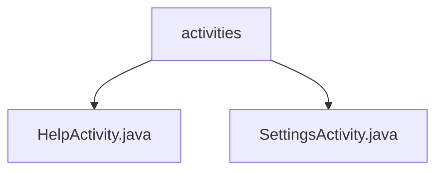

# 基础信息

|      |      |
|------|------|
| 名称 | activities |
| 编码语言 | .java |
| 代码路径 | termux-app/app/src/main/java/com/termux/app/activities |
| 包名 | termux-app.app.src.main.java.com.termux.app.activities |
| 概述说明 | HelpActivity显示Termux维基页面WebView，处理链接和返回键。SettingsActivity管理应用设置，加载偏好项并支持返回导航。 |

# 说明

## 概述

该代码模块是Termux应用的一部分，包含两个主要Activity类：`HelpActivity`和`SettingsActivity`。这两个类都继承自Android的`AppCompatActivity`，分别负责应用的帮助文档浏览和设置管理功能。

## 主要业务场景

1. **帮助文档浏览** (`HelpActivity`)
   - 加载并显示Termux维基页面的WebView视图
   - 在加载过程中显示进度条，完成后切换到WebView
   - 配置WebView禁用缓存，并处理URL加载逻辑：
     - 内部链接直接在WebView中加载
     - 外部链接通过系统浏览器打开（无浏览器时回退到WebView）
   - 处理返回键逻辑：优先处理WebView的返回导航

2. **应用设置管理** (`SettingsActivity`)
   - 初始化夜间模式和应用设置界面
   - 通过`FragmentTransaction`加载`RootPreferencesFragment`来配置偏好设置
   - 管理多个功能模块的偏好设置项：
     - Termux API、Termux Float、Termux Tasker、Termux Widget
     - 关于和捐赠选项
   - 动态控制偏好项的可见性（基于相关应用是否安装）
   - 显示应用和设备信息（关于选项）
   - 根据APK发布渠道控制捐赠选项的显示
   - 支持导航返回操作

### 包内部结构视图

该流程图展示了Termux应用中的activities目录结构，包含两个主要活动文件：HelpActivity.java和SettingsActivity.java。这两个文件都直接隶属于activities目录，体现了简单的层级关系，适用于快速理解应用核心功能模块的组织方式。

# 文件列表 File List

| 名称   | 类型  | 说明 |
|-------|------|-------------|
| [SettingsActivity.java](SettingsActivity.md) | file | 设置活动初始化界面并加载首选项片段，动态配置可见性及处理点击事件。 |
| [HelpActivity.java](HelpActivity.md) | file | 帮助活动类，加载网页显示进度条，支持返回键导航。 |

