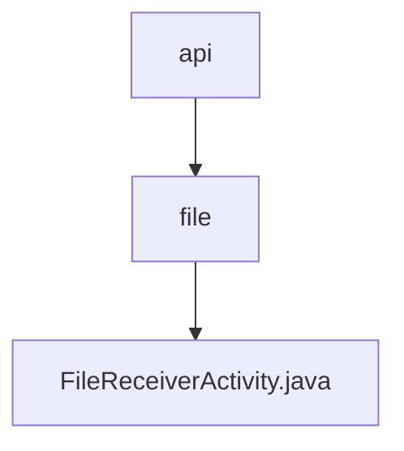

# 基础信息

|      |      |
|------|------|
| 名称 | api |
| 编码语言 | .java |
| 代码路径 | termux-app/app/src/main/java/com/termux/app/api |
| 包名 | termux-app.app.src.main.java.com.termux.app.api |
| 概述说明 | 处理文件接收和URL共享的Activity，支持编辑、保存和打开目录操作。 |

# 说明

FileReceiverActivity是Termux应用的文件接收组件，主要处理通过ACTION_SEND或文件URI共享的内容。它定义了下载目录路径和编辑器/URL打开器程序路径。功能包括：检测共享文本是否为URL，处理内容URI获取文件名，通过输入对话框保存文件流到指定目录，并支持调用termux-file-editor编辑文件或termux-url-opener打开URL。错误处理通过对话框提示并退出，同时提供组件状态更新功能以控制文件分享/查看接收器的启用状态。

### 包内部结构视图

该流程图展示了Termux应用中API模块的层级结构。顶层节点"api"包含子目录"file"，而"file"目录下包含具体的Java实现文件"FileReceiverActivity.java"。这是一个典型的三级目录结构，清晰地反映了从API入口到具体文件接收功能的路径关系，总节点数严格匹配输入的3条路径信息。

# 文件列表 File List

| 名称   | 类型  | 说明 |
|-------|------|-------------|
| [file](file/_module.md) | package | 处理文件接收和URL共享的Activity，支持编辑、保存和打开目录操作。 |

