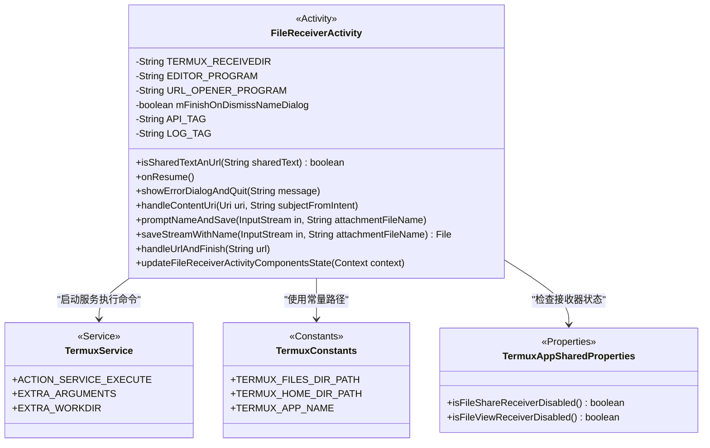
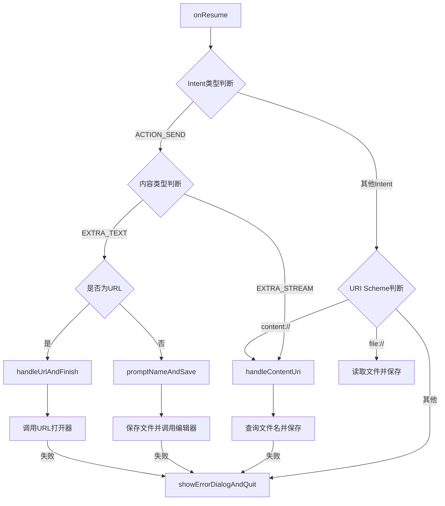
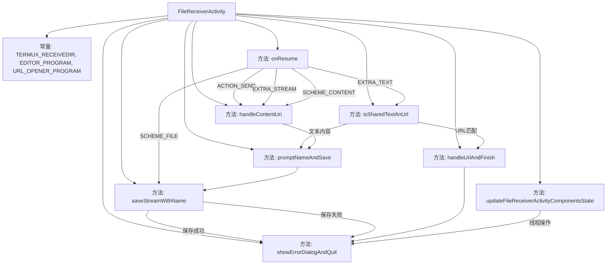
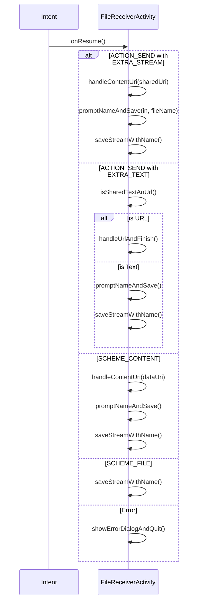

# 基础信息

|      |      |
|------|------|
| 名称 | FileReceiverActivity |
| 编码语言 | .java |
| 代码路径 | termux-app/app/src/main/java/com/termux/app/api/file/FileReceiverActivity.java |
| 包名 | com.termux.app.api.file |
| 依赖项 | ['android.content.Context', 'android.content.Intent', 'android.database.Cursor', 'android.net.Uri', 'android.provider.OpenableColumns', 'android.util.Patterns', 'androidx.annotation.NonNull', 'androidx.appcompat.app.AppCompatActivity', 'com.termux.R', 'com.termux.shared.android.PackageUtils', 'com.termux.shared.data.DataUtils', 'com.termux.shared.data.IntentUtils', 'com.termux.shared.net.uri.UriUtils', 'com.termux.shared.interact.MessageDialogUtils', 'com.termux.shared.net.uri.UriScheme', 'com.termux.shared.termux.interact.TextInputDialogUtils', 'com.termux.shared.termux.TermuxConstants', 'com.termux.shared.termux.TermuxConstants.TERMUX_APP', 'com.termux.shared.termux.TermuxConstants.TERMUX_APP.TERMUX_SERVICE', 'com.termux.app.TermuxService', 'com.termux.shared.logger.Logger', 'com.termux.shared.termux.settings.properties.TermuxAppSharedProperties', 'com.termux.shared.termux.settings.properties.TermuxPropertyConstants', 'java.io.ByteArrayInputStream', 'java.io.File', 'java.io.FileInputStream', 'java.io.FileNotFoundException', 'java.io.FileOutputStream', 'java.io.IOException', 'java.io.InputStream', 'java.nio.charset.StandardCharsets', 'java.util.regex.Pattern'] |
| 概述说明 | 处理文件接收和URL共享的Activity，支持编辑、保存和打开目录操作。 |

# 说明

FileReceiverActivity是Termux应用的文件接收组件，主要处理通过ACTION_SEND或文件URI共享的内容。它定义了下载目录路径和编辑器/URL打开器程序路径。功能包括：检测共享文本是否为URL，处理内容URI获取文件名，通过输入对话框保存文件流到指定目录，并支持调用termux-file-editor编辑文件或termux-url-opener打开URL。错误处理通过对话框提示并退出，同时提供组件状态更新功能以控制文件分享/查看接收器的启用状态。

# 类列表 Class Summary

| 名称   | 类型  | 说明 |
|-------|------|-------------|
| FileReceiverActivity | class | 处理文件接收和URL打开的Android活动类，支持编辑和保存功能。 |

## 类 FileReceiverActivity

|      |      |
|------|------|
| 访问范围 | public |
| 类型 | class |
| 名称 | FileReceiverActivity |
| 说明 | 处理文件接收和URL打开的Android活动类，支持编辑和保存功能。 |

### UML类图

类图描述：FileReceiverActivity是一个Android活动类，负责处理文件接收和URL共享功能。它依赖TermuxService来执行命令，使用TermuxConstants中的路径常量，并通过TermuxAppSharedProperties检查接收器状态。主要功能包括处理内容URI、保存文件流、调用编辑器和URL打开器，以及错误处理。流程图展示了从Intent接收到最终处理的完整逻辑分支。

### 内部方法调用关系图

这段代码是Termux应用的文件接收器Activity，主要处理来自其他应用的文件和URL共享请求。流程图展示了类结构和主要方法调用关系，时序图详细描述了不同Intent类型的处理流程。代码通过检查Intent类型和内容，分别处理文件流、URL和文本内容，最终保存到指定目录或调用外部程序处理。包含完善的错误处理机制，能应对各种异常情况如无效URI、文件操作失败等。

### 字段列表 Field List

| 名称  | 类型  | 说明 |
|-------|-------|------|
| URL_OPENER_PROGRAM = TermuxConstants.TERMUX_HOME_DIR_PATH + "/bin/termux-url-opener" | String | Termux的URL打开程序路径 |
| API_TAG = TermuxConstants.TERMUX_APP_NAME + "FileReceiver" | String | Termux应用文件接收器的API标签常量定义。 |
| TERMUX_RECEIVEDIR = TermuxConstants.TERMUX_FILES_DIR_PATH + "/home/downloads" | String | Termux下载目录路径常量定义 |
| EDITOR_PROGRAM = TermuxConstants.TERMUX_HOME_DIR_PATH + "/bin/termux-file-editor" | String | Termux文件编辑器路径常量定义 |
| LOG_TAG = "FileReceiverActivity" | String | 私有常量LOG_TAG值为"FileReceiverActivity"。 |
| mFinishOnDismissNameDialog = true | boolean | 布尔变量mFinishOnDismissNameDialog设为true |

### 方法列表 Method List

| 名称  | 类型  | 说明 |
|-------|-------|------|
| isSharedTextAnUrl | boolean | 检查文本是否为URL或磁力链接 |
| promptNameAndSave | void | 方法提示用户输入文件名并保存流，检查编辑器程序是否存在，启动服务执行脚本或打开目录。 |
| updateFileReceiverActivityComponentsState | void | 更新文件接收器和查看器组件状态。 |
| onResume | void | 处理接收的Intent，解析内容或URI，保存文件或URL，错误时提示。 |
| saveStreamWithName | File | 保存输入流到指定目录文件，检查文件名和目录，失败返回错误。 |
| showErrorDialogAndQuit | void | 显示错误对话框后退出，关闭时结束当前活动。 |
| handleUrlAndFinish | void | 检查并执行URL打开程序，处理错误后启动服务传递URL参数。 |
| handleContentUri | void | 处理URI内容：获取文件名，打开输入流并保存，出错时显示错误信息。 |

