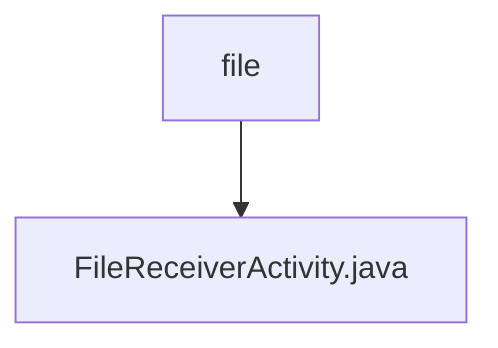

# 基础信息

|      |      |
|------|------|
| 名称 | file |
| 编码语言 | .java |
| 代码路径 | termux-app/app/src/main/java/com/termux/app/api/file |
| 包名 | termux-app.app.src.main.java.com.termux.app.api.file |
| 概述说明 | 处理文件接收和URL共享的Activity，支持编辑、保存和打开目录操作。 |

# 说明

FileReceiverActivity是Termux应用的文件接收组件，主要处理通过ACTION_SEND或文件URI共享的内容。它定义了下载目录路径和编辑器/URL打开器程序路径。功能包括：检测共享文本是否为URL，处理内容URI获取文件名，通过输入对话框保存文件流到指定目录，并支持调用termux-file-editor编辑文件或termux-url-opener打开URL。错误处理通过对话框提示并退出，同时提供组件状态更新功能以控制文件分享/查看接收器的启用状态。

### 包内部结构视图

该流程图展示了Termux应用中文件API模块的简单层级结构。根节点"file"代表文件API包路径，其下包含一个具体的Activity实现类"FileReceiverActivity.java"。这种结构表明该模块当前仅包含一个主要功能组件，用于处理文件接收相关操作。整个结构简洁明了，体现了单一职责原则。

# 文件列表 File List

| 名称   | 类型  | 说明 |
|-------|------|-------------|
| [FileReceiverActivity.java](FileReceiverActivity.md) | file | 处理文件接收和URL共享的Activity，支持编辑、保存和打开目录操作。 |

