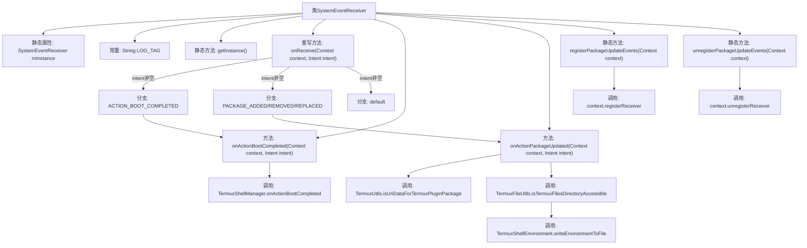

# 基础信息

|      |      |
|------|------|
| 名称 | SystemEventReceiver |
| 编码语言 | .java |
| 代码路径 | termux-app/app/src/main/java/com/termux/app/event/SystemEventReceiver.java |
| 包名 | com.termux.app.event |
| 依赖项 | ['android.content.BroadcastReceiver', 'android.content.Context', 'android.content.Intent', 'android.content.IntentFilter', 'android.net.Uri', 'androidx.annotation.NonNull', 'androidx.annotation.Nullable', 'com.termux.shared.data.IntentUtils', 'com.termux.shared.logger.Logger', 'com.termux.shared.termux.TermuxUtils', 'com.termux.shared.termux.file.TermuxFileUtils', 'com.termux.shared.termux.shell.command.environment.TermuxShellEnvironment', 'com.termux.shared.termux.shell.TermuxShellManager'] |
| 概述说明 | 系统事件接收器，处理启动和包更新广播。 |

# 说明

SystemEventReceiver是一个单例广播接收器，用于监听系统事件。它通过getInstance方法获取实例，并在onReceive中处理三种意图：开机完成、应用安装/卸载/更新。针对开机事件调用TermuxShellManager处理，针对应用变更事件检查是否为Termux插件包并更新环境文件。提供registerPackageUpdateEvents和unregisterPackageUpdateEvents方法动态注册/注销应用变更监听，以适配Android 8+限制。所有操作均线程安全且附带日志记录。

# 类列表 Class Summary

| 名称   | 类型  | 说明 |
|-------|------|-------------|
| SystemEventReceiver | class | 系统事件接收器，处理启动和包更新广播，动态注册监听。 |

## 类 SystemEventReceiver

|      |      |
|------|------|
| 访问范围 | public |
| 类型 | class |
| 名称 | SystemEventReceiver |
| 说明 | 系统事件接收器，处理启动和包更新广播，动态注册监听。 |

### UML类图

```mermaid
classDiagram
    class SystemEventReceiver {
        -SystemEventReceiver mInstance
        -String LOG_TAG
        +synchronized SystemEventReceiver getInstance()
        +void onReceive(Context context, Intent intent)
        +synchronized void onActionBootCompleted(Context context, Intent intent)
        +synchronized void onActionPackageUpdated(Context context, Intent intent)
        +synchronized static void registerPackageUpdateEvents(Context context)
        +synchronized static void unregisterPackageUpdateEvents(Context context)
    }

    class TermuxShellManager {
        +void onActionBootCompleted(Context context, Intent intent)
    }

    class TermuxUtils {
        +boolean isUriDataForTermuxPluginPackage(Uri data)
    }

    class TermuxFileUtils {
        +String isTermuxFilesDirectoryAccessible(Context context, boolean b1, boolean b2)
    }

    class TermuxShellEnvironment {
        +void writeEnvironmentToFile(Context context)
    }

    class Intent {
        <<Interface>>
        +String ACTION_BOOT_COMPLETED
        +String ACTION_PACKAGE_ADDED
        +String ACTION_PACKAGE_REMOVED
        +String ACTION_PACKAGE_REPLACED
        +String getAction()
        +Uri getData()
    }

    class Context {
        <<Interface>>
        +void registerReceiver(BroadcastReceiver receiver, IntentFilter filter)
        +void unregisterReceiver(BroadcastReceiver receiver)
    }

    class BroadcastReceiver {
        <<Interface>>
        +void onReceive(Context context, Intent intent)
    }

    SystemEventReceiver --> Intent : 解析
    SystemEventReceiver --> Context : 注册/注销广播
    SystemEventReceiver --> TermuxShellManager : 调用
    SystemEventReceiver --> TermuxUtils : 校验
    SystemEventReceiver --> TermuxFileUtils : 检查
    SystemEventReceiver --> TermuxShellEnvironment : 写入
    SystemEventReceiver ..|> BroadcastReceiver : 实现
```

这段代码描述了一个系统事件接收器`SystemEventReceiver`，它继承自`BroadcastReceiver`，用于监听系统广播事件（如启动完成、应用安装/卸载/更新）。采用单例模式确保全局唯一实例，通过同步方法保证线程安全。主要功能包括处理启动完成事件、包更新事件，并动态注册/注销广播接收器。与Termux相关组件交互，完成环境变量写入等操作。类图清晰展示了其与Android系统接口及其他工具类的依赖关系。

### 内部方法调用关系图

该流程图描述了SystemEventReceiver类的完整结构和工作流程。这个广播接收器采用单例模式，主要处理系统启动完成和包更新事件。核心流程包括：通过getInstance()获取实例，在onReceive()中根据不同的Intent动作分发处理，其中ACTION_BOOT_COMPLETED会触发TermuxShellManager，而包更新事件会验证URI并可能写入环境文件。还包含动态注册/注销广播接收器的方法，符合Android 8+的限制要求。所有关键方法都使用synchronized保证线程安全。

### 字段列表 Field List

| 名称  | 类型  | 说明 |
|-------|-------|------|
| LOG_TAG = "SystemEventReceiver" | String | 私有静态常量LOG_TAG值为SystemEventReceiver |
| mInstance | SystemEventReceiver | 私有静态系统事件接收器实例 |

### 方法列表 Method List

| 名称  | 类型  | 说明 |
|-------|-------|------|
| onReceive | void | 接收并处理特定系统广播事件，如启动完成和包更新。 |
| getInstance | SystemEventReceiver | 单例模式获取同步实例，空则新建。 |
| onActionBootCompleted | void | 同步方法处理启动完成事件，调用TermuxShellManager对应方法。 |
| onActionPackageUpdated | void | 同步方法处理Termux插件包更新，检查URI并记录日志，若目录可访问则更新环境文件。 |
| registerPackageUpdateEvents | void | 同步静态方法注册包更新事件监听，包含添加、移除、替换动作。 |
| unregisterPackageUpdateEvents | void | 同步静态方法，取消注册包更新事件接收器。 |

