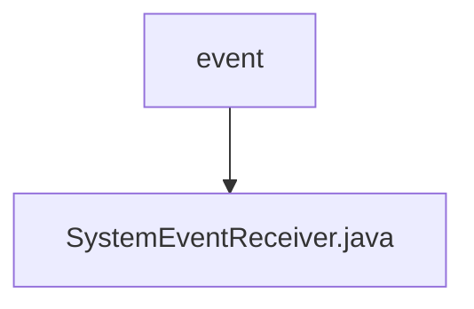

# 基础信息

|      |      |
|------|------|
| 名称 | event |
| 编码语言 | .java |
| 代码路径 | termux-app/app/src/main/java/com/termux/app/event |
| 包名 | termux-app.app.src.main.java.com.termux.app.event |
| 概述说明 | 系统事件接收器，处理启动和包更新广播。 |

# 说明

SystemEventReceiver是一个单例广播接收器，用于监听系统事件。它通过getInstance方法获取实例，并在onReceive中处理三种意图：开机完成、应用安装/卸载/更新。针对开机事件调用TermuxShellManager处理，针对应用变更事件检查是否为Termux插件包并更新环境文件。提供registerPackageUpdateEvents和unregisterPackageUpdateEvents方法动态注册/注销应用变更监听，以适配Android 8+限制。所有操作均线程安全且附带日志记录。

### 包内部结构视图

该流程图展示了Termux应用中事件处理模块的简单结构。根节点"event"表示事件处理目录，其下包含一个具体的系统事件接收器实现文件"SystemEventReceiver.java"。这种结构体现了单一职责原则，将系统事件接收功能独立封装在一个文件中，便于维护和扩展。

# 文件列表 File List

| 名称   | 类型  | 说明 |
|-------|------|-------------|
| [SystemEventReceiver.java](SystemEventReceiver.md) | file | 系统事件接收器，处理启动和包更新广播。 |

