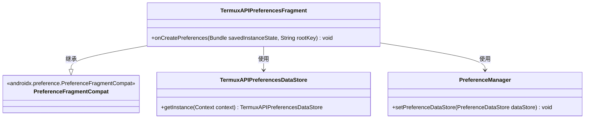
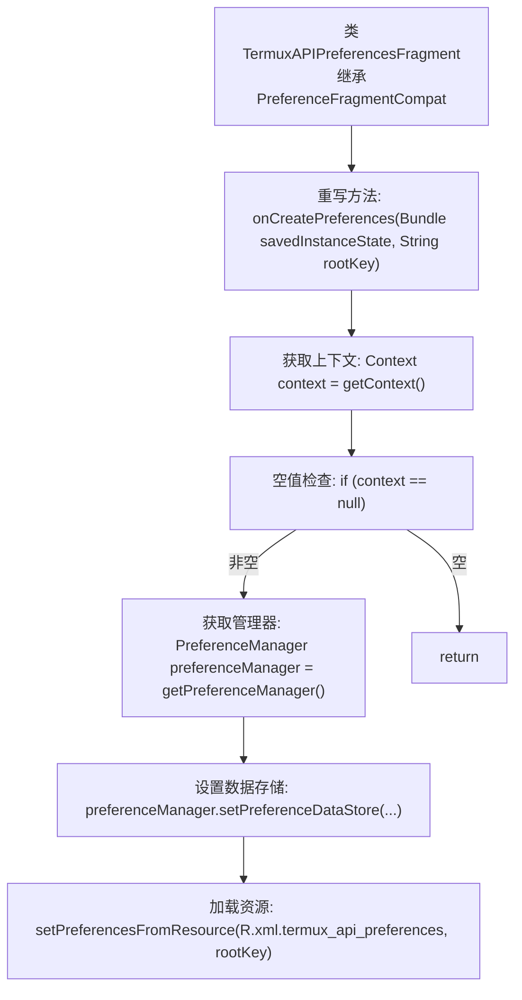
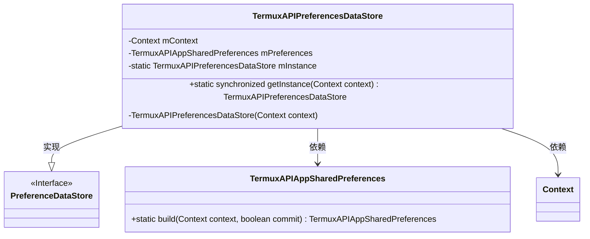
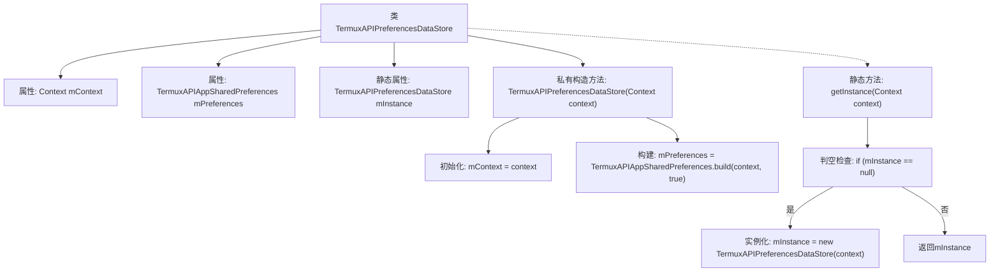

# 基础信息

|      |      |
|------|------|
| 名称 | TermuxAPIPreferencesFragment |
| 编码语言 | .java |
| 代码路径 | termux-app/app/src/main/java/com/termux/app/fragments/settings/TermuxAPIPreferencesFragment.java |
| 包名 | com.termux.app.fragments.settings |
| 依赖项 | ['android.content.Context', 'android.os.Bundle', 'androidx.annotation.Keep', 'androidx.preference.PreferenceDataStore', 'androidx.preference.PreferenceFragmentCompat', 'androidx.preference.PreferenceManager', 'com.termux.R', 'com.termux.shared.termux.settings.preferences.TermuxAPIAppSharedPreferences'] |
| 概述说明 | TermuxAPI偏好设置片段，使用单例数据存储加载XML配置。 |

# 说明

TermuxAPIPreferencesFragment继承PreferenceFragmentCompat，在onCreatePreferences中设置PreferenceManager的数据存储为TermuxAPIPreferencesDataStore实例，并从XML资源加载首选项。TermuxAPIPreferencesDataStore是单例类，通过私有构造方法初始化上下文和TermuxAPIAppSharedPreferences，提供静态getInstance方法获取唯一实例。

# 类列表 Class Summary

| 名称   | 类型  | 说明 |
|-------|------|-------------|
| TermuxAPIPreferencesFragment | class | TermuxAPI偏好设置片段，初始化数据存储并加载XML配置。 |
| TermuxAPIPreferencesDataStore | class | TermuxAPI偏好设置数据存储类，单例模式，管理应用共享偏好。 |

## 类 TermuxAPIPreferencesFragment

|      |      |
|------|------|
| 访问范围 | @Keep;public |
| 类型 | class |
| 名称 | TermuxAPIPreferencesFragment |
| 说明 | TermuxAPI偏好设置片段，初始化数据存储并加载XML配置。 |

### UML类图

类图描述：该图展示了TermuxAPIPreferencesFragment继承自PreferenceFragmentCompat，并通过PreferenceManager管理偏好设置数据存储的关系。TermuxAPIPreferencesFragment在onCreatePreferences方法中初始化时，会获取上下文并设置自定义的TermuxAPIPreferencesDataStore作为数据存储，最后从XML资源加载偏好设置。整个结构体现了Android偏好设置框架的典型用法，同时通过自定义DataStore实现了数据存储的扩展。

### 内部方法调用关系图

该流程图描述了TermuxAPIPreferencesFragment类的核心逻辑流程。首先通过getContext()获取上下文对象并进行空值检查，若有效则继续获取PreferenceManager并设置自定义数据存储TermuxAPIPreferencesDataStore，最后从XML资源加载偏好设置。整个过程体现了Android偏好设置片段的典型初始化模式，包含必要的空值防护和资源加载步骤。

### 字段列表 Field List

| 名称  | 类型  | 说明 |
|-------|-------|------|

### 方法列表 Method List

| 名称  | 类型  | 说明 |
|-------|-------|------|
| onCreatePreferences | void | 重写偏好设置方法，初始化数据存储并加载XML资源。 |

## 类 TermuxAPIPreferencesDataStore

|      |      |
|------|------|
| 访问范围 | None |
| 类型 | class |
| 名称 | TermuxAPIPreferencesDataStore |
| 说明 | TermuxAPI偏好设置数据存储类，单例模式，管理应用共享偏好。 |

### UML类图

这段代码展示了一个单例模式的偏好设置数据存储类TermuxAPIPreferencesDataStore，它继承自PreferenceDataStore接口。该类通过私有构造函数和静态getInstance方法确保全局唯一实例，并依赖TermuxAPIAppSharedPreferences来管理持久化数据。Context用于构建偏好设置实例，体现了Android开发中典型的依赖注入模式。类图清晰地反映了单例实现、接口继承和组件依赖关系。

### 内部方法调用关系图

该流程图展示了TermuxAPIPreferencesDataStore类的结构和关键方法调用关系。类包含两个私有属性和一个静态实例变量，通过私有构造方法初始化上下文和共享偏好设置。核心的getInstance()方法实现了线程安全的单例模式，首次调用时创建实例并缓存，后续直接返回已存在的实例。构造方法中会调用TermuxAPIAppSharedPreferences.build()进行偏好设置初始化。

### 字段列表 Field List

| 名称  | 类型  | 说明 |
|-------|-------|------|
| mContext | Context | 私有上下文变量mContext |
| mPreferences | TermuxAPIAppSharedPreferences | 私有TermuxAPIAppSharedPreferences变量mPreferences |
| mInstance | TermuxAPIPreferencesDataStore | 私有静态TermuxAPI偏好设置数据存储实例。 |

### 方法列表 Method List

| 名称  | 类型  | 说明 |
|-------|-------|------|
| getInstance | TermuxAPIPreferencesDataStore | 获取TermuxAPI单例实例，若不存在则创建。 |

