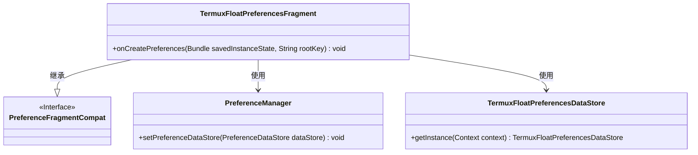
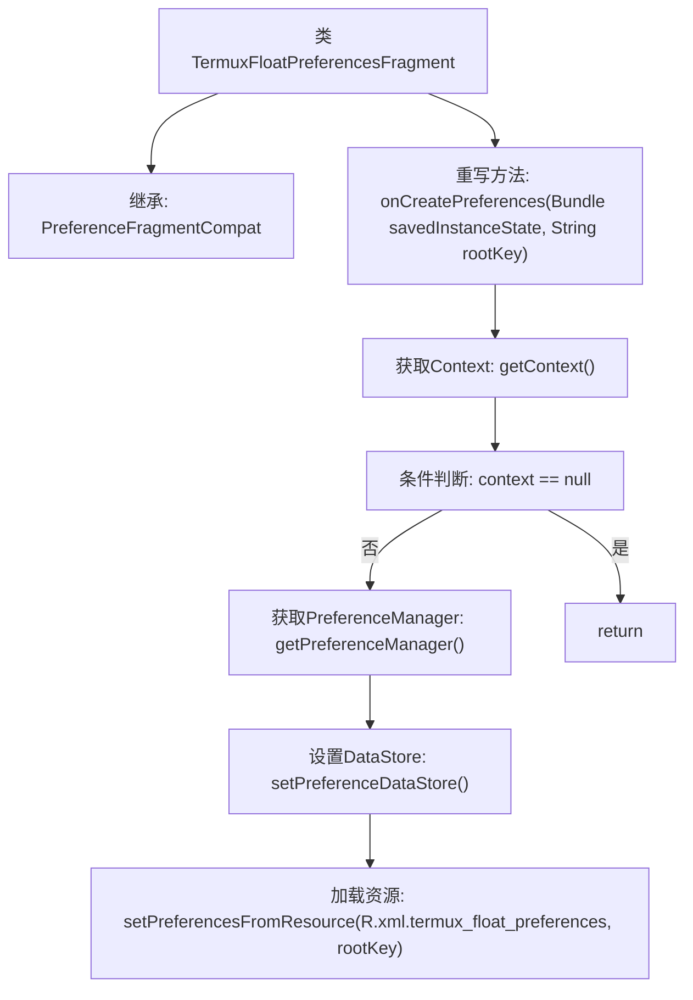
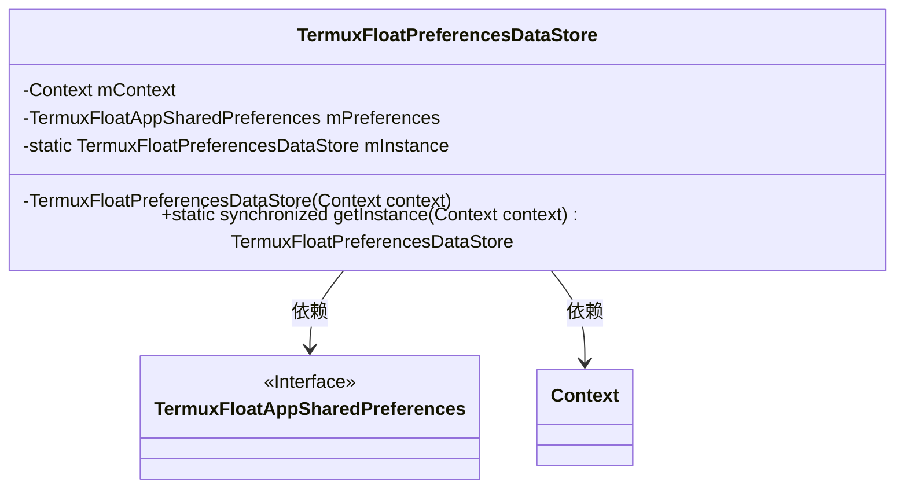
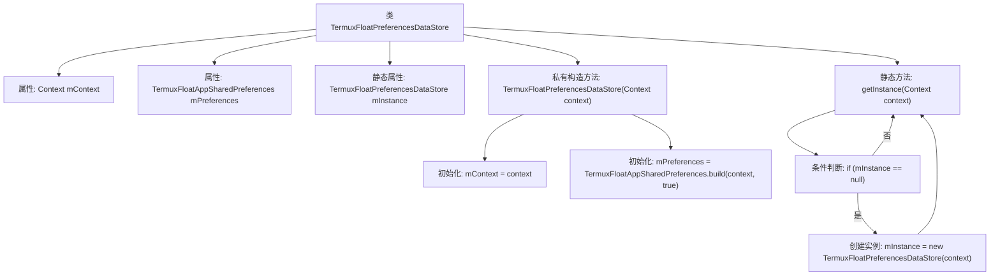

# 基础信息

|      |      |
|------|------|
| 名称 | TermuxFloatPreferencesFragment |
| 编码语言 | .java |
| 代码路径 | termux-app/app/src/main/java/com/termux/app/fragments/settings/TermuxFloatPreferencesFragment.java |
| 包名 | com.termux.app.fragments.settings |
| 依赖项 | ['android.content.Context', 'android.os.Bundle', 'androidx.annotation.Keep', 'androidx.preference.PreferenceDataStore', 'androidx.preference.PreferenceFragmentCompat', 'androidx.preference.PreferenceManager', 'com.termux.R', 'com.termux.shared.termux.settings.preferences.TermuxFloatAppSharedPreferences'] |
| 概述说明 | TermuxFloatPreferencesFragment管理浮动窗口偏好设置，使用单例数据存储类TermuxFloatPreferencesDataStore。 |

# 说明

该内容描述了两个Java类。TermuxFloatPreferencesFragment继承自PreferenceFragmentCompat，用于加载和管理首选项界面，通过TermuxFloatPreferencesDataStore实例设置数据存储，并从XML资源加载首选项。TermuxFloatPreferencesDataStore继承自PreferenceDataStore，采用单例模式，通过TermuxFloatAppSharedPreferences构建实例，用于持久化存储首选项数据。两个类协同工作，实现首选项的界面展示和数据存储功能。

# 类列表 Class Summary

| 名称   | 类型  | 说明 |
|-------|------|-------------|
| TermuxFloatPreferencesFragment | class | TermuxFloat偏好设置片段，管理应用浮动窗口配置。 |
| TermuxFloatPreferencesDataStore | class | TermuxFloatPreferencesDataStore类，单例模式管理TermuxFloatAppSharedPreferences。 |

## 类 TermuxFloatPreferencesFragment

|      |      |
|------|------|
| 访问范围 | @Keep;public |
| 类型 | class |
| 名称 | TermuxFloatPreferencesFragment |
| 说明 | TermuxFloat偏好设置片段，管理应用浮动窗口配置。 |

### UML类图

这段代码展示了一个Android偏好设置片段`TermuxFloatPreferencesFragment`，它继承自`PreferenceFragmentCompat`接口，用于管理应用的偏好设置。在`onCreatePreferences`方法中，它首先检查上下文是否存在，然后通过`PreferenceManager`设置自定义的数据存储`TermuxFloatPreferencesDataStore`，最后从XML资源加载偏好设置。类图清晰地展示了继承关系和使用关系，突出了核心组件之间的交互方式。

### 内部方法调用关系图

这段代码流程图展示了TermuxFloatPreferencesFragment类的核心逻辑。该类继承PreferenceFragmentCompat并重写onCreatePreferences方法，首先获取上下文对象进行空值检查，然后初始化PreferenceManager并设置自定义数据存储TermuxFloatPreferencesDataStore，最后从XML资源加载偏好设置。流程清晰展现了Android偏好设置的初始化过程，包含关键的空值保护机制和数据存储绑定操作。

### 字段列表 Field List

| 名称  | 类型  | 说明 |
|-------|-------|------|

### 方法列表 Method List

| 名称  | 类型  | 说明 |
|-------|-------|------|
| onCreatePreferences | void | 重写方法，设置偏好数据存储并加载XML资源。 |

## 类 TermuxFloatPreferencesDataStore

|      |      |
|------|------|
| 访问范围 | None |
| 类型 | class |
| 名称 | TermuxFloatPreferencesDataStore |
| 说明 | TermuxFloatPreferencesDataStore类，单例模式管理TermuxFloatAppSharedPreferences。 |

### UML类图

这段类图展示了TermuxFloatPreferencesDataStore类的结构，它是一个单例模式实现的数据存储类，用于管理Termux浮动窗口应用的偏好设置。该类包含私有构造方法和静态实例获取方法，通过TermuxFloatAppSharedPreferences接口与底层存储交互，并依赖Android的Context对象进行初始化。图中清晰地呈现了类成员、方法可见性以及与其他组件的关系。

### 内部方法调用关系图

该流程图展示了TermuxFloatPreferencesDataStore类的结构及其关键方法调用关系。类包含两个实例属性和一个静态属性，通过私有构造方法初始化上下文和偏好设置对象。核心静态方法getInstance()实现了单例模式，通过同步锁确保线程安全，在首次调用时创建实例并缓存，后续调用直接返回缓存实例。流程清晰展现了对象初始化和单例控制的逻辑分支。

### 字段列表 Field List

| 名称  | 类型  | 说明 |
|-------|-------|------|
| mContext | Context | 私有上下文变量mContext |
| mPreferences | TermuxFloatAppSharedPreferences | 私有Termux浮动应用偏好设置实例 |
| mInstance | TermuxFloatPreferencesDataStore | 私有静态TermuxFloatPreferencesDataStore实例 |

### 方法列表 Method List

| 名称  | 类型  | 说明 |
|-------|-------|------|
| getInstance | TermuxFloatPreferencesDataStore | 单例模式获取TermuxFloatPreferencesDataStore实例，线程安全。 |

