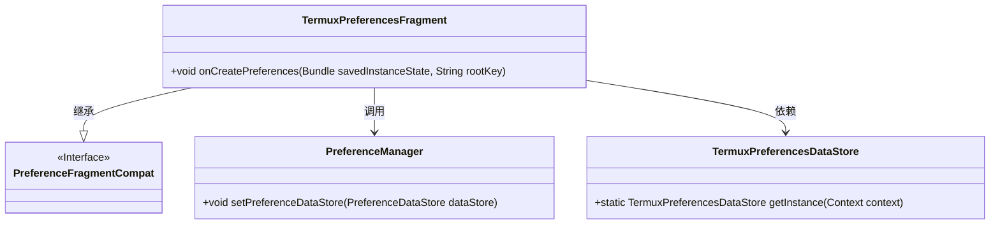
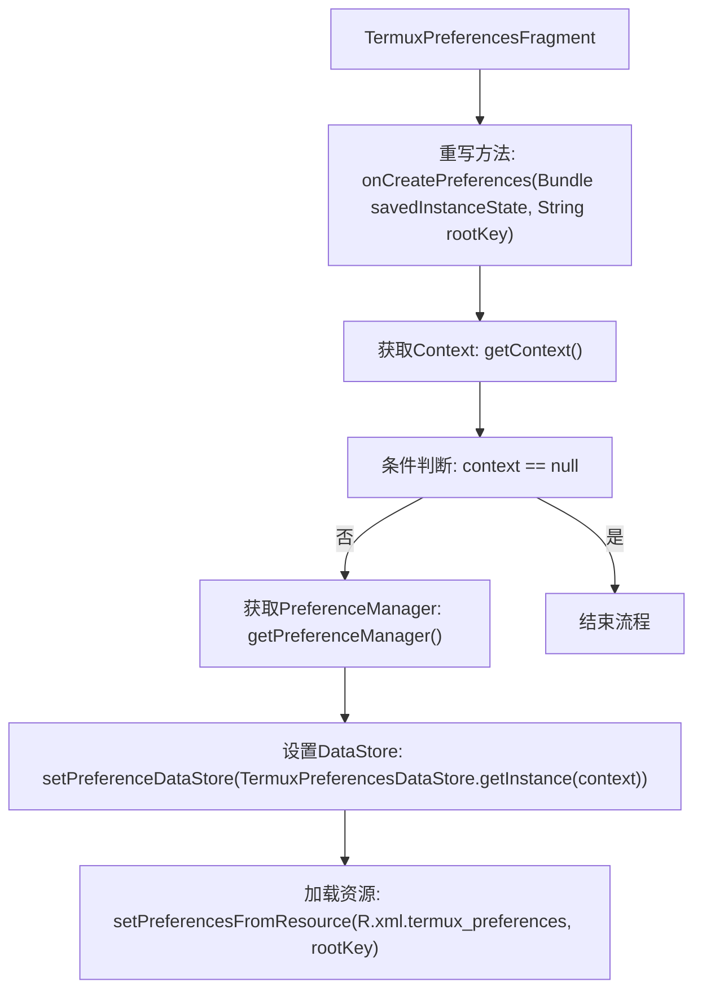
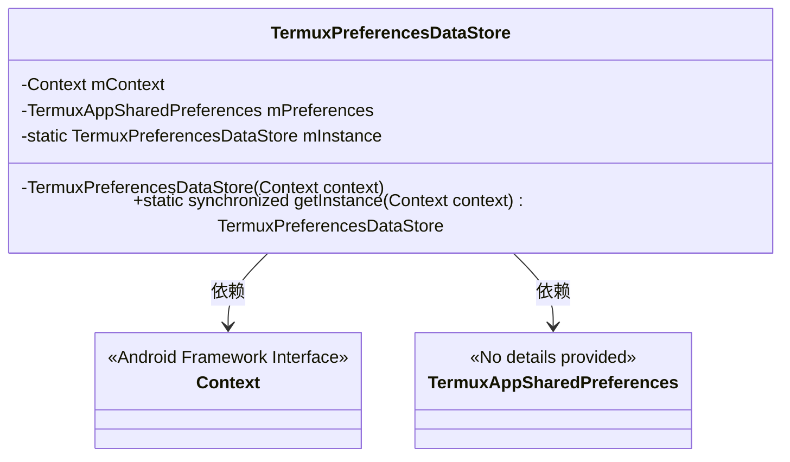
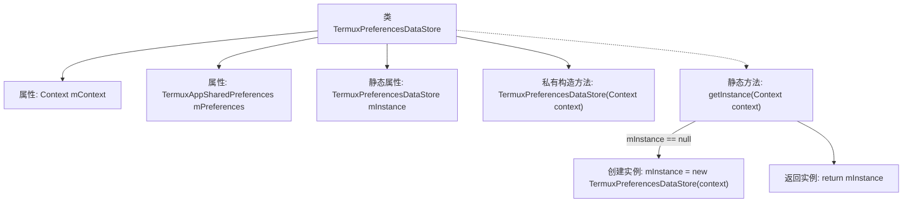

# 基础信息

|      |      |
|------|------|
| 名称 | TermuxPreferencesFragment |
| 编码语言 | .java |
| 代码路径 | termux-app/app/src/main/java/com/termux/app/fragments/settings/TermuxPreferencesFragment.java |
| 包名 | com.termux.app.fragments.settings |
| 依赖项 | ['android.content.Context', 'android.os.Bundle', 'androidx.annotation.Keep', 'androidx.preference.PreferenceDataStore', 'androidx.preference.PreferenceFragmentCompat', 'androidx.preference.PreferenceManager', 'com.termux.R', 'com.termux.shared.termux.settings.preferences.TermuxAppSharedPreferences'] |
| 概述说明 | Termux偏好设置片段和数据存储类实现。 |

# 说明

TermuxPreferencesFragment继承PreferenceFragmentCompat，在onCreatePreferences方法中设置PreferenceManager的数据存储为TermuxPreferencesDataStore实例，并从XML资源加载首选项。TermuxPreferencesDataStore是单例类，通过getInstance获取实例，内部使用TermuxAppSharedPreferences存储数据，构造函数接收Context并初始化共享首选项。

# 类列表 Class Summary

| 名称   | 类型  | 说明 |
|-------|------|-------------|
| TermuxPreferencesFragment | class | Termux偏好设置片段类，初始化并加载XML配置。 |
| TermuxPreferencesDataStore | class | Termux偏好设置数据存储类，单例模式，管理应用偏好。 |

## 类 TermuxPreferencesFragment

|      |      |
|------|------|
| 访问范围 | @Keep;public |
| 类型 | class |
| 名称 | TermuxPreferencesFragment |
| 说明 | Termux偏好设置片段类，初始化并加载XML配置。 |

### UML类图

类图描述：该图展示了TermuxPreferencesFragment继承自PreferenceFragmentCompat接口，并在onCreatePreferences方法中调用PreferenceManager设置数据存储，同时依赖TermuxPreferencesDataStore获取实例。整体结构体现了Android偏好设置的典型实现方式，通过数据存储分离实现配置持久化，符合单一职责原则。

### 内部方法调用关系图

该流程图描述了TermuxPreferencesFragment类的核心逻辑流程。首先重写onCreatePreferences方法，获取上下文环境后进行非空校验，若有效则初始化PreferenceManager并设置自定义的TermuxPreferencesDataStore，最后从XML资源加载偏好设置。整个过程体现了Android偏好设置的典型初始化模式，包含资源加载、数据存储绑定和空值防护等关键步骤。

### 字段列表 Field List

| 名称  | 类型  | 说明 |
|-------|-------|------|

### 方法列表 Method List

| 名称  | 类型  | 说明 |
|-------|-------|------|
| onCreatePreferences | void | 重写Android偏好设置方法，初始化数据存储并加载XML资源。 |

## 类 TermuxPreferencesDataStore

|      |      |
|------|------|
| 访问范围 | None |
| 类型 | class |
| 名称 | TermuxPreferencesDataStore |
| 说明 | Termux偏好设置数据存储类，单例模式，管理应用偏好。 |

### UML类图

这段类图展示了TermuxPreferencesDataStore类的结构，它是一个单例模式的偏好设置数据存储类。该类私有持有Context和TermuxAppSharedPreferences实例，通过静态同步方法getInstance()获取唯一实例。TermuxAppSharedPreferences是用于构建偏好设置的工具类，Context是Android框架提供的系统上下文接口。类图中清晰地表现了依赖关系和单例实现方式。

### 内部方法调用关系图

这段代码展示了一个单例模式的实现，用于管理Termux应用的偏好设置数据存储。类中包含私有构造方法和静态获取实例方法，确保全局唯一实例。流程图清晰展示了类的属性结构、构造方法初始化过程以及通过getInstance()方法控制实例创建的线程安全逻辑，其中包含条件判断和实例返回的完整流程。

### 字段列表 Field List

| 名称  | 类型  | 说明 |
|-------|-------|------|
| mContext | Context | 私有上下文变量mContext |
| mPreferences | TermuxAppSharedPreferences | 私有Termux应用偏好设置对象 |
| mInstance | TermuxPreferencesDataStore | 私有静态TermuxPreferencesDataStore实例mInstance。 |

### 方法列表 Method List

| 名称  | 类型  | 说明 |
|-------|-------|------|
| getInstance | TermuxPreferencesDataStore | 单例模式获取TermuxPreferencesDataStore实例，线程安全。 |

