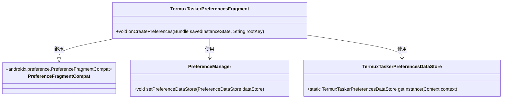
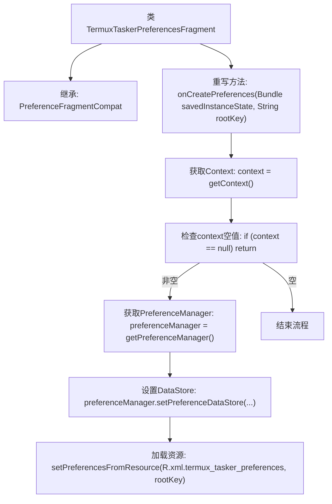
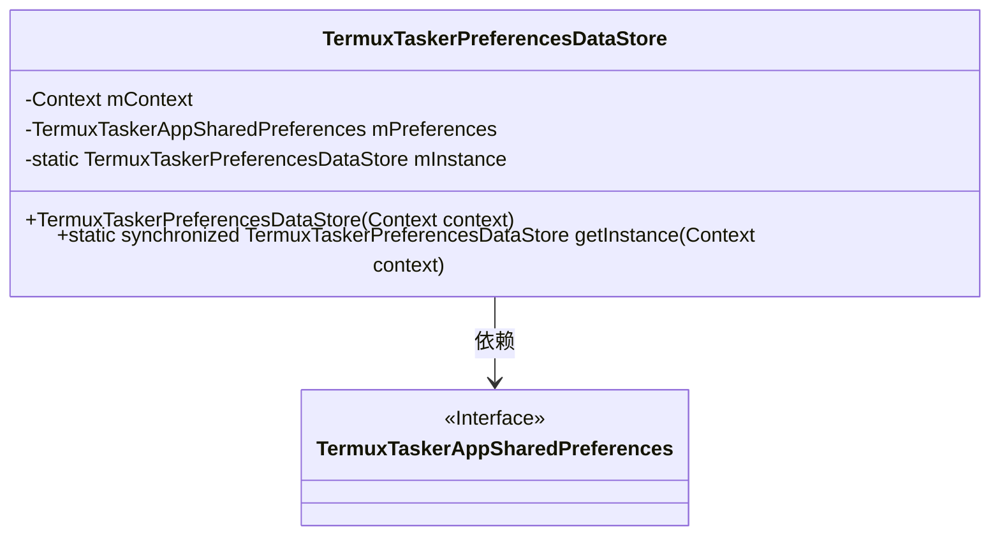
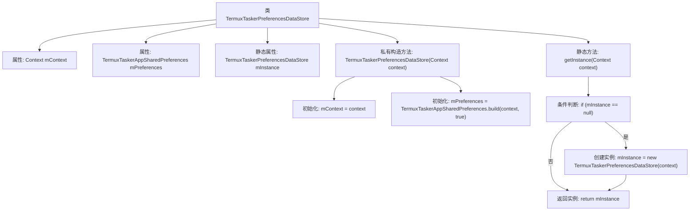

# 基础信息

|      |      |
|------|------|
| 名称 | TermuxTaskerPreferencesFragment |
| 编码语言 | .java |
| 代码路径 | termux-app/app/src/main/java/com/termux/app/fragments/settings/TermuxTaskerPreferencesFragment.java |
| 包名 | com.termux.app.fragments.settings |
| 依赖项 | ['android.content.Context', 'android.os.Bundle', 'androidx.annotation.Keep', 'androidx.preference.PreferenceDataStore', 'androidx.preference.PreferenceFragmentCompat', 'androidx.preference.PreferenceManager', 'com.termux.R', 'com.termux.shared.termux.settings.preferences.TermuxTaskerAppSharedPreferences'] |
| 概述说明 | TermuxTasker偏好设置片段和数据存储类实现。 |

# 说明

TermuxTaskerPreferencesFragment继承PreferenceFragmentCompat，在onCreatePreferences中设置PreferenceDataStore为TermuxTaskerPreferencesDataStore实例，并从XML资源加载偏好设置。TermuxTaskerPreferencesDataStore是单例类，通过build方法初始化TermuxTaskerAppSharedPreferences，提供静态getInstance方法获取实例。

# 类列表 Class Summary

| 名称   | 类型  | 说明 |
|-------|------|-------------|
| TermuxTaskerPreferencesFragment | class | TermuxTasker偏好设置片段，初始化上下文和数据存储并加载XML资源。 |
| TermuxTaskerPreferencesDataStore | class | TermuxTasker偏好设置数据存储类，单例模式，管理应用配置。 |

## 类 TermuxTaskerPreferencesFragment

|      |      |
|------|------|
| 访问范围 | @Keep;public |
| 类型 | class |
| 名称 | TermuxTaskerPreferencesFragment |
| 说明 | TermuxTasker偏好设置片段，初始化上下文和数据存储并加载XML资源。 |

### UML类图

这段代码展示了一个Android偏好设置片段TermuxTaskerPreferencesFragment的实现，它继承自PreferenceFragmentCompat类。在onCreatePreferences方法中，它首先检查上下文是否存在，然后获取PreferenceManager实例并设置自定义的数据存储TermuxTaskerPreferencesDataStore，最后从XML资源加载偏好设置。该设计遵循Android偏好设置的架构，通过数据存储实现偏好设置的持久化，适合需要定制化偏好存储的场景。

### 内部方法调用关系图

该流程图描述了TermuxTaskerPreferencesFragment类的配置加载过程。首先检查上下文有效性，若存在则初始化PreferenceManager并设置自定义数据存储TermuxTaskerPreferencesDataStore，最后从XML资源加载偏好设置。整个过程体现了Android偏好设置的典型初始化流程，包含空值安全检查和数据存储绑定等关键步骤，确保配置管理的可靠性和可扩展性。

### 字段列表 Field List

| 名称  | 类型  | 说明 |
|-------|-------|------|

### 方法列表 Method List

| 名称  | 类型  | 说明 |
|-------|-------|------|
| onCreatePreferences | void | 重写偏好设置方法，初始化数据存储并加载XML配置。 |

## 类 TermuxTaskerPreferencesDataStore

|      |      |
|------|------|
| 访问范围 | None |
| 类型 | class |
| 名称 | TermuxTaskerPreferencesDataStore |
| 说明 | TermuxTasker偏好设置数据存储类，单例模式，管理应用配置。 |

### UML类图

这段代码展示了一个单例模式的偏好设置数据存储类TermuxTaskerPreferencesDataStore，它继承自PreferenceDataStore。该类通过私有构造函数和静态getInstance方法确保全局唯一实例，并依赖TermuxTaskerAppSharedPreferences接口来管理应用偏好设置。类图中清晰地体现了单例模式的实现方式及其与偏好设置接口的依赖关系。

### 内部方法调用关系图

该流程图展示了TermuxTaskerPreferencesDataStore类的结构及其关键方法调用关系。类包含三个私有属性（mContext、mPreferences和静态mInstance），通过私有构造方法初始化前两个属性。核心方法getInstance()采用单例模式，首次调用时创建实例并缓存，后续直接返回缓存实例。构造方法中会调用TermuxTaskerAppSharedPreferences.build()进行偏好设置初始化，整个过程体现了线程安全的单例实现模式。

### 字段列表 Field List

| 名称  | 类型  | 说明 |
|-------|-------|------|
| mPreferences | TermuxTaskerAppSharedPreferences | 私有TermuxTaskerApp共享偏好设置mPreferences |
| mContext | Context | 私有上下文变量mContext |
| mInstance | TermuxTaskerPreferencesDataStore | 私有静态TermuxTaskerPreferencesDataStore实例mInstance |

### 方法列表 Method List

| 名称  | 类型  | 说明 |
|-------|-------|------|
| getInstance | TermuxTaskerPreferencesDataStore | 静态同步方法获取单例实例，若空则新建。 |

