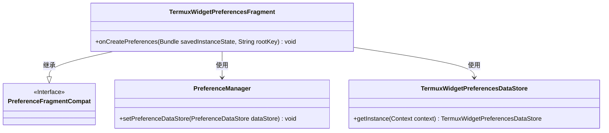
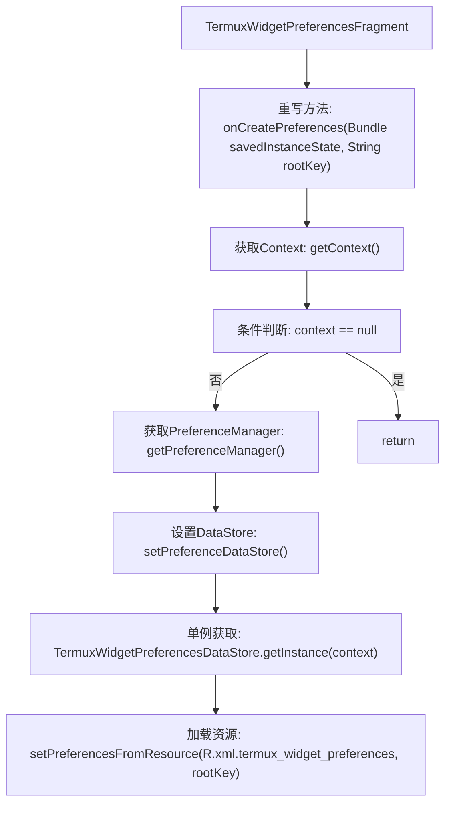
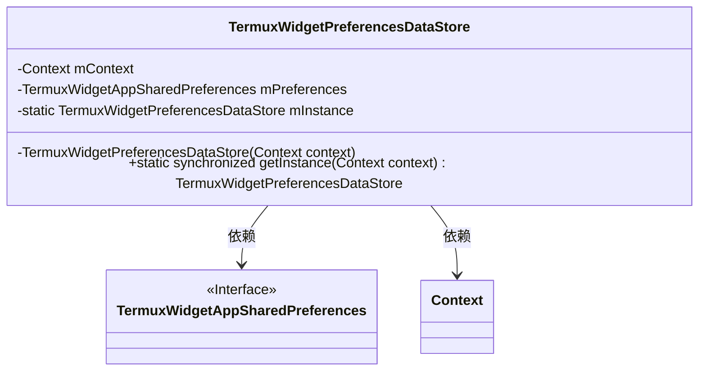
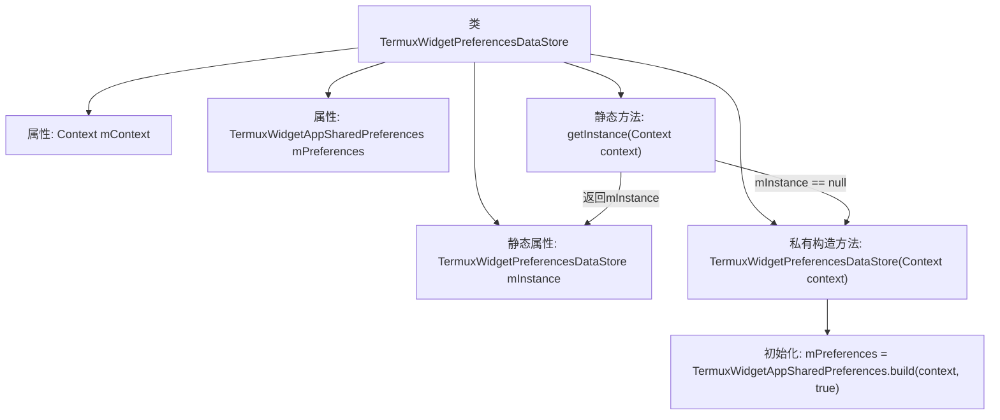

# 基础信息

|      |      |
|------|------|
| 名称 | TermuxWidgetPreferencesFragment |
| 编码语言 | .java |
| 代码路径 | termux-app/app/src/main/java/com/termux/app/fragments/settings/TermuxWidgetPreferencesFragment.java |
| 包名 | com.termux.app.fragments.settings |
| 依赖项 | ['android.content.Context', 'android.os.Bundle', 'androidx.annotation.Keep', 'androidx.preference.PreferenceDataStore', 'androidx.preference.PreferenceFragmentCompat', 'androidx.preference.PreferenceManager', 'com.termux.R', 'com.termux.shared.termux.settings.preferences.TermuxWidgetAppSharedPreferences'] |
| 概述说明 | Termux小部件偏好设置片段和数据存储类。 |

# 说明

TermuxWidgetPreferencesFragment继承PreferenceFragmentCompat，在onCreatePreferences中设置PreferenceManager的数据存储为TermuxWidgetPreferencesDataStore实例，并从XML资源加载偏好设置。TermuxWidgetPreferencesDataStore是单例类，通过私有构造方法初始化上下文和TermuxWidgetAppSharedPreferences，提供静态getInstance方法获取实例。

# 类列表 Class Summary

| 名称   | 类型  | 说明 |
|-------|------|-------------|
| TermuxWidgetPreferencesFragment | class | Termux部件偏好设置片段，加载XML配置并初始化数据存储。 |
| TermuxWidgetPreferencesDataStore | class | Termux小部件偏好设置数据存储类，单例模式，管理共享偏好。 |

## 类 TermuxWidgetPreferencesFragment

|      |      |
|------|------|
| 访问范围 | @Keep;public |
| 类型 | class |
| 名称 | TermuxWidgetPreferencesFragment |
| 说明 | Termux部件偏好设置片段，加载XML配置并初始化数据存储。 |

### UML类图

这段类图展示了TermuxWidgetPreferencesFragment继承自PreferenceFragmentCompat接口，并依赖于PreferenceManager和TermuxWidgetPreferencesDataStore两个类。主要功能是通过onCreatePreferences方法初始化偏好设置，其中PreferenceManager用于管理偏好设置，TermuxWidgetPreferencesDataStore作为数据存储的实例。该结构体现了Android偏好设置界面的典型实现方式，通过数据存储分离实现数据持久化。

### 内部方法调用关系图

该流程图描述了TermuxWidgetPreferencesFragment类的配置初始化流程。首先通过getContext()获取上下文对象并进行非空校验，随后获取PreferenceManager并设置自定义的TermuxWidgetPreferencesDataStore数据存储实例，最后从XML资源加载偏好设置。整个过程体现了Android偏好设置片段的典型初始化模式，包含数据存储绑定和资源加载两个关键阶段。

### 字段列表 Field List

| 名称  | 类型  | 说明 |
|-------|-------|------|

### 方法列表 Method List

| 名称  | 类型  | 说明 |
|-------|-------|------|
| onCreatePreferences | void | 重写偏好设置创建方法，初始化数据存储并加载XML配置。 |

## 类 TermuxWidgetPreferencesDataStore

|      |      |
|------|------|
| 访问范围 | None |
| 类型 | class |
| 名称 | TermuxWidgetPreferencesDataStore |
| 说明 | Termux小部件偏好设置数据存储类，单例模式，管理共享偏好。 |

### UML类图

这段类图展示了TermuxWidgetPreferencesDataStore类的结构，它是一个单例模式实现，通过私有构造方法和静态getInstance()方法确保全局唯一实例。该类持有Context对象和TermuxWidgetAppSharedPreferences接口实例，用于管理应用偏好设置数据存储。箭头表示TermuxWidgetPreferencesDataStore依赖于这两个外部类型来完成其功能。

### 内部方法调用关系图

这段代码展示了一个单例模式的偏好设置数据存储类TermuxWidgetPreferencesDataStore，继承自PreferenceDataStore。类中包含两个私有属性（mContext和mPreferences）和一个静态实例mInstance。通过私有构造方法初始化配置，并提供线程安全的getInstance()方法获取唯一实例。流程图清晰呈现了类的结构、属性关系以及单例初始化的条件判断流程。

### 字段列表 Field List

| 名称  | 类型  | 说明 |
|-------|-------|------|
| mContext | Context | 私有上下文变量mContext |
| mPreferences | TermuxWidgetAppSharedPreferences | 私有Termux组件共享偏好实例mPreferences |
| mInstance | TermuxWidgetPreferencesDataStore | 私有静态TermuxWidgetPreferencesDataStore实例 |

### 方法列表 Method List

| 名称  | 类型  | 说明 |
|-------|-------|------|
| getInstance | TermuxWidgetPreferencesDataStore | 获取TermuxWidgetPreferencesDataStore单例实例，若不存在则创建。 |

