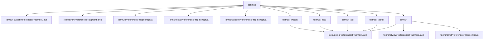

# 基础信息

|      |      |
|------|------|
| 名称 | settings |
| 编码语言 | .java |
| 代码路径 | termux-app/app/src/main/java/com/termux/app/fragments/settings |
| 包名 | termux-app.app.src.main.java.com.termux.app.fragments.settings |
| 概述说明 | Termux偏好设置模块，包含多个继承PreferenceFragmentCompat的片段及单例数据存储类，用于管理调试、终端视图等配置。 |

# 说明

## 概述

该代码模块是Termux应用中的偏好设置管理模块，主要由多个继承自`PreferenceFragmentCompat`的片段类及其对应的`PreferenceDataStore`实现类组成。这些类采用单例模式管理偏好数据存储，通过各自的`XXXAppSharedPreferences`实现数据持久化。模块涵盖了Termux应用及其插件（Tasker、API、Float、Widget等）的偏好设置管理，以及调试相关的配置功能。

## 主要业务场景

1. **Termux核心偏好设置**
   - `TermuxPreferencesFragment`管理Termux主应用的偏好设置界面
   - 通过`TermuxPreferencesDataStore`与`TermuxAppSharedPreferences`交互实现数据持久化

2. **插件偏好设置**
   - `TermuxTaskerPreferencesFragment`：管理Termux与Tasker集成的偏好设置
   - `TermuxAPIPreferencesFragment`：处理Termux API相关的配置
   - `TermuxFloatPreferencesFragment`：控制浮动终端相关偏好
   - `TermuxWidgetPreferencesFragment`：管理小部件相关设置
   - 各插件均通过对应的`XXXPreferencesDataStore`实现数据存储

3. **调试配置管理**
   - `DebuggingPreferencesFragment`提供统一的调试配置界面
   - 支持日志级别设置、终端视图按键日志等调试选项
   - 通过`DebuggingPreferencesDataStore`与各插件的`XXXAppSharedPreferences`交互
   - 可针对不同组件（Tasker、API、Float、Widget等）分别配置调试选项

4. **数据存储架构**
   - 采用单例模式的`XXXPreferencesDataStore`类统一管理偏好数据
   - 通过`PreferenceDataStore`接口实现与偏好界面的数据绑定
   - 各模块使用专用的`XXXAppSharedPreferences`进行数据持久化
   - 提供静态`getInstance()`方法获取数据存储实例

### 包内部结构视图

该流程图展示了Termux应用设置模块的层级结构。根节点"settings"包含5个直接子文件（各类偏好设置片段）和5个子目录（termux相关模块）。每个子目录下都包含一个DebuggingPreferencesFragment.java文件，而termux目录额外包含两个终端相关偏好设置片段。结构清晰地反映了不同功能模块的偏好设置组织方式。

# 文件列表 File List

| 名称   | 类型  | 说明 |
|-------|------|-------------|
| [TermuxAPIPreferencesFragment.java](TermuxAPIPreferencesFragment.md) | file | TermuxAPI偏好设置片段，使用单例数据存储加载XML配置。 |
| [TermuxTaskerPreferencesFragment.java](TermuxTaskerPreferencesFragment.md) | file | TermuxTasker偏好设置片段和数据存储类实现。 |
| [TermuxWidgetPreferencesFragment.java](TermuxWidgetPreferencesFragment.md) | file | Termux小部件偏好设置片段和数据存储类。 |
| [TermuxFloatPreferencesFragment.java](TermuxFloatPreferencesFragment.md) | file | TermuxFloatPreferencesFragment管理浮动窗口偏好设置，使用单例数据存储类TermuxFloatPreferencesDataStore。 |
| [TermuxPreferencesFragment.java](TermuxPreferencesFragment.md) | file | Termux偏好设置片段和数据存储类实现。 |
| [termux](termux/_module.md) | package | DebuggingPreferencesFragment管理调试设置，TerminalViewPreferencesFragment处理终端视图偏好，TerminalIOPreferencesFragment管理终端IO设置，均使用单例数据存储类。 |
| [termux_tasker](termux_tasker/_module.md) | package | 调试偏好设置片段，管理日志级别配置和数据存储。 |
| [termux_api](termux_api/_module.md) | package | 调试偏好设置片段，管理日志级别配置，使用单例数据存储。 |
| [termux_float](termux_float/_module.md) | package | 调试偏好设置片段，管理日志级别和终端视图键记录。 |
| [termux_widget](termux_widget/_module.md) | package | 调试偏好设置片段类，管理日志级别配置和数据存储。 |

