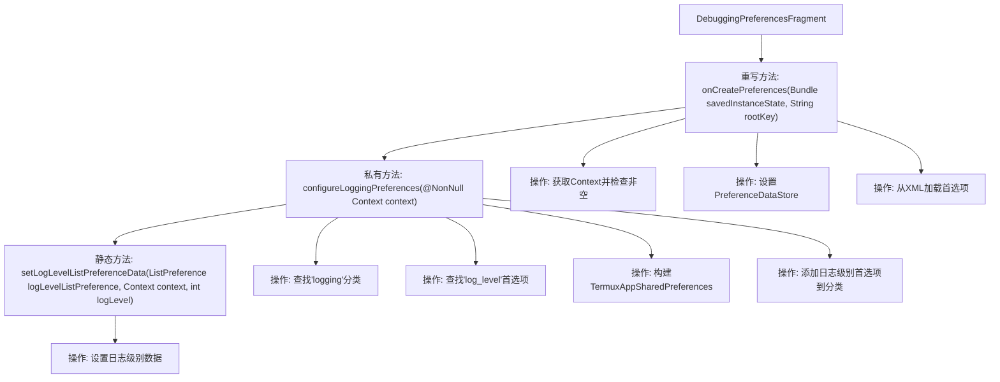
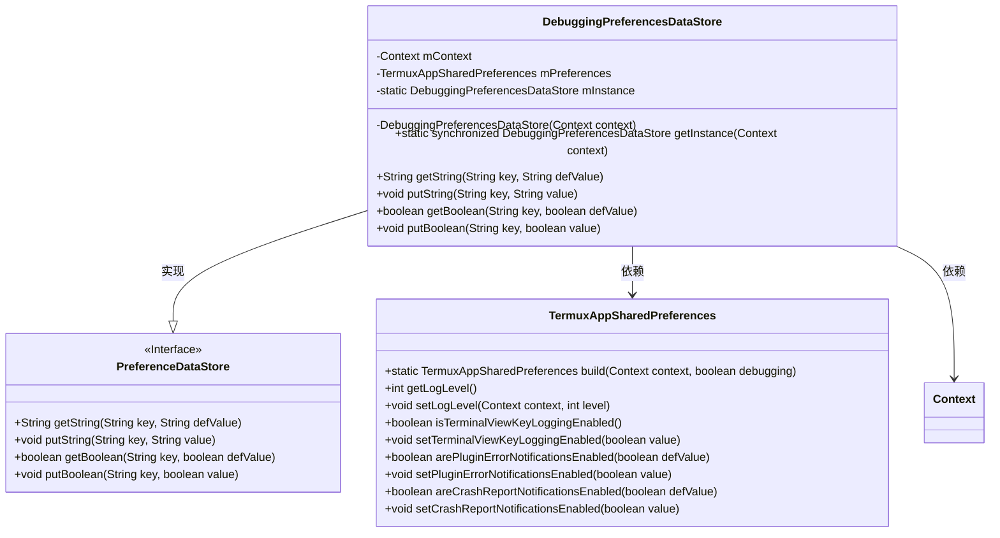
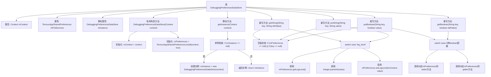

# 基础信息

|      |      |
|------|------|
| 名称 | DebuggingPreferencesFragment |
| 编码语言 | .java |
| 代码路径 | termux-app/app/src/main/java/com/termux/app/fragments/settings/termux/DebuggingPreferencesFragment.java |
| 包名 | com.termux.app.fragments.settings.termux |
| 依赖项 | ['android.content.Context', 'android.os.Bundle', 'androidx.annotation.Keep', 'androidx.annotation.NonNull', 'androidx.annotation.Nullable', 'androidx.preference.ListPreference', 'androidx.preference.PreferenceCategory', 'androidx.preference.PreferenceDataStore', 'androidx.preference.PreferenceFragmentCompat', 'androidx.preference.PreferenceManager', 'com.termux.R', 'com.termux.shared.termux.settings.preferences.TermuxAppSharedPreferences', 'com.termux.shared.logger.Logger'] |
| 概述说明 | 调试偏好设置片段，管理日志级别和终端视图键日志等选项。 |

# 说明

DebuggingPreferencesFragment继承自PreferenceFragmentCompat，用于管理调试偏好设置。在onCreatePreferences中初始化上下文和PreferenceManager，设置数据存储为DebuggingPreferencesDataStore实例，并加载XML资源。configureLoggingPreferences方法配置日志级别选项，通过TermuxAppSharedPreferences获取当前日志级别并设置列表选项。DebuggingPreferencesDataStore是单例类，负责处理字符串和布尔类型的偏好设置读写操作，包括日志级别、终端按键日志、插件错误通知和崩溃报告通知等功能的启用状态。

# 类列表 Class Summary

| 名称   | 类型  | 说明 |
|-------|------|-------------|
| DebuggingPreferencesFragment | class | 调试偏好设置片段类，管理日志级别配置。 |
| DebuggingPreferencesDataStore | class | 调试偏好存储类，单例模式管理日志级别及布尔型设置项。 |

## 类 DebuggingPreferencesFragment

|      |      |
|------|------|
| 访问范围 | @Keep;public |
| 类型 | class |
| 名称 | DebuggingPreferencesFragment |
| 说明 | 调试偏好设置片段类，管理日志级别配置。 |

### UML类图

```mermaid
classDiagram
    class DebuggingPreferencesFragment {
        +onCreatePreferences(Bundle savedInstanceState, String rootKey) void
        -configureLoggingPreferences(Context context) void
        +setLogLevelListPreferenceData(ListPreference logLevelListPreference, Context context, int logLevel) ListPreference
    }

    class PreferenceFragmentCompat {
        <<Interface>>
    }

    class Context {
        <<Interface>>
    }

    class PreferenceManager {
        +setPreferenceDataStore(PreferenceDataStore dataStore) void
    }

    class DebuggingPreferencesDataStore {
        +getInstance(Context context) DebuggingPreferencesDataStore
    }

    class TermuxAppSharedPreferences {
        +build(Context context, boolean commitToFile) TermuxAppSharedPreferences
        +getLogLevel() int
    }

    class Logger {
        <<Interface>>
        +getLogLevelsArray() CharSequence[]
        +getLogLevelLabelsArray(Context context, CharSequence[] logLevels, boolean addDefaultLabel) CharSequence[]
        +DEFAULT_LOG_LEVEL int
    }

    class ListPreference {
        +setEntryValues(CharSequence[] entryValues) void
        +setEntries(CharSequence[] entries) void
        +setValue(String value) void
        +setDefaultValue(Object defaultValue) void
    }

    class PreferenceCategory {
        +addPreference(Preference preference) void
    }

    DebuggingPreferencesFragment --> PreferenceFragmentCompat : 继承
    DebuggingPreferencesFragment --> Context : 使用
    DebuggingPreferencesFragment --> PreferenceManager : 使用
    DebuggingPreferencesFragment --> DebuggingPreferencesDataStore : 使用
    DebuggingPreferencesFragment --> TermuxAppSharedPreferences : 使用
    DebuggingPreferencesFragment --> Logger : 使用
    DebuggingPreferencesFragment --> ListPreference : 创建/修改
    DebuggingPreferencesFragment --> PreferenceCategory : 使用
    PreferenceManager --> DebuggingPreferencesDataStore : 设置数据存储
    TermuxAppSharedPreferences --> Context : 依赖
    Logger --> Context : 依赖
```

这段代码展示了一个Android偏好设置片段`DebuggingPreferencesFragment`，用于管理调试相关的偏好设置。该类继承自`PreferenceFragmentCompat`，主要功能包括初始化偏好设置管理器、从XML资源加载偏好设置、配置日志级别选项。通过`TermuxAppSharedPreferences`获取当前日志级别，使用`Logger`类提供的日志级别数据填充`ListPreference`控件，最终将控件添加到`PreferenceCategory`中。整个流程涉及多个Android组件和自定义类的协作，实现了动态偏好设置界面的构建。

### 内部方法调用关系图

这段代码流程图展示了DebuggingPreferencesFragment类的核心逻辑流程。该片段主要负责处理调试相关的偏好设置，首先在onCreatePreferences中初始化基础配置，然后通过configureLoggingPreferences方法配置日志相关设置。关键步骤包括加载XML资源、查找特定偏好设置分类、构建共享偏好对象，最后通过静态方法setLogLevelListPreferenceData配置日志级别选项的显示值和默认值。整个过程体现了Android偏好设置的典型处理模式，包含资源加载、数据验证和UI配置等关键环节。

### 字段列表 Field List

| 名称  | 类型  | 说明 |
|-------|-------|------|

### 方法列表 Method List

| 名称  | 类型  | 说明 |
|-------|-------|------|
| onCreatePreferences | void | 重写onCreatePreferences方法，初始化调试偏好设置并配置日志选项。 |
| configureLoggingPreferences | void | 配置日志级别偏好设置，检查并更新日志等级选项。 |
| setLogLevelListPreferenceData | ListPreference | 设置日志级别列表偏好数据，包括值和标签，并指定默认值。 |

## 类 DebuggingPreferencesDataStore

|      |      |
|------|------|
| 访问范围 | None |
| 类型 | class |
| 名称 | DebuggingPreferencesDataStore |
| 说明 | 调试偏好存储类，单例模式管理日志级别及布尔型设置项。 |

### UML类图

该类图展示了DebuggingPreferencesDataStore作为PreferenceDataStore接口的实现类，通过单例模式管理调试偏好设置。它依赖TermuxAppSharedPreferences来持久化日志级别、终端按键日志、插件错误通知和崩溃报告等配置，同时通过Context参数进行初始化。类中实现了对字符串和布尔类型偏好值的读写操作，并严格处理空值和异常情况。

### 内部方法调用关系图

该流程图展示了DebuggingPreferencesDataStore类的完整结构，重点描述了单例模式的实现过程和数据存储操作的核心逻辑。类通过私有构造方法和getInstance()方法确保单例，所有重写方法都包含空值检查和安全处理，针对不同配置键值使用switch-case分发处理，最终委托给TermuxAppSharedPreferences实例完成实际数据存取。图形清晰呈现了初始化流程、字符串/布尔值操作的分支逻辑，以及类与共享偏好实例的协作关系。

### 字段列表 Field List

| 名称  | 类型  | 说明 |
|-------|-------|------|
| mInstance | DebuggingPreferencesDataStore | 私有静态调试偏好数据存储实例。 |
| mPreferences | TermuxAppSharedPreferences | 私有Termux应用偏好设置实例 |
| mContext | Context | 私有上下文变量mContext |

### 方法列表 Method List

| 名称  | 类型  | 说明 |
|-------|-------|------|
| getInstance | DebuggingPreferencesDataStore | 单例模式获取DebuggingPreferencesDataStore实例，线程安全且懒加载。 |
| getString | String | 重写方法，根据key返回字符串值，仅处理log_level情况。 |
| putString | void | 重写putString方法，处理log_level键值设置日志级别。 |
| putBoolean | void | 重写putBoolean方法，根据key设置不同布尔值配置项。 |
| getBoolean | boolean | 重写方法，根据key返回布尔值，无匹配返回false。 |

