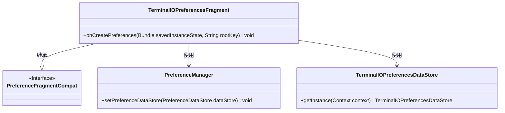
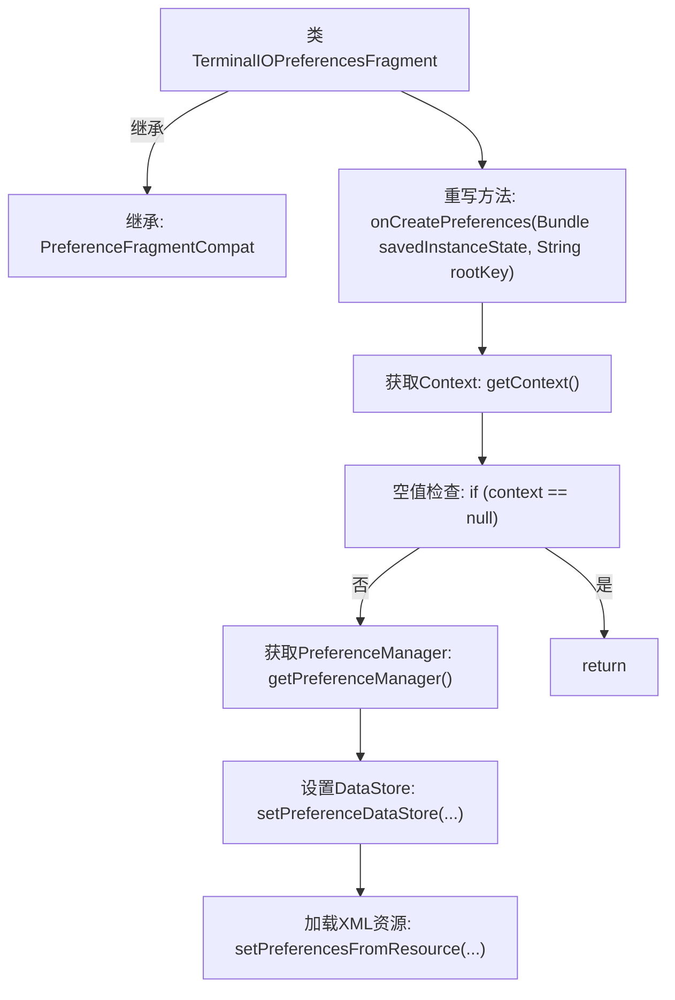
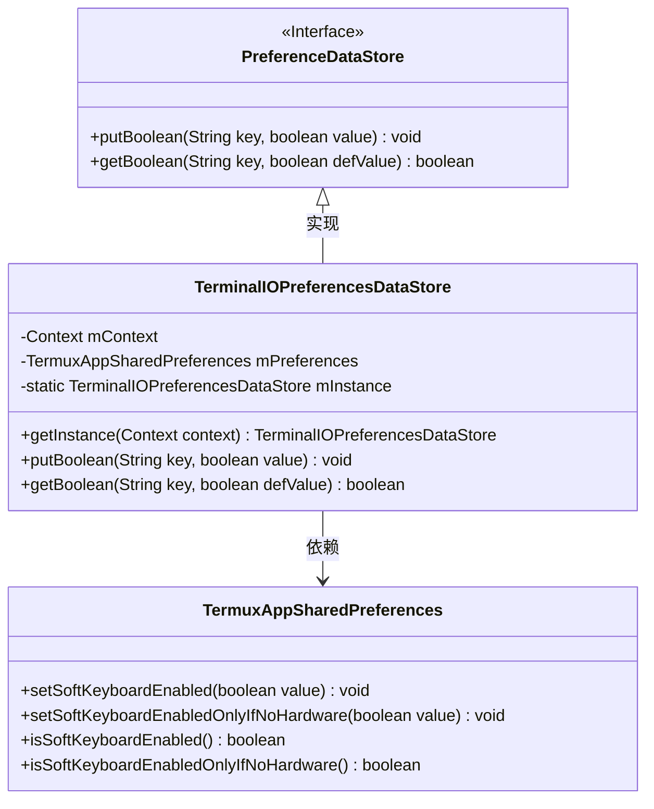
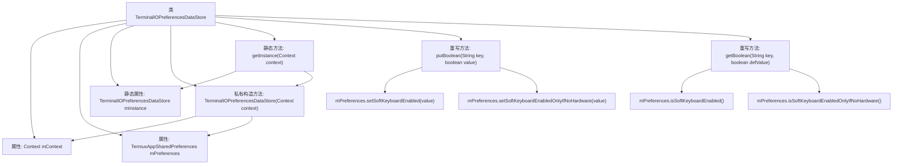

# 基础信息

|      |      |
|------|------|
| 名称 | TerminalIOPreferencesFragment |
| 编码语言 | .java |
| 代码路径 | termux-app/app/src/main/java/com/termux/app/fragments/settings/termux/TerminalIOPreferencesFragment.java |
| 包名 | com.termux.app.fragments.settings.termux |
| 依赖项 | ['android.content.Context', 'android.os.Bundle', 'androidx.annotation.Keep', 'androidx.preference.PreferenceDataStore', 'androidx.preference.PreferenceFragmentCompat', 'androidx.preference.PreferenceManager', 'com.termux.R', 'com.termux.shared.termux.settings.preferences.TermuxAppSharedPreferences'] |
| 概述说明 | 终端IO偏好设置片段，管理软键盘启用状态。 |

# 说明

TerminalIOPreferencesFragment继承PreferenceFragmentCompat，在onCreatePreferences中设置PreferenceDataStore为TerminalIOPreferencesDataStore实例，并从XML加载首选项。TerminalIOPreferencesDataStore是单例类，通过TermuxAppSharedPreferences管理布尔类型首选项，包括软键盘启用状态及相关硬件条件判断。它实现了putBoolean和getBoolean方法，处理特定键值的读写操作。

# 类列表 Class Summary

| 名称   | 类型  | 说明 |
|-------|------|-------------|
| TerminalIOPreferencesFragment | class | 终端IO偏好设置片段，继承PreferenceFragmentCompat，初始化偏好数据存储并加载XML配置。 |
| TerminalIOPreferencesDataStore | class | 终端IO偏好设置数据存储类，单例模式管理软键盘配置。 |

## 类 TerminalIOPreferencesFragment

|      |      |
|------|------|
| 访问范围 | @Keep;public |
| 类型 | class |
| 名称 | TerminalIOPreferencesFragment |
| 说明 | 终端IO偏好设置片段，继承PreferenceFragmentCompat，初始化偏好数据存储并加载XML配置。 |

### UML类图

这段代码展示了一个Android偏好设置片段TerminalIOPreferencesFragment，它继承自PreferenceFragmentCompat并重写了onCreatePreferences方法。该方法初始化上下文相关的偏好设置管理器，将数据存储设置为TerminalIOPreferencesDataStore的单例实例，并从XML资源加载偏好设置。类图清晰地反映了继承关系和关键依赖，包括与PreferenceManager的交互和自定义数据存储的使用。

### 内部方法调用关系图

这段流程图描述了TerminalIOPreferencesFragment类的核心逻辑流程。该片段继承自PreferenceFragmentCompat，主要重写onCreatePreferences方法来初始化偏好设置。流程从获取Context开始，进行空值检查后，配置PreferenceManager的数据存储，最后从XML资源加载偏好设置。整个过程体现了Android偏好设置的典型初始化模式，包含必要的空值防护和资源加载步骤。

### 字段列表 Field List

| 名称  | 类型  | 说明 |
|-------|-------|------|

### 方法列表 Method List

| 名称  | 类型  | 说明 |
|-------|-------|------|
| onCreatePreferences | void | 重写Android偏好设置方法，初始化上下文和数据存储，加载XML资源。 |

## 类 TerminalIOPreferencesDataStore

|      |      |
|------|------|
| 访问范围 | None |
| 类型 | class |
| 名称 | TerminalIOPreferencesDataStore |
| 说明 | 终端IO偏好设置数据存储类，单例模式管理软键盘配置。 |

### UML类图

这段代码展示了一个Android偏好设置存储系统的实现。TerminalIOPreferencesDataStore类继承自PreferenceDataStore接口，采用单例模式管理实例，并通过TermuxAppSharedPreferences类持久化存储键盘相关的布尔型配置项。主要功能包括处理软键盘启用状态和硬件键盘检测逻辑的读写操作，通过键值对方式管理配置，体现了接口实现与模块化设计思想。

### 内部方法调用关系图

这段代码流程图展示了TerminalIOPreferencesDataStore类的结构和主要方法调用关系。该类是一个单例实现，通过getInstance()方法获取唯一实例，包含两个核心方法putBoolean()和getBoolean()用于处理键盘偏好设置。流程图清晰地呈现了私有构造方法初始化属性、静态实例管理以及偏好设置操作的分支逻辑，其中putBoolean()和getBoolean()根据不同的key值调用TermuxAppSharedPreferences的不同方法。整体结构体现了单例模式的设计和偏好设置数据存储的核心功能。

### 字段列表 Field List

| 名称  | 类型  | 说明 |
|-------|-------|------|
| mContext | Context | 私有上下文变量mContext |
| mInstance | TerminalIOPreferencesDataStore | 私有静态终端IO偏好设置数据存储实例。 |
| mPreferences | TermuxAppSharedPreferences | 私有Termux应用偏好设置实例 |

### 方法列表 Method List

| 名称  | 类型  | 说明 |
|-------|-------|------|
| getInstance | TerminalIOPreferencesDataStore | 静态同步方法获取单例TerminalIOPreferencesDataStore实例。 |
| putBoolean | void | 重写putBoolean方法，根据key设置键盘偏好。 |
| getBoolean | boolean | 重写getBoolean方法，根据key返回对应布尔值，默认false。 |

