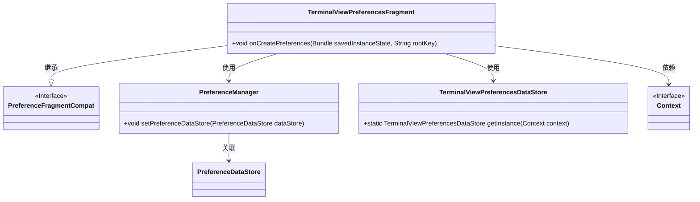

# 基础信息

|      |      |
|------|------|
| 名称 | TerminalViewPreferencesFragment |
| 编码语言 | .java |
| 代码路径 | termux-app/app/src/main/java/com/termux/app/fragments/settings/termux/TerminalViewPreferencesFragment.java |
| 包名 | com.termux.app.fragments.settings.termux |
| 依赖项 | ['android.content.Context', 'android.os.Bundle', 'androidx.annotation.Keep', 'androidx.preference.PreferenceDataStore', 'androidx.preference.PreferenceFragmentCompat', 'androidx.preference.PreferenceManager', 'com.termux.R', 'com.termux.shared.termux.settings.preferences.TermuxAppSharedPreferences'] |
| 概述说明 | 终端视图偏好设置片段，管理边距调整等布尔值配置。 |

# 说明

该内容描述了一个Android偏好设置片段及其数据存储类。TerminalViewPreferencesFragment继承自PreferenceFragmentCompat，在创建时设置自定义数据存储TerminalViewPreferencesDataStore并加载XML偏好配置。TerminalViewPreferencesDataStore采用单例模式，通过TermuxAppSharedPreferences持久化存储布尔类型偏好值，目前仅处理terminal_margin_adjustment这一键值对的读写操作。

# 类列表 Class Summary

| 名称   | 类型  | 说明 |
|-------|------|-------------|
| TerminalViewPreferencesFragment | class | 终端视图偏好设置片段，继承PreferenceFragmentCompat，初始化上下文和数据存储，加载XML偏好设置。 |
| TerminalViewPreferencesDataStore | class | 终端视图偏好设置数据存储类，单例模式管理边距调整设置。 |

## 类 TerminalViewPreferencesFragment

|      |      |
|------|------|
| 访问范围 | @Keep;public |
| 类型 | class |
| 名称 | TerminalViewPreferencesFragment |
| 说明 | 终端视图偏好设置片段，继承PreferenceFragmentCompat，初始化上下文和数据存储，加载XML偏好设置。 |

### UML类图

这段类图展示了TerminalViewPreferencesFragment继承自PreferenceFragmentCompat，并依赖于PreferenceManager、TerminalViewPreferencesDataStore和Context接口的结构。其中PreferenceManager通过setPreferenceDataStore方法与TerminalViewPreferencesDataStore关联，实现偏好设置的数据存储功能。整个结构清晰地反映了Android偏好设置片段的基本实现方式，通过数据存储实例来管理界面偏好配置。

### 内部方法调用关系图

该流程图描述了TerminalViewPreferencesFragment类的核心逻辑流程。首先检查Context有效性，随后初始化PreferenceManager并设置自定义数据存储TerminalViewPreferencesDataStore，最后从XML资源加载偏好设置。整个过程严格遵循Android偏好设置框架的初始化规范，确保在Fragment创建时正确建立配置管理机制，其中关键步骤包括空值防护和数据存储绑定。

### 字段列表 Field List

| 名称  | 类型  | 说明 |
|-------|-------|------|

### 方法列表 Method List

| 名称  | 类型  | 说明 |
|-------|-------|------|
| onCreatePreferences | void | 重写偏好设置方法，初始化数据存储并加载XML资源。 |

## 类 TerminalViewPreferencesDataStore

|      |      |
|------|------|
| 访问范围 | None |
| 类型 | class |
| 名称 | TerminalViewPreferencesDataStore |
| 说明 | 终端视图偏好设置数据存储类，单例模式管理边距调整设置。 |

### UML类图

这段类图展示了TerminalViewPreferencesDataStore继承自PreferenceDataStore接口，并实现了其布尔值存取方法。该类采用单例模式，通过静态方法getInstance获取实例，内部依赖TermuxAppSharedPreferences进行具体偏好设置操作，主要处理终端边距调整的开关状态。Context作为基础依赖项提供Android运行时环境。整体设计体现了偏好数据的封装存储与单例管理的结合。

### 内部方法调用关系图

这段代码展示了一个终端视图偏好设置的数据存储类，采用单例模式实现。类中包含对终端边距调整功能的布尔值存取操作，通过TermuxAppSharedPreferences类实现持久化存储。流程图清晰展示了类的结构，包括私有构造方法、单例获取方法以及两个核心的布尔值操作方法，其中putBoolean()用于设置终端边距调整状态，getBoolean()用于获取当前状态。所有操作都通过mPreferences对象委托给底层共享偏好存储实现。

### 字段列表 Field List

| 名称  | 类型  | 说明 |
|-------|-------|------|
| mInstance | TerminalViewPreferencesDataStore | 私有静态终端视图偏好数据存储实例。 |
| mContext | Context | 私有上下文变量mContext |
| mPreferences | TermuxAppSharedPreferences | 私有Termux应用偏好设置对象mPreferences |

### 方法列表 Method List

| 名称  | 类型  | 说明 |
|-------|-------|------|
| putBoolean | void | 重写putBoolean方法，处理键值对并调用特定设置。 |
| getBoolean | boolean | 重写getBoolean方法，根据key返回对应布尔值，默认false。 |
| getInstance | TerminalViewPreferencesDataStore | 获取单例TerminalViewPreferencesDataStore实例，若不存在则新建。 |

