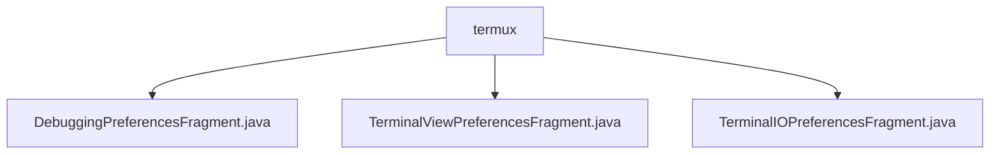

# 基础信息

|      |      |
|------|------|
| 名称 | termux |
| 编码语言 | .java |
| 代码路径 | termux-app/app/src/main/java/com/termux/app/fragments/settings/termux |
| 包名 | termux-app.app.src.main.java.com.termux.app.fragments.settings.termux |
| 概述说明 | DebuggingPreferencesFragment管理调试设置，TerminalViewPreferencesFragment处理终端视图偏好，TerminalIOPreferencesFragment管理终端IO设置，均使用单例数据存储类。 |

# 说明

```markdown
## 概述

该代码模块是Termux应用中的偏好设置管理模块，主要由三个核心片段及其对应的数据存储类组成，均基于Android的`PreferenceFragmentCompat`实现。各片段通过自定义的`PreferenceDataStore`子类（如`DebuggingPreferencesDataStore`、`TerminalViewPreferencesDataStore`等）与`TermuxAppSharedPreferences`交互，实现配置项的持久化存储。模块采用单例模式管理数据存储实例，统一处理布尔型和字符串型偏好设置的读写操作，覆盖调试、终端视图及I/O相关的用户配置。

## 主要业务场景

1. **调试配置管理**  
   - `DebuggingPreferencesFragment`负责加载调试相关的XML配置，通过`DebuggingPreferencesDataStore`管理日志级别、终端按键日志、插件错误通知、崩溃报告等功能的开关状态。  
   - 支持动态获取当前日志级别并更新选项列表（如`configureLoggingPreferences`方法）。

2. **终端视图配置**  
   - `TerminalViewPreferencesFragment`加载终端显示相关的偏好设置，当前主要处理`terminal_margin_adjustment`边距调整配置。  
   - 通过`TerminalViewPreferencesDataStore`将布尔值配置持久化到共享偏好中。

3. **终端I/O控制**  
   - `TerminalIOPreferencesFragment`管理输入输出相关的用户偏好，例如软键盘启用状态及硬件条件判断。  
   - `TerminalIOPreferencesDataStore`实现特定键值（如软键盘开关）的布尔值读写，依赖`TermuxAppSharedPreferences`存储实际数据。
```


### 包内部结构视图



该流程图展示了Termux应用中设置模块下终端相关配置的三个偏好设置片段文件，均位于termux目录中。这三个Java文件分别对应调试偏好、终端视图偏好和终端输入输出偏好设置功能，属于同一层级的功能模块文件，没有更深层级的嵌套关系。

# 文件列表 File List

| 名称   | 类型  | 说明 |
|-------|------|-------------|
| [DebuggingPreferencesFragment.java](DebuggingPreferencesFragment.md) | file | 调试偏好设置片段，管理日志级别和终端视图键日志等选项。 |
| [TerminalIOPreferencesFragment.java](TerminalIOPreferencesFragment.md) | file | 终端IO偏好设置片段，管理软键盘启用状态。 |
| [TerminalViewPreferencesFragment.java](TerminalViewPreferencesFragment.md) | file | 终端视图偏好设置片段，管理边距调整等布尔值配置。 |


