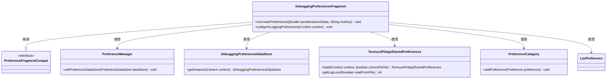
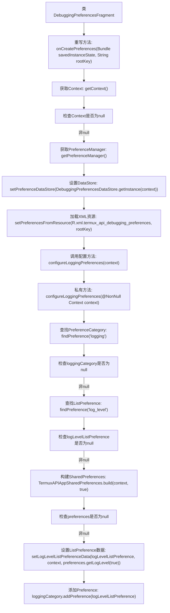
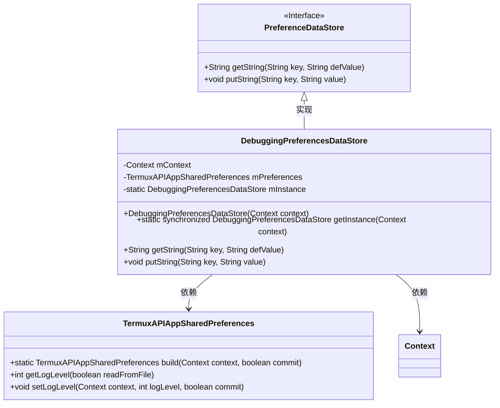
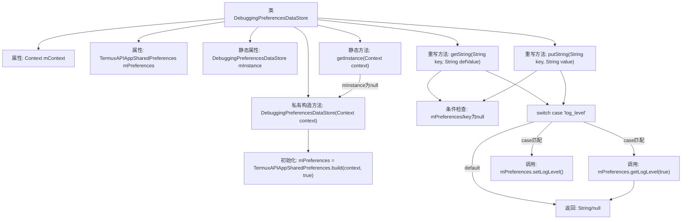

# 基础信息

|      |      |
|------|------|
| 名称 | DebuggingPreferencesFragment |
| 编码语言 | .java |
| 代码路径 | termux-app/app/src/main/java/com/termux/app/fragments/settings/termux_api/DebuggingPreferencesFragment.java |
| 包名 | com.termux.app.fragments.settings.termux_api |
| 依赖项 | ['android.content.Context', 'android.os.Bundle', 'androidx.annotation.Keep', 'androidx.annotation.NonNull', 'androidx.annotation.Nullable', 'androidx.preference.ListPreference', 'androidx.preference.PreferenceCategory', 'androidx.preference.PreferenceDataStore', 'androidx.preference.PreferenceFragmentCompat', 'androidx.preference.PreferenceManager', 'com.termux.R', 'com.termux.shared.termux.settings.preferences.TermuxAPIAppSharedPreferences'] |
| 概述说明 | 调试偏好设置片段，管理日志级别配置，使用单例数据存储。 |

# 说明

该内容描述了一个Android调试偏好设置功能的实现。DebuggingPreferencesFragment继承自PreferenceFragmentCompat，负责初始化调试偏好界面，使用DebuggingPreferencesDataStore管理数据存储。主要功能包括从XML资源加载偏好设置、配置日志级别选项。DebuggingPreferencesDataStore是单例类，通过TermuxAPIAppSharedPreferences持久化存储数据，提供获取和设置日志级别的方法。整个实现涉及偏好界面初始化、数据存储管理和日志级别配置等关键环节。

# 类列表 Class Summary

| 名称   | 类型  | 说明 |
|-------|------|-------------|
| DebuggingPreferencesFragment | class | 调试偏好设置片段类，配置日志级别选项。 |
| DebuggingPreferencesDataStore | class | 调试偏好数据存储类，单例模式，管理日志级别设置。 |

## 类 DebuggingPreferencesFragment

|      |      |
|------|------|
| 访问范围 | @Keep;public |
| 类型 | class |
| 名称 | DebuggingPreferencesFragment |
| 说明 | 调试偏好设置片段类，配置日志级别选项。 |

### UML类图

这段代码展示了一个Android偏好设置片段`DebuggingPreferencesFragment`，它继承自`PreferenceFragmentCompat`，用于管理调试相关的偏好设置。类图中清晰地展示了继承关系和依赖关系，包括与`PreferenceManager`、`DebuggingPreferencesDataStore`等核心组件的交互。该片段通过`onCreatePreferences`初始化设置，并通过`configureLoggingPreferences`方法配置日志级别选项，体现了Android偏好设置框架的典型用法。

### 内部方法调用关系图

该流程图展示了DebuggingPreferencesFragment类的核心逻辑流程。首先通过onCreatePreferences初始化偏好设置，包括获取上下文、设置数据存储和加载XML资源。然后调用configureLoggingPreferences方法配置日志相关偏好，包括查找日志分类、检查空值、构建共享偏好设置对象，最终设置并添加日志级别列表偏好。整个过程严格处理了空值检查等边界情况，确保健壮性。

### 字段列表 Field List

| 名称  | 类型  | 说明 |
|-------|-------|------|

### 方法列表 Method List

| 名称  | 类型  | 说明 |
|-------|-------|------|
| onCreatePreferences | void | 重写偏好设置方法，初始化调试存储并加载XML配置。 |
| configureLoggingPreferences | void | 配置日志偏好设置，包括日志级别和类别。 |

## 类 DebuggingPreferencesDataStore

|      |      |
|------|------|
| 访问范围 | None |
| 类型 | class |
| 名称 | DebuggingPreferencesDataStore |
| 说明 | 调试偏好数据存储类，单例模式，管理日志级别设置。 |

### UML类图

该类图展示了DebuggingPreferencesDataStore继承自PreferenceDataStore接口，并依赖于TermuxAPIAppSharedPreferences和Context。DebuggingPreferencesDataStore采用单例模式，通过getInstance方法获取实例，主要功能是处理日志级别的读写操作。TermuxAPIAppSharedPreferences提供具体的日志级别存储和读取方法，Context用于Android系统上下文访问。整体设计实现了配置数据的存储和读取功能。

### 内部方法调用关系图

流程图描述：该流程图展示了DebuggingPreferencesDataStore类的结构和主要方法调用关系。类包含上下文和偏好设置属性，通过单例模式获取实例。核心方法getString()和putString()均先进行空值检查，然后通过switch处理特定key（如'log_level'），分别调用mPreferences的getLogLevel()和setLogLevel()方法。所有路径最终都会返回结果或空值，体现了健壮的错误处理机制。

### 字段列表 Field List

| 名称  | 类型  | 说明 |
|-------|-------|------|
| mPreferences | TermuxAPIAppSharedPreferences | 私有TermuxAPIAppSharedPreferences变量mPreferences |
| mContext | Context | 私有上下文变量mContext |
| mInstance | DebuggingPreferencesDataStore | 私有静态调试偏好数据存储实例。 |

### 方法列表 Method List

| 名称  | 类型  | 说明 |
|-------|-------|------|
| getInstance | DebuggingPreferencesDataStore | 单例模式获取DebuggingPreferencesDataStore实例，线程安全且懒加载。 |
| getString | String | 重写方法，根据key返回字符串值，仅处理log_level情况。 |
| putString | void | 重写putString方法，处理log_level键值设置，其他键忽略。 |

