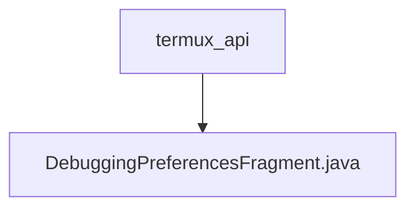

# 基础信息

|      |      |
|------|------|
| 名称 | termux_api |
| 编码语言 | .java |
| 代码路径 | termux-app/app/src/main/java/com/termux/app/fragments/settings/termux_api |
| 包名 | termux-app.app.src.main.java.com.termux.app.fragments.settings.termux_api |
| 概述说明 | 调试偏好设置片段，管理日志级别配置，使用单例数据存储。 |

# 说明

该内容描述了一个Android调试偏好设置功能的实现。DebuggingPreferencesFragment继承自PreferenceFragmentCompat，负责初始化调试偏好界面，使用DebuggingPreferencesDataStore管理数据存储。主要功能包括从XML资源加载偏好设置、配置日志级别选项。DebuggingPreferencesDataStore是单例类，通过TermuxAPIAppSharedPreferences持久化存储数据，提供获取和设置日志级别的方法。整个实现涉及偏好界面初始化、数据存储管理和日志级别配置等关键环节。

### 包内部结构视图

该流程图展示了Termux应用中API调试功能的层级结构。顶层节点为termux_api目录，其下包含一个具体的实现文件DebuggingPreferencesFragment.java，用于处理调试相关的偏好设置。这种结构体现了模块化设计思想，将特定功能的代码集中管理，便于维护和扩展。

# 文件列表 File List

| 名称   | 类型  | 说明 |
|-------|------|-------------|
| [DebuggingPreferencesFragment.java](DebuggingPreferencesFragment.md) | file | 调试偏好设置片段，管理日志级别配置，使用单例数据存储。 |

