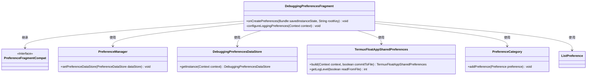

# 基础信息

|      |      |
|------|------|
| 名称 | DebuggingPreferencesFragment |
| 编码语言 | .java |
| 代码路径 | termux-app/app/src/main/java/com/termux/app/fragments/settings/termux_float/DebuggingPreferencesFragment.java |
| 包名 | com.termux.app.fragments.settings.termux_float |
| 依赖项 | ['android.content.Context', 'android.os.Bundle', 'androidx.annotation.Keep', 'androidx.annotation.NonNull', 'androidx.annotation.Nullable', 'androidx.preference.ListPreference', 'androidx.preference.PreferenceCategory', 'androidx.preference.PreferenceDataStore', 'androidx.preference.PreferenceFragmentCompat', 'androidx.preference.PreferenceManager', 'com.termux.R', 'com.termux.shared.termux.settings.preferences.TermuxFloatAppSharedPreferences'] |
| 概述说明 | 调试偏好设置片段，管理日志级别和终端视图键记录。 |

# 说明

DebuggingPreferencesFragment是一个继承自PreferenceFragmentCompat的类，用于管理调试相关的偏好设置。在onCreatePreferences方法中，它初始化了PreferenceManager并设置数据存储为DebuggingPreferencesDataStore实例，同时从XML资源加载偏好设置并配置日志相关选项。configureLoggingPreferences方法负责查找并设置日志级别偏好。DebuggingPreferencesDataStore是一个单例类，实现了PreferenceDataStore接口，用于处理字符串和布尔类型的偏好数据存储，包括日志级别和终端视图按键日志的启用状态。它通过TermuxFloatAppSharedPreferences来持久化这些设置。

# 类列表 Class Summary

| 名称   | 类型  | 说明 |
|-------|------|-------------|
| DebuggingPreferencesFragment | class | 调试偏好设置片段类，初始化数据存储并配置日志级别选项。 |
| DebuggingPreferencesDataStore | class | 调试偏好存储类，单例模式管理日志级别和终端按键记录。 |

## 类 DebuggingPreferencesFragment

|      |      |
|------|------|
| 访问范围 | @Keep;public |
| 类型 | class |
| 名称 | DebuggingPreferencesFragment |
| 说明 | 调试偏好设置片段类，初始化数据存储并配置日志级别选项。 |

### UML类图

这段代码展示了一个Android偏好设置片段`DebuggingPreferencesFragment`，它继承自`PreferenceFragmentCompat`，用于管理调试相关的偏好设置。类图中包含了与偏好设置相关的多个组件，如`PreferenceManager`、`DebuggingPreferencesDataStore`、`TermuxFloatAppSharedPreferences`等，它们协同工作来加载、配置和存储调试偏好设置。该片段通过资源文件加载偏好设置，并动态配置日志级别选项，体现了Android偏好设置框架的典型用法。

### 内部方法调用关系图

这段代码流程图描述了DebuggingPreferencesFragment类的核心逻辑流程。主要分为两个阶段：首先在onCreatePreferences中初始化偏好设置管理器并加载XML配置，然后通过configureLoggingPreferences方法动态配置日志级别选项。流程中严格处理了空值检查等边界情况，确保在Context、PreferenceCategory或ListPreference不可用时安全退出。最终将构建好的日志级别选项添加到PreferenceCategory中，完成调试偏好设置的初始化工作。

### 字段列表 Field List

| 名称  | 类型  | 说明 |
|-------|-------|------|

### 方法列表 Method List

| 名称  | 类型  | 说明 |
|-------|-------|------|
| onCreatePreferences | void | 重写onCreatePreferences方法，设置调试偏好存储并加载XML配置。 |
| configureLoggingPreferences | void | 配置日志偏好设置，检查并设置日志级别选项。 |

## 类 DebuggingPreferencesDataStore

|      |      |
|------|------|
| 访问范围 | None |
| 类型 | class |
| 名称 | DebuggingPreferencesDataStore |
| 说明 | 调试偏好存储类，单例模式管理日志级别和终端按键记录。 |

### UML类图

该类图展示了DebuggingPreferencesDataStore继承自PreferenceDataStore接口，并依赖TermuxFloatAppSharedPreferences和Context类。DebuggingPreferencesDataStore是一个单例类，通过getInstance方法获取实例，提供了对日志级别和终端视图按键日志功能的存取操作。TermuxFloatAppSharedPreferences类负责实际的数据存储和读取操作，包含构建方法及日志相关参数的设置与获取方法。整体设计实现了偏好设置数据的封装和调试功能的集中管理。

### 内部方法调用关系图

该流程图展示了DebuggingPreferencesDataStore类的完整结构，重点描述了单例模式实现和四个核心重写方法。类通过静态getInstance方法保证全局唯一实例，构造方法初始化上下文和偏好设置对象。四个重写方法分别处理字符串/布尔类型的读写操作，其中getString和putString处理日志级别配置，getBoolean和putBoolean处理终端按键日志开关。所有方法均通过mPreferences对象与底层存储交互，流程图清晰呈现了键值判断和对应方法调用的分支逻辑。

### 字段列表 Field List

| 名称  | 类型  | 说明 |
|-------|-------|------|
| mPreferences | TermuxFloatAppSharedPreferences | 私有Termux浮动应用偏好设置实例 |
| mInstance | DebuggingPreferencesDataStore | 私有静态调试偏好数据存储实例。 |
| mContext | Context | 私有上下文变量mContext |

### 方法列表 Method List

| 名称  | 类型  | 说明 |
|-------|-------|------|
| putBoolean | void | 重写方法，根据键值设置布尔参数，仅处理特定键。 |
| getBoolean | boolean | 重写方法，根据键返回布尔值，默认false。 |
| getString | String | 重写方法，根据key返回字符串值，仅处理log_level情况。 |
| putString | void | 重写putString方法，处理log_level键值设置，非空检查后调用setLogLevel。 |
| getInstance | DebuggingPreferencesDataStore | 获取单例实例，若空则新建并返回。 |

