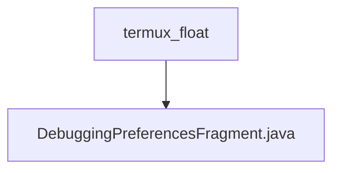

# 基础信息

|      |      |
|------|------|
| 名称 | termux_float |
| 编码语言 | .java |
| 代码路径 | termux-app/app/src/main/java/com/termux/app/fragments/settings/termux_float |
| 包名 | termux-app.app.src.main.java.com.termux.app.fragments.settings.termux_float |
| 概述说明 | 调试偏好设置片段，管理日志级别和终端视图键记录。 |

# 说明

DebuggingPreferencesFragment是一个继承自PreferenceFragmentCompat的类，用于管理调试相关的偏好设置。在onCreatePreferences方法中，它初始化了PreferenceManager并设置数据存储为DebuggingPreferencesDataStore实例，同时从XML资源加载偏好设置并配置日志相关选项。configureLoggingPreferences方法负责查找并设置日志级别偏好。DebuggingPreferencesDataStore是一个单例类，实现了PreferenceDataStore接口，用于处理字符串和布尔类型的偏好数据存储，包括日志级别和终端视图按键日志的启用状态。它通过TermuxFloatAppSharedPreferences来持久化这些设置。

### 包内部结构视图

该流程图展示了Termux应用中的层级结构，顶层节点为termux_float文件夹，其下包含一个名为DebuggingPreferencesFragment.java的Java文件。这种结构体现了Android应用中常见的偏好设置界面实现方式，通过片段(Fragment)来组织不同功能的设置界面，符合模块化开发原则。

# 文件列表 File List

| 名称   | 类型  | 说明 |
|-------|------|-------------|
| [DebuggingPreferencesFragment.java](DebuggingPreferencesFragment.md) | file | 调试偏好设置片段，管理日志级别和终端视图键记录。 |

