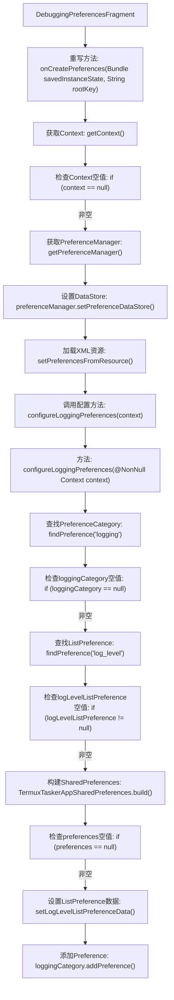
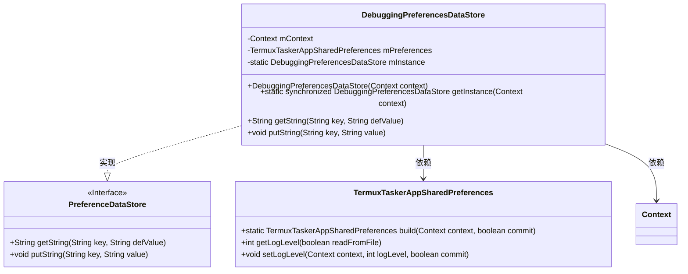
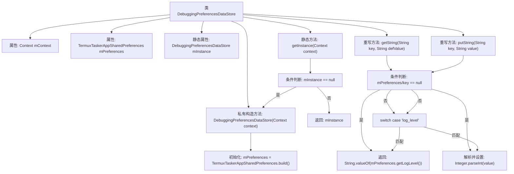

# 基础信息

|      |      |
|------|------|
| 名称 | DebuggingPreferencesFragment |
| 编码语言 | .java |
| 代码路径 | termux-app/app/src/main/java/com/termux/app/fragments/settings/termux_tasker/DebuggingPreferencesFragment.java |
| 包名 | com.termux.app.fragments.settings.termux_tasker |
| 依赖项 | ['android.content.Context', 'android.os.Bundle', 'androidx.annotation.Keep', 'androidx.annotation.NonNull', 'androidx.annotation.Nullable', 'androidx.preference.ListPreference', 'androidx.preference.PreferenceCategory', 'androidx.preference.PreferenceDataStore', 'androidx.preference.PreferenceFragmentCompat', 'androidx.preference.PreferenceManager', 'com.termux.R', 'com.termux.shared.termux.settings.preferences.TermuxTaskerAppSharedPreferences'] |
| 概述说明 | 调试偏好设置片段，管理日志级别配置和数据存储。 |

# 说明

DebuggingPreferencesFragment继承PreferenceFragmentCompat，用于管理调试偏好设置。在onCreatePreferences中初始化PreferenceManager并设置DebuggingPreferencesDataStore作为数据存储，加载XML资源配置。configureLoggingPreferences方法处理日志级别设置，通过TermuxTaskerAppSharedPreferences获取和更新日志级别。DebuggingPreferencesDataStore是单例类，通过getString和putString方法读写日志级别偏好值，使用TermuxTaskerAppSharedPreferences持久化数据。

# 类列表 Class Summary

| 名称   | 类型  | 说明 |
|-------|------|-------------|
| DebuggingPreferencesFragment | class | DebuggingPreferencesFragment类用于配置调试偏好设置，包括日志级别管理。 |
| DebuggingPreferencesDataStore | class | 调试偏好数据存储类，单例模式管理日志级别。 |

## 类 DebuggingPreferencesFragment

|      |      |
|------|------|
| 访问范围 | @Keep;public |
| 类型 | class |
| 名称 | DebuggingPreferencesFragment |
| 说明 | DebuggingPreferencesFragment类用于配置调试偏好设置，包括日志级别管理。 |

### UML类图

```mermaid
classDiagram
    class DebuggingPreferencesFragment {
        +onCreatePreferences(Bundle savedInstanceState, String rootKey) void
        -configureLoggingPreferences(Context context) void
    }

    class PreferenceFragmentCompat {
        <<Interface>>
    }

    class PreferenceManager {
        +setPreferenceDataStore(PreferenceDataStore dataStore) void
    }

    class DebuggingPreferencesDataStore {
        +getInstance(Context context) DebuggingPreferencesDataStore
    }

    class TermuxTaskerAppSharedPreferences {
        +build(Context context, boolean commitToFile) TermuxTaskerAppSharedPreferences
        +getLogLevel(boolean readFromFile) int
    }

    class ListPreference {
        +setValue(String value) void
    }

    class PreferenceCategory {
        +addPreference(Preference preference) void
    }

    DebuggingPreferencesFragment --|> PreferenceFragmentCompat : 继承
    DebuggingPreferencesFragment --> PreferenceManager : 使用
    DebuggingPreferencesFragment --> DebuggingPreferencesDataStore : 使用
    DebuggingPreferencesFragment --> TermuxTaskerAppSharedPreferences : 使用
    DebuggingPreferencesFragment --> ListPreference : 使用
    DebuggingPreferencesFragment --> PreferenceCategory : 使用
```

这段代码展示了一个Android偏好设置片段`DebuggingPreferencesFragment`，它继承自`PreferenceFragmentCompat`，用于管理调试相关的偏好设置。类图中包含了与偏好设置管理相关的关键类，如`PreferenceManager`、`DebuggingPreferencesDataStore`和`TermuxTaskerAppSharedPreferences`，以及用于界面显示的`ListPreference`和`PreferenceCategory`。该片段通过`onCreatePreferences`方法初始化设置，并通过`configureLoggingPreferences`方法配置日志级别选项，展示了Android偏好设置系统的典型使用模式。

### 内部方法调用关系图

这段代码流程图展示了DebuggingPreferencesFragment的核心逻辑流程。首先在onCreatePreferences中初始化Preference相关配置，包括获取Context、设置DataStore和加载XML布局。然后调用configureLoggingPreferences方法配置日志相关选项，包括查找PreferenceCategory、检查空值、构建SharedPreferences实例，最终设置并添加日志级别选项。整个过程体现了对空指针等异常情况的防御性编程。

### 字段列表 Field List

| 名称  | 类型  | 说明 |
|-------|-------|------|

### 方法列表 Method List

| 名称  | 类型  | 说明 |
|-------|-------|------|
| onCreatePreferences | void | 重写onCreatePreferences方法，设置调试偏好存储并加载XML配置。 |
| configureLoggingPreferences | void | 配置日志偏好设置，检查并设置日志级别选项。 |

## 类 DebuggingPreferencesDataStore

|      |      |
|------|------|
| 访问范围 | None |
| 类型 | class |
| 名称 | DebuggingPreferencesDataStore |
| 说明 | 调试偏好数据存储类，单例模式管理日志级别。 |

### UML类图

该类图展示了DebuggingPreferencesDataStore继承PreferenceDataStore接口并实现其方法的结构。作为单例类，它通过TermuxTaskerAppSharedPreferences操作日志级别配置，包含线程安全的实例获取方法。核心功能是通过键值对方式管理日志级别参数，对空值和非法键进行防御性处理，体现了配置存储的封装性和安全性设计。

### 内部方法调用关系图

该流程图展示了DebuggingPreferencesDataStore类的核心结构和逻辑流程。类采用单例模式，通过getInstance()方法保证全局唯一实例，构造方法初始化上下文和偏好设置对象。主要功能包括获取/设置字符串类型的偏好值，特别处理"log_level"键值对，包含空值检查、类型转换和委托调用TermuxTaskerAppSharedPreferences的底层操作。所有方法都包含防御性编程检查，确保健壮性。

### 字段列表 Field List

| 名称  | 类型  | 说明 |
|-------|-------|------|
| mContext | Context | 私有上下文变量mContext |
| mPreferences | TermuxTaskerAppSharedPreferences | 私有TermuxTaskerApp共享偏好设置mPreferences |
| mInstance | DebuggingPreferencesDataStore | 私有静态调试偏好数据存储实例。 |

### 方法列表 Method List

| 名称  | 类型  | 说明 |
|-------|-------|------|
| getString | String | 重写方法getString，根据key返回对应值，默认返回null。 |
| getInstance | DebuggingPreferencesDataStore | 获取单例实例，若为空则新建并返回。 |
| putString | void | 重写putString方法，处理log_level键值，非空时设置日志级别。 |

