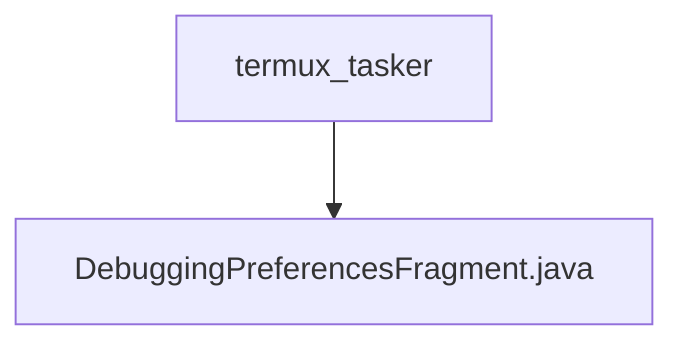

# 基础信息

|      |      |
|------|------|
| 名称 | termux_tasker |
| 编码语言 | .java |
| 代码路径 | termux-app/app/src/main/java/com/termux/app/fragments/settings/termux_tasker |
| 包名 | termux-app.app.src.main.java.com.termux.app.fragments.settings.termux_tasker |
| 概述说明 | 调试偏好设置片段，管理日志级别配置和数据存储。 |

# 说明

DebuggingPreferencesFragment继承PreferenceFragmentCompat，用于管理调试偏好设置。在onCreatePreferences中初始化PreferenceManager并设置DebuggingPreferencesDataStore作为数据存储，加载XML资源配置。configureLoggingPreferences方法处理日志级别设置，通过TermuxTaskerAppSharedPreferences获取和更新日志级别。DebuggingPreferencesDataStore是单例类，通过getString和putString方法读写日志级别偏好值，使用TermuxTaskerAppSharedPreferences持久化数据。

### 包内部结构视图

该流程图展示了Termux应用中设置模块的层级结构，termux_tasker目录作为父节点，包含一个子节点DebuggingPreferencesFragment.java文件。这表示调试偏好设置片段位于termux_tasker设置分组下，属于应用的功能性代码结构的一部分，总节点数严格匹配给定的两条路径信息。

# 文件列表 File List

| 名称   | 类型  | 说明 |
|-------|------|-------------|
| [DebuggingPreferencesFragment.java](DebuggingPreferencesFragment.md) | file | 调试偏好设置片段，管理日志级别配置和数据存储。 |

