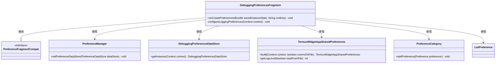
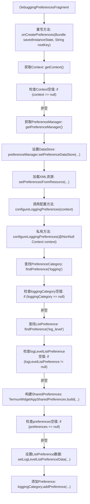
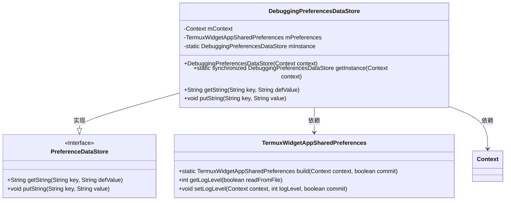
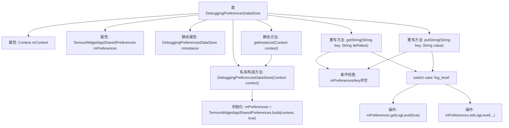

# 基础信息

|      |      |
|------|------|
| 名称 | DebuggingPreferencesFragment |
| 编码语言 | .java |
| 代码路径 | termux-app/app/src/main/java/com/termux/app/fragments/settings/termux_widget/DebuggingPreferencesFragment.java |
| 包名 | com.termux.app.fragments.settings.termux_widget |
| 依赖项 | ['android.content.Context', 'android.os.Bundle', 'androidx.annotation.Keep', 'androidx.annotation.NonNull', 'androidx.annotation.Nullable', 'androidx.preference.ListPreference', 'androidx.preference.PreferenceCategory', 'androidx.preference.PreferenceDataStore', 'androidx.preference.PreferenceFragmentCompat', 'androidx.preference.PreferenceManager', 'com.termux.R', 'com.termux.shared.termux.settings.preferences.TermuxWidgetAppSharedPreferences'] |
| 概述说明 | 调试偏好设置片段类，管理日志级别配置和数据存储。 |

# 说明

DebuggingPreferencesFragment继承PreferenceFragmentCompat，用于管理调试偏好设置。在onCreatePreferences中初始化PreferenceManager并设置自定义数据存储DebuggingPreferencesDataStore，加载XML资源配置。configureLoggingPreferences方法处理日志级别设置，通过TermuxWidgetAppSharedPreferences获取和更新日志级别。DebuggingPreferencesDataStore是单例类，通过getString和putString方法读写日志级别偏好值，与TermuxWidgetAppSharedPreferences交互实现数据持久化。

# 类列表 Class Summary

| 名称   | 类型  | 说明 |
|-------|------|-------------|
| DebuggingPreferencesFragment | class | DebuggingPreferencesFragment类用于配置调试偏好，包括日志级别设置。 |
| DebuggingPreferencesDataStore | class | 调试偏好数据存储类，单例模式，管理日志级别设置。 |

## 类 DebuggingPreferencesFragment

|      |      |
|------|------|
| 访问范围 | @Keep;public |
| 类型 | class |
| 名称 | DebuggingPreferencesFragment |
| 说明 | DebuggingPreferencesFragment类用于配置调试偏好，包括日志级别设置。 |

### UML类图

这段代码展示了一个Android偏好设置片段`DebuggingPreferencesFragment`，它继承自`PreferenceFragmentCompat`，主要用于配置调试相关的偏好设置。类图中清晰地展示了该片段与多个组件的交互关系，包括偏好管理器、数据存储、共享偏好设置以及具体的偏好控件（如分类和列表偏好）。该片段在创建偏好设置时会初始化数据存储，并从资源文件加载配置，同时动态配置日志级别偏好设置。

### 内部方法调用关系图

该流程图展示了DebuggingPreferencesFragment的核心逻辑流程，从初始化偏好设置到配置日志级别选项。首先检查Context有效性，然后初始化PreferenceManager并设置数据存储，接着加载XML资源并触发日志配置。在日志配置过程中，会依次查找并验证界面元素，最终完成日志级别下拉列表的数据绑定和界面添加。整个过程体现了Android偏好设置片段的典型初始化模式和空值安全校验机制。

### 字段列表 Field List

| 名称  | 类型  | 说明 |
|-------|-------|------|

### 方法列表 Method List

| 名称  | 类型  | 说明 |
|-------|-------|------|
| configureLoggingPreferences | void | 配置日志偏好设置，包括日志级别选项。 |
| onCreatePreferences | void | 重写onCreatePreferences方法，设置数据存储并加载XML配置。 |

## 类 DebuggingPreferencesDataStore

|      |      |
|------|------|
| 访问范围 | None |
| 类型 | class |
| 名称 | DebuggingPreferencesDataStore |
| 说明 | 调试偏好数据存储类，单例模式，管理日志级别设置。 |

### UML类图

该类图展示了DebuggingPreferencesDataStore继承自PreferenceDataStore接口并实现其方法的结构。该类采用单例模式，通过getInstance()获取实例，内部依赖TermuxWidgetAppSharedPreferences来管理日志级别等偏好设置数据。主要功能包括通过键值对存取字符串数据，特别处理"log_level"键的读写操作，同时严格检查空值和空键的边界情况，体现了健壮的数据存储设计。

### 内部方法调用关系图

该流程图展示了DebuggingPreferencesDataStore类的结构和核心逻辑。这是一个单例模式的偏好设置数据存储类，主要处理日志级别相关的字符串读写操作。流程包含构造方法初始化、实例获取、以及两个核心方法getString()和putString()的处理逻辑，其中通过switch-case专门处理"log_level"键值，涉及TermuxWidgetAppSharedPreferences的日志级别获取和设置操作。所有方法均包含空值安全检查，确保健壮性。

### 字段列表 Field List

| 名称  | 类型  | 说明 |
|-------|-------|------|
| mInstance | DebuggingPreferencesDataStore | 私有静态调试偏好数据存储实例。 |
| mContext | Context | 私有上下文变量mContext |
| mPreferences | TermuxWidgetAppSharedPreferences | 私有Termux组件共享偏好实例 |

### 方法列表 Method List

| 名称  | 类型  | 说明 |
|-------|-------|------|
| getInstance | DebuggingPreferencesDataStore | 获取单例实例，若为空则新建。 |
| getString | String | Java方法：根据key返回字符串值，仅处理log_level，否则返回null。 |
| putString | void | 重写方法，根据键值设置日志级别，忽略空键或空值。 |

