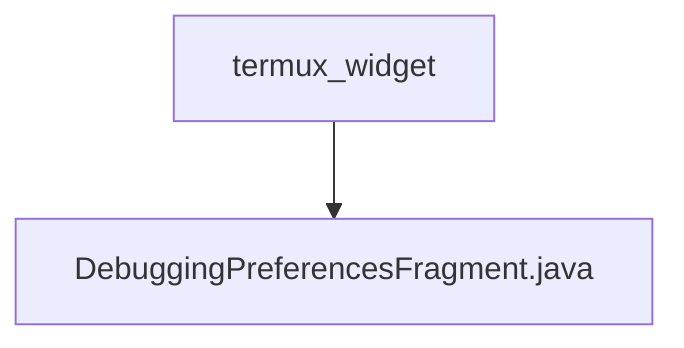

# 基础信息

|      |      |
|------|------|
| 名称 | termux_widget |
| 编码语言 | .java |
| 代码路径 | termux-app/app/src/main/java/com/termux/app/fragments/settings/termux_widget |
| 包名 | termux-app.app.src.main.java.com.termux.app.fragments.settings.termux_widget |
| 概述说明 | 调试偏好设置片段类，管理日志级别配置和数据存储。 |

# 说明

DebuggingPreferencesFragment继承PreferenceFragmentCompat，用于管理调试偏好设置。在onCreatePreferences中初始化PreferenceManager并设置自定义数据存储DebuggingPreferencesDataStore，加载XML资源配置。configureLoggingPreferences方法处理日志级别设置，通过TermuxWidgetAppSharedPreferences获取和更新日志级别。DebuggingPreferencesDataStore是单例类，通过getString和putString方法读写日志级别偏好值，与TermuxWidgetAppSharedPreferences交互实现数据持久化。

### 包内部结构视图

该流程图展示了Termux应用中的widget设置模块结构，顶层目录为termux_widget，其下包含一个具体的设置片段文件DebuggingPreferencesFragment.java。这种结构是典型的Android应用设置界面实现方式，通过Fragment来管理不同功能的偏好设置界面。

# 文件列表 File List

| 名称   | 类型  | 说明 |
|-------|------|-------------|
| [DebuggingPreferencesFragment.java](DebuggingPreferencesFragment.md) | file | 调试偏好设置片段类，管理日志级别配置和数据存储。 |

