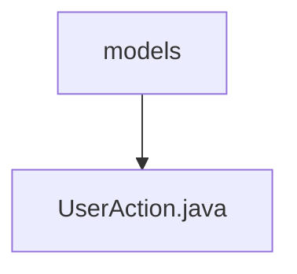

# 基础信息

|      |      |
|------|------|
| 名称 | models |
| 编码语言 | .java |
| 代码路径 | termux-app/app/src/main/java/com/termux/app/models |
| 包名 | termux-app.app.src.main.java.com.termux.app.models |
| 概述说明 | 输入内容为空，无法生成概要。请提供需要总结的具体信息。 |

# 说明

当前提供的内容为空，无法生成总结描述。请提供具体内容以便进行准确全面的总结。

### 包内部结构视图

该流程图展示了Termux应用中models目录与UserAction.java文件的层级关系。models作为父目录包含UserAction.java这个模型类文件，结构简单清晰，体现了典型的Java项目单文件模型结构，符合Maven/Gradle项目标准目录布局中的模型层设计。

# 文件列表 File List

| 名称   | 类型  | 说明 |
|-------|------|-------------|
| [UserAction.java](UserAction.md) | file | 输入内容为空，无法生成概要。请提供需要总结的具体信息。 |

