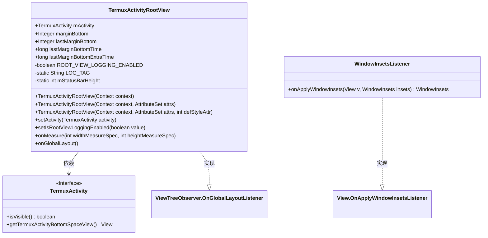
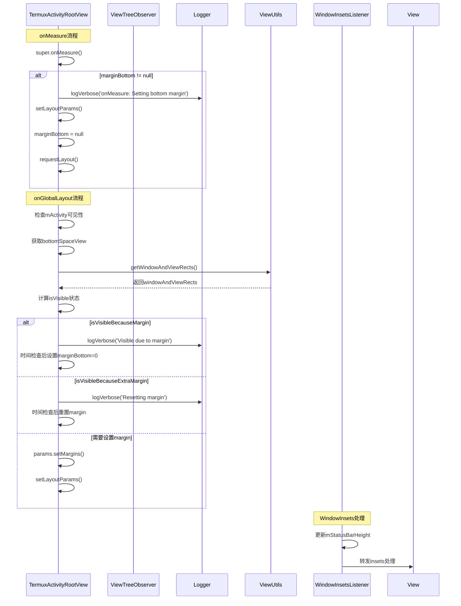

# 基础信息

|      |      |
|------|------|
| 名称 | TermuxActivityRootView |
| 编码语言 | .java |
| 代码路径 | termux-app/app/src/main/java/com/termux/app/terminal/TermuxActivityRootView.java |
| 包名 | com.termux.app.terminal |
| 依赖项 | ['android.content.Context', 'android.graphics.Rect', 'android.inputmethodservice.InputMethodService', 'android.util.AttributeSet', 'android.view.View', 'android.view.ViewGroup', 'android.view.ViewTreeObserver', 'android.view.WindowInsets', 'android.view.inputmethod.EditorInfo', 'android.widget.FrameLayout', 'android.widget.LinearLayout', 'androidx.annotation.Nullable', 'androidx.core.view.WindowInsetsCompat', 'com.termux.app.TermuxActivity', 'com.termux.shared.logger.Logger', 'com.termux.shared.view.ViewUtils'] |
| 概述说明 | TermuxActivityRootView管理底部边距，处理键盘遮挡和布局变化。 |

# 说明

TermuxActivityRootView是一个继承自LinearLayout的自定义视图组件，实现了OnGlobalLayoutListener接口，用于管理Termux应用主界面的布局调整。主要功能包括动态调整底部边距以适配键盘显示状态，通过监听全局布局变化来检测视图可见性，并根据键盘遮挡情况自动设置或重置底部边距。组件支持日志记录功能，包含状态栏高度计算逻辑，并提供了防止布局抖动和无限循环的优化机制。通过WindowInsetsListener处理系统窗口插入区域，确保布局与系统UI元素正确对齐。

# 类列表 Class Summary

| 名称   | 类型  | 说明 |
|-------|------|-------------|
| TermuxActivityRootView | class | TermuxActivityRootView管理底部边距，处理键盘和视图布局变化。 |

## 类 TermuxActivityRootView

|      |      |
|------|------|
| 访问范围 | public |
| 类型 | class |
| 名称 | TermuxActivityRootView |
| 说明 | TermuxActivityRootView管理底部边距，处理键盘和视图布局变化。 |

### UML类图

这段代码描述了一个Android自定义视图组件TermuxActivityRootView，它继承自LinearLayout并实现了OnGlobalLayoutListener接口。主要功能是监听全局布局变化，并根据底部空间视图的可见性动态调整边距，特别处理键盘弹出时的布局适配问题。类中包含了对TermuxActivity的依赖关系，以及一个静态内部类WindowInsetsListener用于处理窗口插入事件。该组件通过复杂的布局计算逻辑确保在键盘显示/隐藏时保持界面元素的正确位置。

### 内部方法调用关系图

```mermaid
graph TD
    A["类TermuxActivityRootView"]
    B["属性: TermuxActivity mActivity"]
    C["属性: Integer marginBottom"]
    D["属性: Integer lastMarginBottom"]
    E["属性: long lastMarginBottomTime"]
    F["属性: long lastMarginBottomExtraTime"]
    G["属性: boolean ROOT_VIEW_LOGGING_ENABLED"]
    H["属性: String LOG_TAG"]
    I["属性: static int mStatusBarHeight"]
    J["构造方法: TermuxActivityRootView(Context)"]
    K["构造方法: TermuxActivityRootView(Context, AttributeSet)"]
    L["构造方法: TermuxActivityRootView(Context, AttributeSet, int)"]
    M["方法: setActivity(TermuxActivity)"]
    N["方法: setIsRootViewLoggingEnabled(boolean)"]
    O["重写方法: onMeasure(int, int)"]
    P["重写方法: onGlobalLayout()"]
    Q["内部类: WindowInsetsListener"]
    R["方法: onApplyWindowInsets(View, WindowInsets)"]

    A --> B
    A --> C
    A --> D
    A --> E
    A --> F
    A --> G
    A --> H
    A --> I
    A --> J
    A --> K
    A --> L
    A --> M
    A --> N
    A --> O
    A --> P
    A --> Q
    Q --> R
```

该流程图展示了TermuxActivityRootView类的完整结构，包含5个属性、3个构造方法、4个主要方法和1个内部类。时序图详细描述了onMeasure和onGlobalLayout两个核心方法的执行流程，包括边界条件处理、日志记录和视图参数更新逻辑。特别展示了键盘显示/隐藏时动态调整底部边距的复杂处理流程，包含时间间隔检查防止无限循环、多种可见性状态判断和边距计算等关键业务逻辑。

### 字段列表 Field List

| 名称  | 类型  | 说明 |
|-------|-------|------|
| lastMarginBottomExtraTime | long | 长整型变量，记录底部额外边距时间。 |
| mStatusBarHeight | int | 私有静态整型变量，存储状态栏高度。 |
| marginBottom | Integer | 定义整型变量marginBottom，表示底部边距。 |
| ROOT_VIEW_LOGGING_ENABLED = false | boolean | 私有布尔变量ROOT_VIEW_LOGGING_ENABLED设为false |
| lastMarginBottom | Integer | 声明整型变量lastMarginBottom，作用域为public。 |
| lastMarginBottomTime | long | 记录最后底部边距时间的长整型变量。 |
| LOG_TAG = "TermuxActivityRootView" | String | 私有常量LOG_TAG值为TermuxActivityRootView |
| mActivity | TermuxActivity | TermuxActivity实例变量mActivity |

### 方法列表 Method List

| 名称  | 类型  | 说明 |
|-------|-------|------|
| setActivity | void | 设置TermuxActivity实例到mActivity变量。 |
| setIsRootViewLoggingEnabled | void | 启用或禁用根视图日志记录功能。 |
| onMeasure | void | 重写onMeasure方法，设置底部边距并更新布局参数。 |
| onGlobalLayout | void | 检查底部视图可见性并调整边距以避免键盘遮挡。 |

