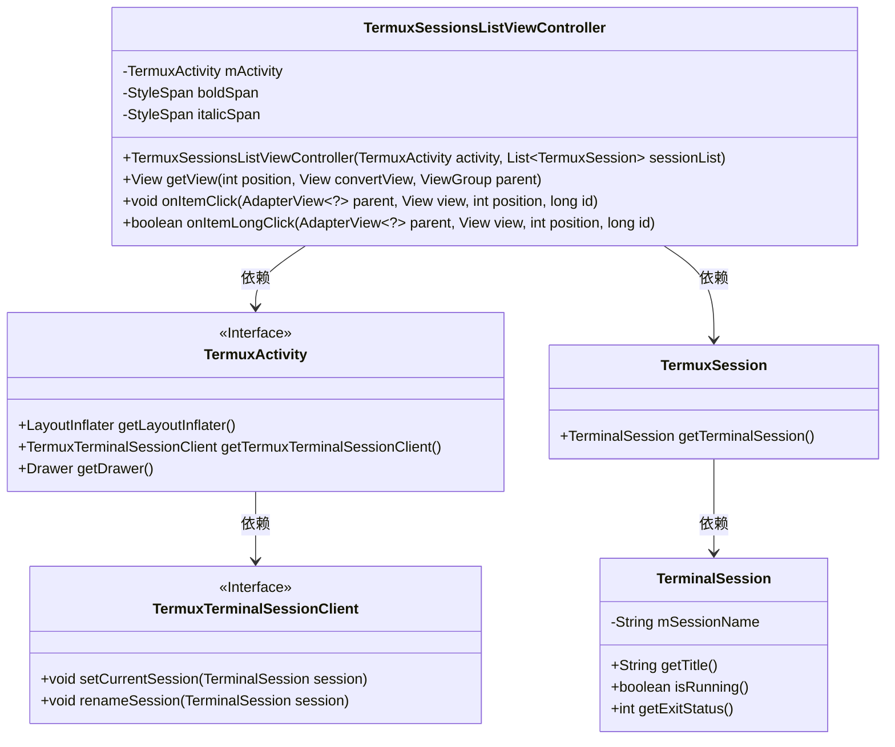
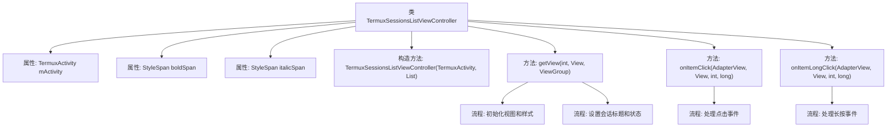

# 基础信息

|      |      |
|------|------|
| 名称 | TermuxSessionsListViewController |
| 编码语言 | .java |
| 代码路径 | termux-app/app/src/main/java/com/termux/app/terminal/TermuxSessionsListViewController.java |
| 包名 | com.termux.app.terminal |
| 依赖项 | ['android.annotation.SuppressLint', 'android.graphics.Color', 'android.graphics.Paint', 'android.graphics.Typeface', 'android.text.SpannableString', 'android.text.Spanned', 'android.text.TextUtils', 'android.text.style.StyleSpan', 'android.view.LayoutInflater', 'android.view.View', 'android.view.ViewGroup', 'android.widget.AdapterView', 'android.widget.ArrayAdapter', 'android.widget.TextView', 'androidx.annotation.NonNull', 'androidx.core.content.ContextCompat', 'com.termux.R', 'com.termux.app.TermuxActivity', 'com.termux.shared.termux.shell.command.runner.terminal.TermuxSession', 'com.termux.shared.theme.NightMode', 'com.termux.shared.theme.ThemeUtils', 'com.termux.terminal.TerminalSession', 'java.util.List'] |
| 概述说明 | Termux会话列表控制器类，管理会话显示与交互，支持点击和长按操作。 |

# 说明

TermuxSessionsListViewController是一个用于管理Termux终端会话列表的控制器类，继承自ArrayAdapter并实现了点击和长按监听接口。该类负责渲染会话列表项视图，根据会话状态动态设置文本样式、颜色和背景。会话标题由序号、名称和描述组成，使用粗体和斜体区分不同部分。根据会话是否运行中或异常退出，分别显示正常、删除线或红色文本。点击会话会切换当前会话，长按则会触发重命名操作。此外，该类还根据应用主题模式（深色/浅色）调整背景样式。

# 类列表 Class Summary

| 名称   | 类型  | 说明 |
|-------|------|-------------|
| TermuxSessionsListViewController | class | Termux会话列表控制器，管理会话显示与交互，支持点击和长按操作。 |

## 类 TermuxSessionsListViewController

|      |      |
|------|------|
| 访问范围 | public |
| 类型 | class |
| 名称 | TermuxSessionsListViewController |
| 说明 | Termux会话列表控制器，管理会话显示与交互，支持点击和长按操作。 |

### UML类图

这段代码描述了一个Android应用中的会话列表视图控制器`TermuxSessionsListViewController`，它继承自`ArrayAdapter`并实现了点击和长按监听接口。该类主要负责管理终端会话列表的显示和交互，包括会话标题的样式设置（加粗、斜体）、颜色控制（根据运行状态和主题变化）以及点击事件处理。它与`TermuxActivity`、`TermuxTerminalSessionClient`和`TerminalSession`等类进行交互，实现了会话选择、重命名等功能，同时考虑了深色主题适配和会话状态可视化。

### 内部方法调用关系图

该流程图展示了TermuxSessionsListViewController类的结构和主要方法调用关系。该类继承自ArrayAdapter，实现了会话列表视图控制功能，包含构造方法初始化、视图渲染(getView)、点击事件处理(onItemClick)和长按事件处理(onItemLongClick)等核心流程。getView方法负责会话项的视图创建和样式设置，包括标题格式化、运行状态标识和主题适配，而事件处理方法则分别处理会话切换和重命名操作。

### 字段列表 Field List

| 名称  | 类型  | 说明 |
|-------|-------|------|
| mActivity | TermuxActivity | TermuxActivity的最终实例变量mActivity。 |
| boldSpan = new StyleSpan(Typeface.BOLD) | StyleSpan | 创建加粗样式的文本跨度对象。 |
| italicSpan = new StyleSpan(Typeface.ITALIC) | StyleSpan | 创建斜体样式文本的StyleSpan对象。 |

### 方法列表 Method List

| 名称  | 类型  | 说明 |
|-------|-------|------|
| onItemLongClick | boolean | 长按列表项重命名Termux会话。 |
| onItemClick | void | 点击列表项时设置当前会话并关闭抽屉。 |
| getView | View | 自定义列表项视图适配器，处理会话标题样式、运行状态及主题颜色。 |

