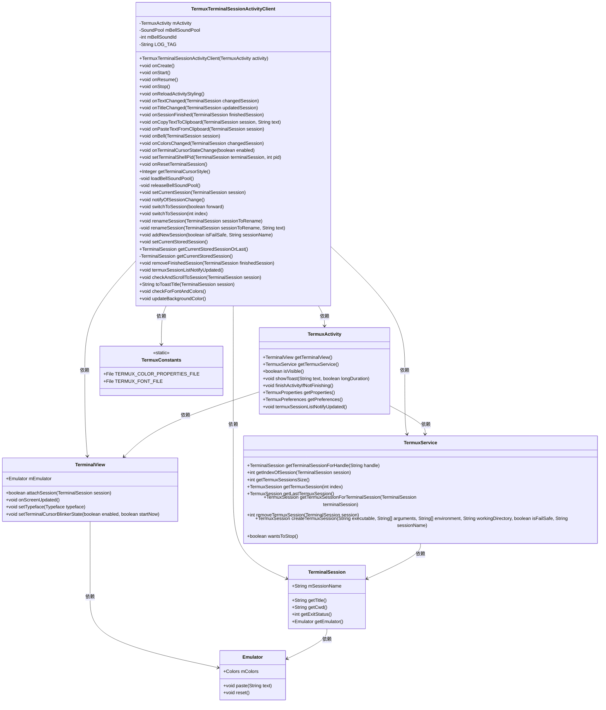

# 基础信息

|      |      |
|------|------|
| 名称 | TermuxTerminalSessionActivityClient |
| 编码语言 | .java |
| 代码路径 | termux-app/app/src/main/java/com/termux/app/terminal/TermuxTerminalSessionActivityClient.java |
| 包名 | com.termux.app.terminal |
| 依赖项 | ['android.annotation.SuppressLint', 'android.app.Activity', 'android.app.AlertDialog', 'android.content.ClipData', 'android.content.ClipboardManager', 'android.content.Context', 'android.content.pm.PackageManager', 'android.graphics.Typeface', 'android.media.AudioAttributes', 'android.media.SoundPool', 'android.text.TextUtils', 'android.widget.ListView', 'androidx.annotation.NonNull', 'androidx.annotation.Nullable', 'com.termux.R', 'com.termux.shared.interact.ShareUtils', 'com.termux.shared.termux.shell.command.runner.terminal.TermuxSession', 'com.termux.shared.termux.interact.TextInputDialogUtils', 'com.termux.app.TermuxActivity', 'com.termux.shared.termux.terminal.TermuxTerminalSessionClientBase', 'com.termux.shared.termux.TermuxConstants', 'com.termux.app.TermuxService', 'com.termux.shared.termux.settings.properties.TermuxPropertyConstants', 'com.termux.shared.termux.terminal.io.BellHandler', 'com.termux.shared.logger.Logger', 'com.termux.terminal.TerminalColors', 'com.termux.terminal.TerminalSession', 'com.termux.terminal.TerminalSessionClient', 'com.termux.terminal.TextStyle', 'java.io.File', 'java.io.FileInputStream', 'java.io.InputStream', 'java.util.Properties'] |
| 概述说明 | Termux终端会话活动客户端，管理会话生命周期、铃声、字体颜色及背景更新。 |

# 说明

TermuxTerminalSessionActivityClient是Termux应用的核心终端会话管理类，继承自TermuxTerminalSessionClientBase。它通过mActivity关联TermuxActivity，管理最多8个会话，处理铃声池加载/释放，并实现生命周期回调（onCreate/onStart/onResume/onStop）。功能包括会话切换、重命名、滚动定位、字体颜色检查、背景色更新，以及处理终端事件（文本变更、标题变更、会话结束、剪贴板操作、响铃等）。通过TermuxService管理会话状态，支持故障安全模式，自动清理退出会话，并维护偏好设置中的当前会话记录。

# 类列表 Class Summary

| 名称   | 类型  | 说明 |
|-------|------|-------------|
| TermuxTerminalSessionActivityClient | class | Termux终端会话活动客户端，管理会话生命周期、铃声、字体颜色及UI交互。 |

## 类 TermuxTerminalSessionActivityClient

|      |      |
|------|------|
| 访问范围 | public |
| 类型 | class |
| 名称 | TermuxTerminalSessionActivityClient |
| 说明 | Termux终端会话活动客户端，管理会话生命周期、铃声、字体颜色及UI交互。 |

### UML类图

这段代码展示了一个Android终端模拟器应用的核心组件交互。TermuxTerminalSessionActivityClient作为主要控制器，管理终端会话生命周期、响应用户输入/输出事件（如铃声、复制粘贴）、处理会话切换/重命名等操作，并与TermuxActivity（UI）、TermuxService（后台服务）、TerminalSession（会话实例）等组件协作。通过SoundPool实现铃声效果，支持多会话管理（最多8个），并处理字体/颜色配置、光标状态等终端特性。类图清晰地呈现了各模块间的依赖关系和职责划分。

### 内部方法调用关系图

```mermaid
graph TD
    A["类TermuxTerminalSessionActivityClient"]
    B["属性: TermuxActivity mActivity"]
    C["属性: SoundPool mBellSoundPool"]
    D["属性: int mBellSoundId"]
    E["构造方法: TermuxTerminalSessionActivityClient(TermuxActivity activity)"]
    F["生命周期方法: onCreate()"]
    G["生命周期方法: onStart()"]
    H["生命周期方法: onResume()"]
    I["生命周期方法: onStop()"]
    J["生命周期方法: onReloadActivityStyling()"]
    K["回调方法: onTextChanged()"]
    L["回调方法: onTitleChanged()"]
    M["回调方法: onSessionFinished()"]
    N["回调方法: onCopyTextToClipboard()"]
    O["回调方法: onPasteTextFromClipboard()"]
    P["回调方法: onBell()"]
    Q["回调方法: onColorsChanged()"]
    R["回调方法: onTerminalCursorStateChange()"]
    S["回调方法: setTerminalShellPid()"]
    T["会话管理: setCurrentSession()"]
    U["会话管理: switchToSession()"]
    V["会话管理: renameSession()"]
    W["会话管理: addNewSession()"]
    X["会话管理: removeFinishedSession()"]
    Y["辅助方法: loadBellSoundPool()"]
    Z["辅助方法: releaseBellSoundPool()"]
    AA["辅助方法: checkForFontAndColors()"]
    AB["辅助方法: updateBackgroundColor()"]

    A --> B
    A --> C
    A --> D
    A --> E
    A --> F
    A --> G
    A --> H
    A --> I
    A --> J
    A --> K
    A --> L
    A --> M
    A --> N
    A --> O
    A --> P
    A --> Q
    A --> R
    A --> S
    A --> T
    A --> U
    A --> V
    A --> W
    A --> X
    A --> Y
    A --> Z
    A --> AA
    A --> AB
```

该流程图展示了TermuxTerminalSessionActivityClient类的完整结构，包含4个主要属性、1个构造方法、5个生命周期回调方法、9个终端会话事件回调方法、6个会话管理方法和5个辅助方法。这个类主要负责管理Termux应用的终端会话生命周期，处理终端事件（如文本变化、标题变化、会话结束等），控制铃声和背景颜色等终端样式，以及实现会话切换、重命名等管理功能。所有方法都围绕TermuxActivity和TerminalSession展开，形成一个完整的终端会话管理客户端。

### 字段列表 Field List

| 名称  | 类型  | 说明 |
|-------|-------|------|
| LOG_TAG = "TermuxTerminalSessionActivityClient" | String | 私有静态终态字符串LOG_TAG值为TermuxTerminalSessionActivityClient |
| mBellSoundId | int | 私有整型变量mBellSoundId |
| MAX_SESSIONS = 8 | int | 私有常量MAX_SESSIONS值为8。 |
| mBellSoundPool | SoundPool | 私有SoundPool变量mBellSoundPool |
| mActivity | TermuxActivity | 私有TermuxActivity实例mActivity |

### 方法列表 Method List

| 名称  | 类型  | 说明 |
|-------|-------|------|
| onColorsChanged | void | 终端会话颜色变化时更新背景色。 |
| setCurrentStoredSession | void | 设置当前存储会话，若存在则更新偏好设置，否则设为空。 |
| onStart | void | 服务启动时检查会话状态，更新当前会话并刷新终端显示。 |
| setCurrentSession | void | 设置当前终端会话，若成功附加则通知变更，并检查滚动和更新背景色。 |
| getCurrentStoredSession | TerminalSession | 获取当前存储的终端会话，若无则返回空。 |
| getTerminalCursorStyle | Integer | 重写方法，返回终端光标样式属性值。 |
| switchToSession | void | 切换终端会话，支持前后循环切换。 |
| renameSession | void | 重命名终端会话，更新会话名及关联命令的shell名称。 |
| switchToSession | void | 切换Termux会话到指定索引位置。 |
| onResetTerminalSession | void | 重置终端会话时恢复光标闪烁状态。 |
| releaseBellSoundPool | void | 私有同步方法，释放铃声池资源并置空。 |
| onTextChanged | void | 终端会话文本变化时，若活动可见且为当前会话，则更新终端视图。 |
| onResume | void | 初始化声音池，确保铃声首次按键时正常播放。 |
| renameSession | void | 终端会话重命名方法：检查非空后弹窗输入新名称，确认后更新会话并通知列表刷新。 |
| termuxSessionListNotifyUpdated | void | 方法通知活动更新Termux会话列表 |
| onTitleChanged | void | 终端会话标题变更时，非当前会话显示提示并更新列表。 |
| onCreate | void | 初始化时设置终端字体和颜色。 |
| addNewSession | void | 添加新会话方法：检查会话数上限，未超限则创建新会话并设为当前会话。 |
| notifyOfSessionChange | void | 方法notifyOfSessionChange检查活动可见且未禁用提示时，显示当前会话的提示标题。 |
| onReloadActivityStyling | void | 方法onReloadActivityStyling调用checkForFontAndColors设置终端字体和颜色。 |
| onTerminalCursorStateChange | void | 重写方法控制终端光标闪烁，仅在活动可见时启用。 |
| onPasteTextFromClipboard | void | 重写粘贴方法：检查活动可见性后从剪贴板获取文本并粘贴到终端。 |
| onSessionFinished | void | 会话结束时检查服务状态，处理插件命令结果，根据设备类型移除会话。 |
| onStop | void | 方法onStop保存当前会话并释放铃声资源池，避免超时异常。 |
| removeFinishedSession | void | 移除完成会话并更新当前会话，若无会话则关闭活动。 |
| setTerminalShellPid | void | 重写方法，设置终端会话的shell进程ID。 |
| getCurrentStoredSessionOrLast | TerminalSession | 获取当前存储会话或最后运行会话，无则返回空。 |
| loadBellSoundPool | void | 私有同步方法加载铃声池，若空则创建并加载铃声文件，异常时记录日志。 |
| onCopyTextToClipboard | void | 重写复制文本到剪贴板方法，活动可见时执行复制操作。 |
| onBell | void | 终端响铃时根据设置执行振动、蜂鸣或忽略操作。 |
| checkAndScrollToSession | void | 检查并滚动到终端会话，确保活动可见且服务有效，延迟滚动确保操作成功。 |
| toToastTitle | String | 获取终端会话标题，格式为"[序号] 会话名\n标题"。 |
| checkForFontAndColors | void | 检查字体和颜色文件，更新终端配色和字体，处理异常。 |
| updateBackgroundColor | void | 更新终端背景色，检查活动可见性及会话状态后设置窗口背景色。 |

