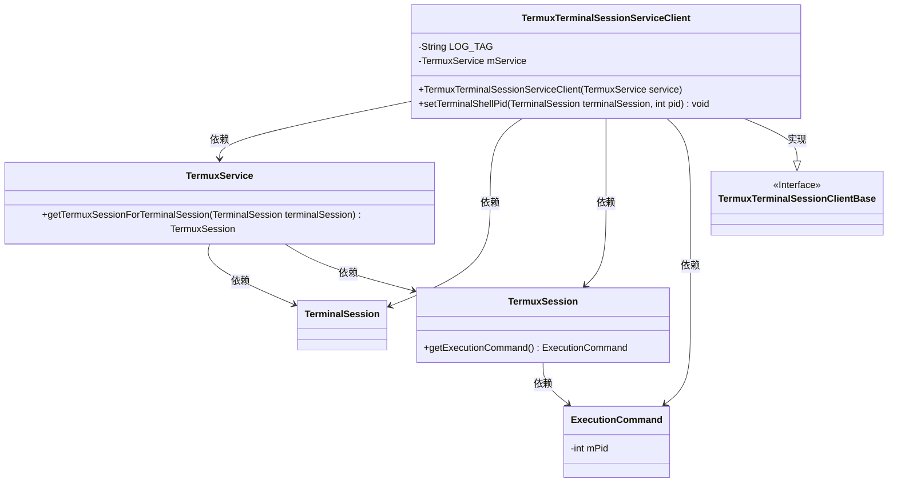
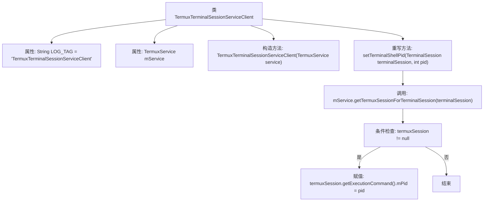

# 基础信息

|      |      |
|------|------|
| 名称 | TermuxTerminalSessionServiceClient |
| 编码语言 | .java |
| 代码路径 | termux-app/app/src/main/java/com/termux/app/terminal/TermuxTerminalSessionServiceClient.java |
| 包名 | com.termux.app.terminal |
| 依赖项 | ['android.app.Service', 'androidx.annotation.NonNull', 'com.termux.app.TermuxService', 'com.termux.shared.termux.shell.command.runner.terminal.TermuxSession', 'com.termux.shared.termux.terminal.TermuxTerminalSessionClientBase', 'com.termux.terminal.TerminalSession', 'com.termux.terminal.TerminalSessionClient'] |
| 概述说明 | Termux终端会话服务客户端类，继承基础类，通过服务设置终端会话PID。 |

# 说明

这是一个TermuxTerminalSessionServiceClient类的描述，继承自TermuxTerminalSessionClientBase基类。该类用于管理Termux服务的终端会话，包含一个私有常量LOG_TAG和私有成员变量mService。构造函数接收TermuxService实例并初始化mService。重写了setTerminalShellPid方法，通过终端会话获取对应的TermuxSession，并设置其执行命令的进程ID。

# 类列表 Class Summary

| 名称   | 类型  | 说明 |
|-------|------|-------------|
| TermuxTerminalSessionServiceClient | class | Termux终端会话服务客户端类，继承基础类，通过服务设置终端会话的Shell进程ID。 |

## 类 TermuxTerminalSessionServiceClient

|      |      |
|------|------|
| 访问范围 | public |
| 类型 | class |
| 名称 | TermuxTerminalSessionServiceClient |
| 说明 | Termux终端会话服务客户端类，继承基础类，通过服务设置终端会话的Shell进程ID。 |

### UML类图

这段代码展示了一个Android终端会话服务客户端TermuxTerminalSessionServiceClient，它继承自TermuxTerminalSessionClientBase接口，并通过TermuxService管理终端会话。主要功能是通过setTerminalShellPid方法设置终端会话的进程ID，涉及TerminalSession、TermuxSession和ExecutionCommand等多个类的协作。类图清晰地展示了这些类之间的依赖关系和继承层次。

### 内部方法调用关系图

这段代码流程图展示了TermuxTerminalSessionServiceClient类的结构和关键方法调用流程。该类继承自TermuxTerminalSessionClientBase，包含日志标签属性和TermuxService实例，通过构造函数注入服务依赖。核心方法是setTerminalShellPid，它会从服务中获取对应会话并检查非空后更新进程ID。流程图清晰呈现了属性定义、构造初始化、方法调用链和条件判断逻辑，体现了Android终端会话管理的典型设计模式。

### 字段列表 Field List

| 名称  | 类型  | 说明 |
|-------|-------|------|
| mService | TermuxService | 私有TermuxService实例mService |
| LOG_TAG = "TermuxTerminalSessionServiceClient" | String | 私有静态终态字符串LOG_TAG值为TermuxTerminalSessionServiceClient |

### 方法列表 Method List

| 名称  | 类型  | 说明 |
|-------|-------|------|
| setTerminalShellPid | void | 重写方法，设置终端会话PID到Termux会话执行命令中。 |

