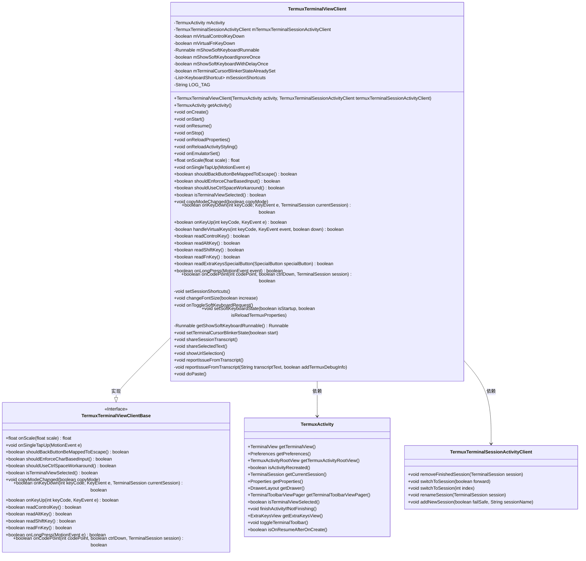

# 基础信息

|      |      |
|------|------|
| 名称 | TermuxTerminalViewClient |
| 编码语言 | .java |
| 代码路径 | termux-app/app/src/main/java/com/termux/app/terminal/TermuxTerminalViewClient.java |
| 包名 | com.termux.app.terminal |
| 依赖项 | ['android.annotation.SuppressLint', 'android.app.AlertDialog', 'android.content.ClipData', 'android.content.ClipboardManager', 'android.content.Context', 'android.media.AudioManager', 'android.os.Environment', 'android.text.TextUtils', 'android.view.Gravity', 'android.view.InputDevice', 'android.view.KeyEvent', 'android.view.MotionEvent', 'android.view.View', 'android.widget.EditText', 'android.widget.ListView', 'android.widget.Toast', 'com.termux.R', 'com.termux.app.TermuxActivity', 'com.termux.shared.file.FileUtils', 'com.termux.shared.interact.MessageDialogUtils', 'com.termux.shared.interact.ShareUtils', 'com.termux.shared.shell.ShellUtils', 'com.termux.shared.termux.TermuxBootstrap', 'com.termux.shared.termux.terminal.TermuxTerminalViewClientBase', 'com.termux.shared.termux.extrakeys.SpecialButton', 'com.termux.shared.android.AndroidUtils', 'com.termux.shared.termux.TermuxConstants', 'com.termux.shared.activities.ReportActivity', 'com.termux.shared.models.ReportInfo', 'com.termux.app.models.UserAction', 'com.termux.app.terminal.io.KeyboardShortcut', 'com.termux.shared.termux.settings.properties.TermuxPropertyConstants', 'com.termux.shared.data.DataUtils', 'com.termux.shared.logger.Logger', 'com.termux.shared.markdown.MarkdownUtils', 'com.termux.shared.termux.TermuxUtils', 'com.termux.shared.termux.data.TermuxUrlUtils', 'com.termux.shared.view.KeyboardUtils', 'com.termux.shared.view.ViewUtils', 'com.termux.terminal.KeyHandler', 'com.termux.terminal.TerminalEmulator', 'com.termux.terminal.TerminalSession', 'java.util.ArrayList', 'java.util.Arrays', 'java.util.Collections', 'java.util.LinkedHashSet', 'java.util.List', 'java.util.Map', 'androidx.drawerlayout.widget.DrawerLayout'] |
| 概述说明 | Termux终端视图客户端，管理键盘、会话及UI交互。 |

# 说明

TermuxTerminalViewClient是Termux应用的核心终端视图客户端类，继承自TermuxTerminalViewClientBase。它负责管理终端会话的UI交互逻辑，包括软键盘控制、光标闪烁、字体大小调整、快捷键处理等。该类通过重写父类方法实现了对终端视图的各种操作响应，如点击事件处理、按键事件分发、虚拟按键映射等。它还维护了会话快捷键列表，支持通过Ctrl+Alt组合键快速切换会话、创建新会话等操作。此外，该类提供了分享终端内容、URL选择、问题报告等实用功能，并与TermuxActivity紧密协作以同步UI状态。其设计充分考虑了外接键盘、虚拟按键等不同输入场景的兼容性。

# 类列表 Class Summary

| 名称   | 类型  | 说明 |
|-------|------|-------------|
| TermuxTerminalViewClient | class | Termux终端视图客户端类，管理键盘、光标和会话操作。 |

## 类 TermuxTerminalViewClient

|      |      |
|------|------|
| 访问范围 | public |
| 类型 | class |
| 名称 | TermuxTerminalViewClient |
| 说明 | Termux终端视图客户端类，管理键盘、光标和会话操作。 |

### UML类图

这段代码定义了一个Termux终端视图客户端类TermuxTerminalViewClient，它继承自TermuxTerminalViewClientBase接口，并管理着与TermuxActivity和TermuxTerminalSessionActivityClient的交互。该类负责处理终端视图的各种事件，包括键盘输入、软键盘状态管理、字体大小调整、会话快捷键设置、URL选择和问题报告等功能。通过实现接口方法并扩展额外功能，该类为Termux应用提供了完整的终端交互控制能力。

### 内部方法调用关系图

```mermaid
graph TD
    A["类TermuxTerminalViewClient"]
    B["属性: TermuxActivity mActivity"]
    C["属性: TermuxTerminalSessionActivityClient mTermuxTerminalSessionActivityClient"]
    D["属性: boolean mVirtualControlKeyDown, mVirtualFnKeyDown"]
    E["属性: Runnable mShowSoftKeyboardRunnable"]
    F["属性: boolean mShowSoftKeyboardIgnoreOnce, mShowSoftKeyboardWithDelayOnce"]
    G["属性: boolean mTerminalCursorBlinkerStateAlreadySet"]
    H["属性: List<KeyboardShortcut> mSessionShortcuts"]
    I["构造方法: TermuxTerminalViewClient(TermuxActivity, TermuxTerminalSessionActivityClient)"]
    J["生命周期方法: onCreate()"]
    K["生命周期方法: onStart()"]
    L["生命周期方法: onResume()"]
    M["生命周期方法: onStop()"]
    N["生命周期方法: onReloadProperties()"]
    O["生命周期方法: onReloadActivityStyling()"]
    P["回调方法: onEmulatorSet()"]
    Q["输入处理: onScale(float)"]
    R["输入处理: onSingleTapUp(MotionEvent)"]
    S["输入处理: onKeyDown(int, KeyEvent, TerminalSession)"]
    T["输入处理: onKeyUp(int, KeyEvent)"]
    U["输入处理: handleVirtualKeys(int, KeyEvent, boolean)"]
    V["输入处理: onCodePoint(int, boolean, TerminalSession)"]
    W["功能方法: changeFontSize(boolean)"]
    X["功能方法: onToggleSoftKeyboardRequest()"]
    Y["功能方法: setSoftKeyboardState(boolean, boolean)"]
    Z["功能方法: setTerminalCursorBlinkerState(boolean)"]
    AA["功能方法: shareSessionTranscript()"]
    AB["功能方法: shareSelectedText()"]
    AC["功能方法: showUrlSelection()"]
    AD["功能方法: reportIssueFromTranscript()"]
    AE["功能方法: doPaste()"]

    A --> B
    A --> C
    A --> D
    A --> E
    A --> F
    A --> G
    A --> H
    A --> I
    A --> J
    A --> K
    A --> L
    A --> M
    A --> N
    A --> O
    A --> P
    A --> Q
    A --> R
    A --> S
    A --> T
    A --> U
    A --> V
    A --> W
    A --> X
    A --> Y
    A --> Z
    A --> AA
    A --> AB
    A --> AC
    A --> AD
    A --> AE
```

该流程图展示了TermuxTerminalViewClient类的完整结构，包含核心属性、构造方法、生命周期回调、输入事件处理和功能方法。类主要作为Termux终端视图的控制器，管理虚拟键盘状态、字体大小调整、会话快捷键、URL识别分享等功能。通过监听Activity生命周期和用户输入事件，协调TerminalView与底层会话的交互，同时处理各种边缘情况如硬件键盘检测、光标闪烁控制等。

### 字段列表 Field List

| 名称  | 类型  | 说明 |
|-------|-------|------|
| mVirtualFnKeyDown | boolean | 声明两个布尔变量：mVirtualControlKeyDown和mVirtualFnKeyDown。 |
| mShowSoftKeyboardIgnoreOnce | boolean | 忽略一次软键盘显示 |
| mSessionShortcuts | List<KeyboardShortcut> | 私有键盘快捷键列表变量mSessionShortcuts |
| mShowSoftKeyboardWithDelayOnce | boolean | 延迟显示软键盘标志 |
| mTerminalCursorBlinkerStateAlreadySet | boolean | 私有布尔变量，标记终端光标闪烁状态是否已设置。 |
| LOG_TAG = "TermuxTerminalViewClient" | String | Termux终端视图客户端日志标签 |
| mTermuxTerminalSessionActivityClient | TermuxTerminalSessionActivityClient | Termux终端会话活动客户端变量声明。 |
| mActivity | TermuxActivity | TermuxActivity的最终实例变量mActivity。 |
| mShowSoftKeyboardRunnable | Runnable | 私有Runnable成员变量mShowSoftKeyboardRunnable |

### 方法列表 Method List

| 名称  | 类型  | 说明 |
|-------|-------|------|
| shouldUseCtrlSpaceWorkaround | boolean | 重写方法，返回是否启用Ctrl+Space的修复方案。 |
| isTerminalViewSelected | boolean | 检查终端视图是否选中：工具栏为空、已选中或获得焦点时返回真。 |
| readExtraKeysSpecialButton | boolean | 方法检查特殊按钮状态，失败返回false并记录错误。 |
| onReloadActivityStyling | void | 方法重载活动样式：控制软键盘显示与终端光标闪烁。 |
| onResume | void | 恢复时显示键盘并设置终端光标闪烁状态。 |
| setSoftKeyboardState | void | 设置软键盘状态，根据启动和重载条件控制显示或隐藏，确保终端视图焦点。 |
| shareSelectedText | void | 分享选中文本功能：检查非空后调用系统分享接口。 |
| shouldEnforceCharBasedInput | boolean | 重写方法，返回是否强制字符输入，基于活动属性判断。 |
| copyModeChanged | void | 复制模式切换时锁定或解锁抽屉布局。 |
| readFnKey | boolean | 重写readFnKey方法，调用readExtraKeysSpecialButton检查FN键状态。 |
| getActivity | TermuxActivity | 获取TermuxActivity实例的方法。 |
| onCodePoint | boolean | 代码处理终端按键映射，包括方向键、功能键、特殊字符及快捷键操作。 |
| reportIssueFromTranscript | void | 终端会话获取日志并弹出报告问题对话框，用户选择是否包含调试信息。 |
| onReloadProperties | void | 方法onReloadProperties调用setSessionShortcuts。 |
| onKeyDown | boolean | 处理键盘事件：虚拟键、会话切换、菜单操作、字体调整等。 |
| onToggleSoftKeyboardRequest | void | 根据设置切换软键盘状态：启用/禁用或显示/隐藏，处理延迟和焦点请求。 |
| onStart | void | 启动时设置终端视图和根视图的按键日志状态，与用户偏好一致。 |
| setSessionShortcuts | void | 初始化会话快捷键列表，从属性配置中读取键值对并验证有效性后添加。 |
| onLongPress | boolean | 重写长按事件方法，默认返回false。 |
| readControlKey | boolean | 检查控制键状态：读取特殊按钮或虚拟键状态。 |
| showUrlSelection | void | 方法显示终端会话中的URL列表，点击复制到剪贴板，长按打开URL。若无URL则提示未找到。 |
| getShowSoftKeyboardRunnable | Runnable | 获取显示软键盘的Runnable实例，若为空则创建并返回。 |
| shouldBackButtonBeMappedToEscape | boolean | 方法检查返回键是否映射为Esc键。 |
| onScale | float | 重写缩放方法，超出阈值时调整字体大小并返回1.0，否则返回原值。 |
| readAltKey | boolean | 重写方法，调用readExtraKeysSpecialButton检查ALT键状态。 |
| shareSessionTranscript | void | 共享终端会话文本，截断超长内容。 |
| onKeyUp | boolean | 处理返回键事件，若模拟器未初始化则退出活动，否则处理虚拟按键。 |
| changeFontSize | void | 方法调整字体大小，根据参数增减并更新视图。 |
| onStop | void | 停止终端光标闪烁 |
| readShiftKey | boolean | 重写方法，读取Shift键状态。 |
| onCreate | void | 初始化终端视图：设置字体大小和保持屏幕常亮。 |
| handleVirtualKeys | boolean | 处理虚拟按键：禁用时返回假，外部键盘不拦截，音量键控制虚拟按键状态。 |
| setTerminalCursorBlinkerState | void | 控制终端光标闪烁状态，成功设置速率则启用，失败记录错误，否则禁用。 |
| onEmulatorSet | void | 终端游标闪烁状态初始化设置，确保首次会话连接后启动。 |
| onSingleTapUp | void | 点击处理：检查URL点击打开，无鼠标跟踪时显示软键盘。 |
| reportIssueFromTranscript | void | 生成报告功能：收集日志、设备及应用信息，支持调试模式，保存为文件并启动报告活动。 |
| doPaste | void | 终端会话粘贴剪贴板文本 |

