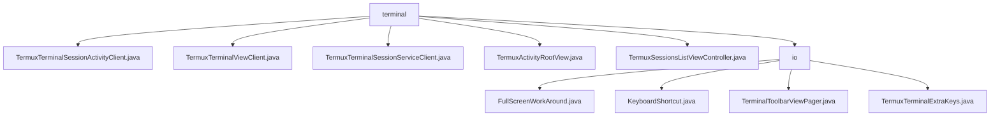

# 基础信息

|      |      |
|------|------|
| 名称 | terminal |
| 编码语言 | .java |
| 代码路径 | termux-app/app/src/main/java/com/termux/app/terminal |
| 包名 | termux-app.app.src.main.java.com.termux.app.terminal |
| 概述说明 | Termux终端核心类：会话管理、视图交互、服务控制、布局适配、列表控制及输入处理。 |

# 说明

```markdown
## 概述

该代码模块是Termux Android终端应用的核心交互系统，主要包含终端会话管理、视图控制、服务集成和界面适配四大功能维度。模块通过分层架构设计实现终端模拟器的完整生命周期管理，支持多会话并行操作、键盘交互优化和UI状态同步。核心组件包括会话活动客户端、视图控制器、服务集成层以及自适应布局系统，共同构建了移动端Linux环境的交互体验。

## 主要业务场景

1. **终端会话全生命周期管理**  
   - `TermuxTerminalSessionActivityClient`实现会话创建/销毁的完整流程控制，包括：
     - 最大8会话的并发管理
     - 铃声池资源调度
     - 故障安全模式下的自动清理
     - 通过`TermuxService`同步会话状态
   - 处理终端事件链（文本变更、标题更新、剪贴板操作等）

2. **终端视图交互体系**  
   - `TermuxTerminalViewClient`构建的输入处理框架：
     - 软键盘与物理键盘的兼容处理
     - 快捷键映射（Ctrl+Alt组合键会话切换）
     - 光标闪烁控制与字体动态缩放
     - 内容分享/URL提取功能
   - 通过`TermuxActivityRootView`实现：
     - 键盘弹出时的布局自适应
     - 系统窗口插入区域检测
     - 防布局抖动优化机制

3. **后台服务集成**  
   - `TermuxTerminalSessionServiceClient`建立的进程通信机制：
     - Shell PID绑定与追踪
     - 服务端会话状态同步

4. **多会话可视化控制**  
   - `TermuxSessionsListViewController`提供的列表管理：
     - 动态渲染会话状态（运行中/异常终止）
     - 主题敏感的样式适配
     - 点击切换与长按重命名操作
     - 复合标题展示（序号+名称+状态描述）

5. **扩展输入场景支持**  
   - 工具栏分页系统（按键页/输入页）的焦点自动切换
   - 扩展按键的降级处理策略
   - 全屏模式下的键盘遮挡解决方案
```


### 包内部结构视图



该流程图展示了Termux应用中terminal模块的层级结构，顶层为terminal目录，包含5个终端相关客户端类文件和1个io子目录。io子目录下又包含4个输入输出相关的工具类文件，完整呈现了终端功能模块的文件组织关系，共10个节点严格对应输入路径数量。

# 文件列表 File List

| 名称   | 类型  | 说明 |
|-------|------|-------------|
| [TermuxActivityRootView.java](TermuxActivityRootView.md) | file | TermuxActivityRootView管理底部边距，处理键盘遮挡和布局变化。 |
| [TermuxTerminalSessionServiceClient.java](TermuxTerminalSessionServiceClient.md) | file | Termux终端会话服务客户端类，继承基础类，通过服务设置终端会话PID。 |
| [TermuxTerminalSessionActivityClient.java](TermuxTerminalSessionActivityClient.md) | file | Termux终端会话活动客户端，管理会话生命周期、铃声、字体颜色及背景更新。 |
| [TermuxSessionsListViewController.java](TermuxSessionsListViewController.md) | file | Termux会话列表控制器类，管理会话显示与交互，支持点击和长按操作。 |
| [TermuxTerminalViewClient.java](TermuxTerminalViewClient.md) | file | Termux终端视图客户端，管理键盘、会话及UI交互。 |
| [io](io/_module.md) | package | FullScreenWorkAround处理全屏键盘遮挡。KeyboardShortcut定义快捷键。TerminalToolbarViewPager管理页面切换和焦点。TermuxTerminalExtraKeys管理终端按键功能。 |


