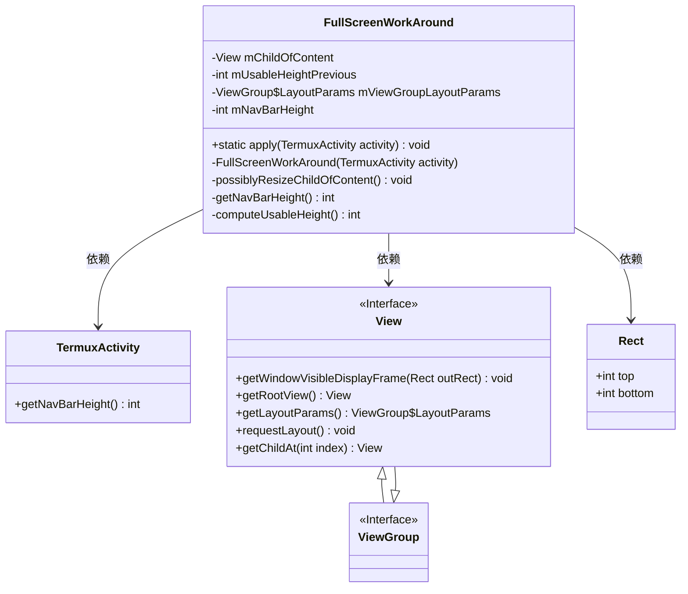
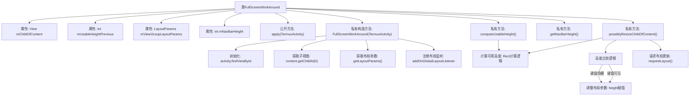

# 基础信息

|      |      |
|------|------|
| 名称 | FullScreenWorkAround |
| 编码语言 | .java |
| 代码路径 | termux-app/app/src/main/java/com/termux/app/terminal/io/FullScreenWorkAround.java |
| 包名 | com.termux.app.terminal.io |
| 依赖项 | ['android.graphics.Rect', 'android.view.View', 'android.view.ViewGroup', 'com.termux.app.TermuxActivity'] |
| 概述说明 | 安卓全屏适配类，动态调整布局高度以适应软键盘显示。 |

# 说明

该代码描述了一个用于处理全屏模式下键盘显示问题的辅助类FullScreenWorkAround。它通过监听布局变化动态调整内容视图高度，确保键盘弹出时内容区域不会遮挡。类中包含计算可用高度、导航栏高度处理以及根据键盘状态调整布局参数的逻辑。主要方法包括初始化设置、布局变化监听和高度计算功能，适用于TermuxActivity场景。

# 类列表 Class Summary

| 名称   | 类型  | 说明 |
|-------|------|-------------|
| FullScreenWorkAround | class | 安卓全屏适配类，动态调整布局高度以适应软键盘显示。 |

## 类 FullScreenWorkAround

|      |      |
|------|------|
| 访问范围 | public |
| 类型 | class |
| 名称 | FullScreenWorkAround |
| 说明 | 安卓全屏适配类，动态调整布局高度以适应软键盘显示。 |

### UML类图

这段代码描述了一个用于处理全屏模式下软键盘显示问题的工具类FullScreenWorkAround。该类通过监听视图布局变化，动态调整内容区域高度来适应软键盘的显示/隐藏状态。主要功能包括：获取导航栏高度、计算可用显示区域、根据键盘状态调整布局参数等。类图中展示了与TermuxActivity、View/ViewGroup和Rect等Android核心类的依赖关系，体现了该工具类在Android视图系统中的协调作用。

### 内部方法调用关系图

流程图描述：该流程图展示了FullScreenWorkAround类的完整工作流程，从初始化时获取Activity的content视图和布局参数，到注册全局布局监听器。当布局变化时触发possiblyResizeChildOfContent方法，通过计算当前可用高度与键盘状态的比较，动态调整子视图高度参数并请求重新布局。特别处理了导航栏高度和键盘可见区域的精确计算，确保软键盘弹出时输入区域能正确适配屏幕空间。

### 字段列表 Field List

| 名称  | 类型  | 说明 |
|-------|-------|------|
| mUsableHeightPrevious | int | 私有整型变量，记录之前可用高度。 |
| mViewGroupLayoutParams | ViewGroup.LayoutParams | 私有视图组布局参数变量 |
| mNavBarHeight | int | 私有整型变量mNavBarHeight，存储导航栏高度。 |
| mChildOfContent | View | 私有视图成员变量mChildOfContent |

### 方法列表 Method List

| 名称  | 类型  | 说明 |
|-------|-------|------|
| apply | void | TermuxActivity全屏适配方法。 |
| possiblyResizeChildOfContent | void | 调整子视图高度以适应键盘显示或隐藏。 |
| getNavBarHeight | int | 获取导航栏高度的方法，返回私有变量mNavBarHeight。 |
| computeUsableHeight | int | 计算窗口可见区域高度。 |

