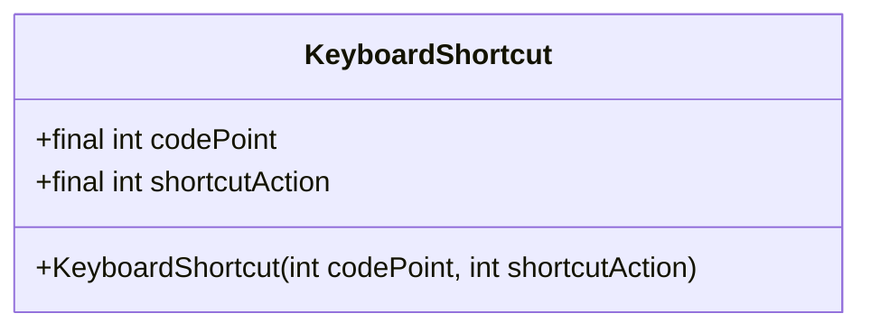
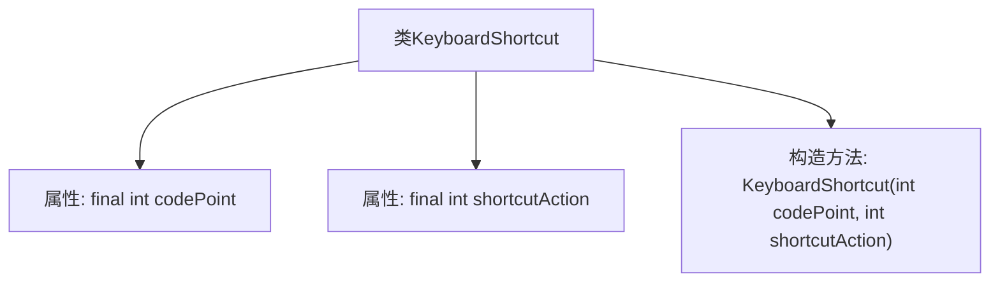

# 基础信息

|      |      |
|------|------|
| 名称 | KeyboardShortcut |
| 编码语言 | .java |
| 代码路径 | termux-app/app/src/main/java/com/termux/app/terminal/io/KeyboardShortcut.java |
| 包名 | com.termux.app.terminal.io |
| 依赖项 | [] |
| 概述说明 | 键盘快捷键类，含代码点和操作参数。 |

# 说明

这段内容定义了一个名为KeyboardShortcut的公共类，包含两个不可变的整型成员变量codePoint和shortcutAction。该类通过构造函数初始化这两个变量，分别表示键盘快捷键的代码点和对应的快捷操作。结构简洁，明确展示了类的基本属性和初始化方式。

# 类列表 Class Summary

| 名称   | 类型  | 说明 |
|-------|------|-------------|
| KeyboardShortcut | class | 键盘快捷键类，含代码点和操作两个整型参数。 |

## 类 KeyboardShortcut

|      |      |
|------|------|
| 访问范围 | public |
| 类型 | class |
| 名称 | KeyboardShortcut |
| 说明 | 键盘快捷键类，含代码点和操作两个整型参数。 |

### UML类图

这段代码定义了一个名为KeyboardShortcut的类，用于表示键盘快捷键的抽象。该类包含两个不可变的公有整型字段：codePoint表示按键的Unicode码点，shortcutAction表示快捷键对应的操作标识。通过构造函数初始化这两个字段，没有提供其他方法。这是一个简单的数据载体类，主要用于封装和传递键盘快捷键的相关信息。

### 内部方法调用关系图

这段流程图描述了KeyboardShortcut类的结构，包含两个final整型属性codePoint和shortcutAction，以及一个接收这两个参数的构造方法。该类的设计目的是封装键盘快捷键的相关信息，通过构造方法初始化后，其属性值不可修改（final修饰），适用于需要存储固定快捷键配置的场景。流程图清晰地展示了类成员与构造方法之间的从属关系。

### 字段列表 Field List

| 名称  | 类型  | 说明 |
|-------|-------|------|
| shortcutAction | int | 公开不可变的快捷操作整型变量。 |
| codePoint | int | 公开不可变的整型码点值。 |

### 方法列表 Method List

| 名称  | 类型  | 说明 |
|-------|-------|------|

