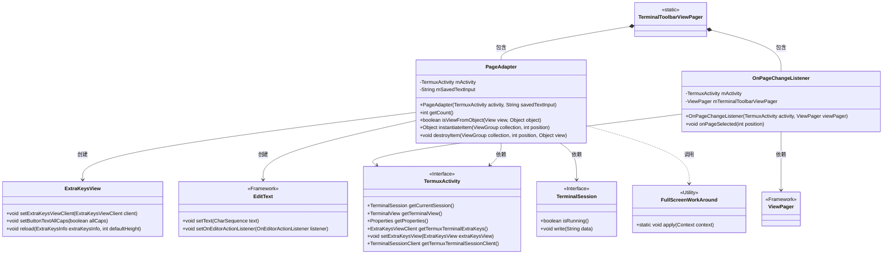
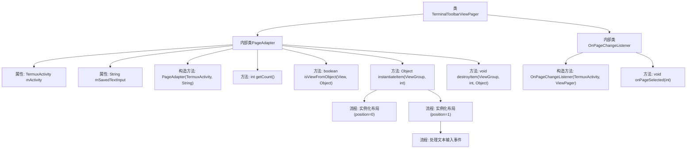
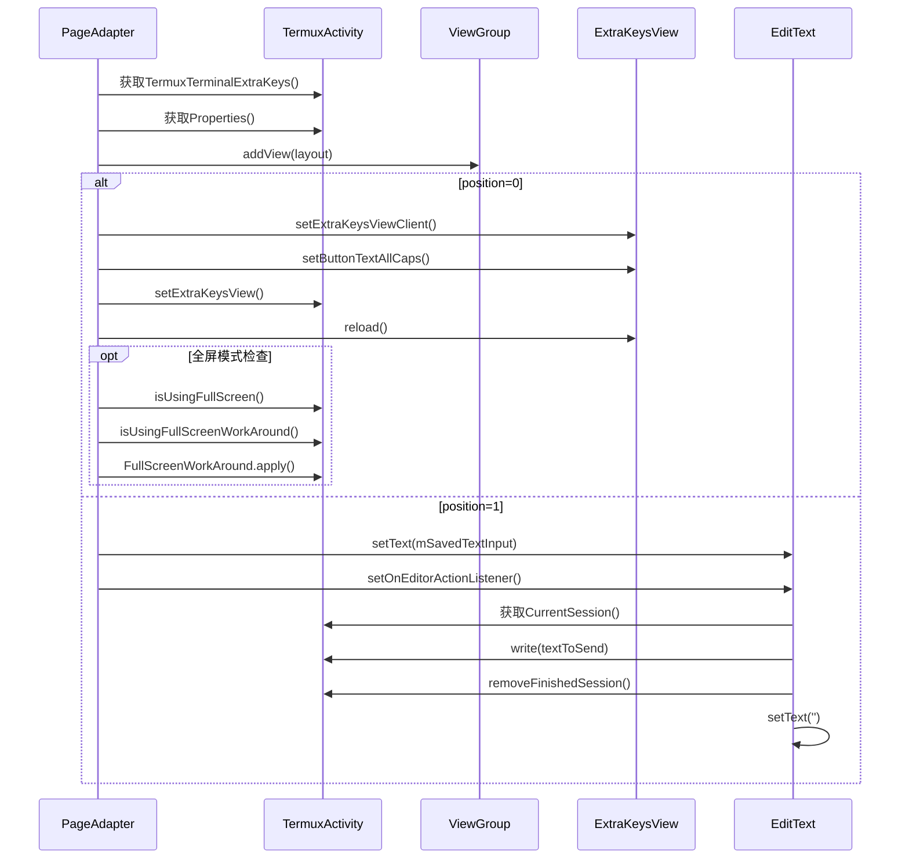

# 基础信息

|      |      |
|------|------|
| 名称 | TerminalToolbarViewPager |
| 编码语言 | .java |
| 代码路径 | termux-app/app/src/main/java/com/termux/app/terminal/io/TerminalToolbarViewPager.java |
| 包名 | com.termux.app.terminal.io |
| 依赖项 | ['android.view.LayoutInflater', 'android.view.View', 'android.view.ViewGroup', 'android.widget.EditText', 'androidx.annotation.NonNull', 'androidx.viewpager.widget.PagerAdapter', 'androidx.viewpager.widget.ViewPager', 'com.termux.R', 'com.termux.app.TermuxActivity', 'com.termux.shared.termux.extrakeys.ExtraKeysView', 'com.termux.terminal.TerminalSession'] |
| 概述说明 | 终端工具栏分页适配器，管理额外按键和文本输入视图切换。 |

# 说明

TerminalToolbarViewPager包含PageAdapter和OnPageChangeListener两个内部类。PageAdapter继承自PagerAdapter，管理两个页面：第一个页面加载额外按键视图并应用全屏修复，第二个页面提供文本输入框，支持发送文本到当前会话。OnPageChangeListener处理页面切换时的焦点变化，切换到按键页时聚焦终端视图，切换到输入页时聚焦文本输入框。适配器还保存并恢复输入文本状态。

# 类列表 Class Summary

| 名称   | 类型  | 说明 |
|-------|------|-------------|
| TerminalToolbarViewPager | class | 终端工具栏分页适配器，处理按键和文本输入视图切换及交互逻辑。 |

## 类 TerminalToolbarViewPager

|      |      |
|------|------|
| 访问范围 | public |
| 类型 | class |
| 名称 | TerminalToolbarViewPager |
| 说明 | 终端工具栏分页适配器，处理按键和文本输入视图切换及交互逻辑。 |

### UML类图

该类图展示了TerminalToolbarViewPager及其两个嵌套类PageAdapter和OnPageChangeListener的结构关系。PageAdapter继承自PagerAdapter，负责管理两个页面视图（ExtraKeysView和文本输入框）的创建与销毁，并与TermuxActivity交互获取会话和配置信息。OnPageChangeListener处理页面切换时的焦点变化逻辑，依赖ViewPager和TermuxActivity。整体设计实现了终端工具栏的视图分页功能，涉及Android框架组件和自定义视图的协同工作。

### 内部方法调用关系图

这段代码实现了一个终端工具栏视图分页器，包含两个主要功能模块：PageAdapter处理分页视图的创建和管理，OnPageChangeListener处理页面切换事件。PageAdapter根据position不同加载不同布局（0为额外按键视图，1为文本输入视图），并处理相应的交互逻辑。当position为0时初始化并配置ExtraKeysView，为1时设置EditText的输入监听器，将输入内容发送到当前会话。OnPageChangeListener在页面切换时自动切换焦点到对应控件，确保用户交互的连贯性。

### 字段列表 Field List

| 名称  | 类型  | 说明 |
|-------|-------|------|

### 方法列表 Method List

| 名称  | 类型  | 说明 |
|-------|-------|------|

