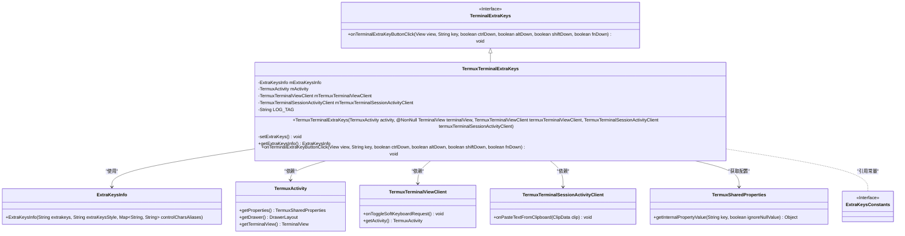
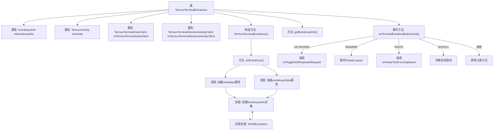

# 基础信息

|      |      |
|------|------|
| 名称 | TermuxTerminalExtraKeys |
| 编码语言 | .java |
| 代码路径 | termux-app/app/src/main/java/com/termux/app/terminal/io/TermuxTerminalExtraKeys.java |
| 包名 | com.termux.app.terminal.io |
| 依赖项 | ['android.annotation.SuppressLint', 'android.view.Gravity', 'android.view.View', 'androidx.annotation.NonNull', 'androidx.drawerlayout.widget.DrawerLayout', 'com.termux.app.TermuxActivity', 'com.termux.app.terminal.TermuxTerminalSessionActivityClient', 'com.termux.app.terminal.TermuxTerminalViewClient', 'com.termux.shared.logger.Logger', 'com.termux.shared.termux.extrakeys.ExtraKeysConstants', 'com.termux.shared.termux.extrakeys.ExtraKeysInfo', 'com.termux.shared.termux.settings.properties.TermuxPropertyConstants', 'com.termux.shared.termux.settings.properties.TermuxSharedProperties', 'com.termux.shared.termux.terminal.io.TerminalExtraKeys', 'com.termux.view.TerminalView', 'org.json.JSONException'] |
| 概述说明 | Termux终端扩展键类，处理键盘、抽屉、粘贴和滚动功能。 |

# 说明

TermuxTerminalExtraKeys类继承自TerminalExtraKeys，用于管理Termux终端应用的额外按键功能。它包含TermuxActivity、TermuxTerminalViewClient和TermuxTerminalSessionActivityClient的引用，并通过setExtraKeys方法加载和设置按键配置。若配置无效则使用默认值。按键事件处理包括切换软键盘、控制侧边抽屉、粘贴剪贴板内容及切换自动滚动等功能。异常情况下会记录错误日志并显示提示。

# 类列表 Class Summary

| 名称   | 类型  | 说明 |
|-------|------|-------------|
| TermuxTerminalExtraKeys | class | Termux终端扩展键类，管理键盘样式和功能，如软键盘切换、粘贴和滚动控制。 |

## 类 TermuxTerminalExtraKeys

|      |      |
|------|------|
| 访问范围 | public |
| 类型 | class |
| 名称 | TermuxTerminalExtraKeys |
| 说明 | Termux终端扩展键类，管理键盘样式和功能，如软键盘切换、粘贴和滚动控制。 |

### UML类图

该类图展示了TermuxTerminalExtraKeys继承自TerminalExtraKeys接口，并依赖多个组件实现终端额外按键功能。核心类通过TermuxActivity获取系统属性，使用ExtraKeysInfo配置按键样式，并委托TermuxTerminalViewClient和TermuxTerminalSessionActivityClient处理键盘切换、粘贴等操作。图中清晰呈现了类之间的继承、依赖和关联关系，体现了模块化设计思想。

### 内部方法调用关系图

这段代码是Termux终端应用的扩展按键处理类，继承自TerminalExtraKeys。主要功能包括：1) 通过setExtraKeys()方法从属性文件加载自定义按键配置和样式；2) 处理各种扩展按键事件（如键盘切换、侧边栏抽屉、粘贴和滚动控制）；3) 提供异常处理和默认配置回退机制。流程图展示了属性初始化、按键配置加载逻辑以及不同按键事件的分发处理过程，体现了对JSON解析异常和无效样式的健壮性处理。

### 字段列表 Field List

| 名称  | 类型  | 说明 |
|-------|-------|------|
| LOG_TAG = "TermuxTerminalExtraKeys" | String | 私有静态终态字符串LOG_TAG赋值为TermuxTerminalExtraKeys。 |
| mExtraKeysInfo | ExtraKeysInfo | 私有成员变量mExtraKeysInfo，类型为ExtraKeysInfo。 |
| mActivity | TermuxActivity | TermuxActivity的最终实例变量mActivity。 |
| mTermuxTerminalSessionActivityClient | TermuxTerminalSessionActivityClient | Termux终端会话活动客户端变量声明 |
| mTermuxTerminalViewClient | TermuxTerminalViewClient | Termux终端视图客户端变量声明 |

### 方法列表 Method List

| 名称  | 类型  | 说明 |
|-------|-------|------|
| setExtraKeys | void | 设置额外按键，处理样式错误时使用默认值，异常时创建默认按键。 |
| getExtraKeysInfo | ExtraKeysInfo | 获取额外按键信息的方法，返回mExtraKeysInfo对象。 |
| onTerminalExtraKeyButtonClick | void | 处理终端额外按键点击事件：键盘切换、抽屉开关、粘贴、滚动切换等。 |

