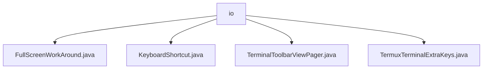

# 基础信息

|      |      |
|------|------|
| 名称 | io |
| 编码语言 | .java |
| 代码路径 | termux-app/app/src/main/java/com/termux/app/terminal/io |
| 包名 | termux-app.app.src.main.java.com.termux.app.terminal.io |
| 概述说明 | FullScreenWorkAround处理全屏键盘遮挡。KeyboardShortcut定义快捷键。TerminalToolbarViewPager管理页面切换和焦点。TermuxTerminalExtraKeys管理终端按键功能。 |

# 说明

```markdown
## 概述
该代码模块主要围绕Termux终端应用的输入处理与界面交互功能展开，包含键盘布局适配、快捷键管理、工具栏分页控制及扩展按键功能四大核心组件。模块通过动态调整布局、事件监听和状态管理，优化移动端终端操作体验，特别是在全屏模式下的键盘交互场景。

## 主要业务场景
1. **全屏键盘适配**  
   - `FullScreenWorkAround`类解决全屏模式下键盘弹出时的布局遮挡问题，通过实时计算可用高度并调整内容视图，确保输入区域可见（如TermuxActivity场景）。

2. **键盘快捷键处理**  
   - `KeyboardShortcut`类定义标准化快捷键结构，封装代码点与操作指令，为终端输入提供基础事件单元。

3. **终端工具栏分页控制**  
   - `TerminalToolbarViewPager`实现双页工具栏管理：
     - **按键页**：加载扩展按键视图并集成全屏修复。
     - **输入页**：提供文本输入框支持会话文本发送，通过`OnPageChangeListener`自动切换焦点。

4. **扩展按键功能**  
   - `TermuxTerminalExtraKeys`继承扩展按键基类，支持动态配置按键行为，包括：
     - 软键盘显隐切换
     - 侧边抽屉控制
     - 剪贴板粘贴
     - 自动滚动开关
     - 异常时降级默认配置并记录错误日志。
```


### 包内部结构视图



该流程图展示了Termux应用中terminal/io目录下的文件结构关系。io作为父节点，包含四个Java文件：FullScreenWorkAround、KeyboardShortcut、TerminalToolbarViewPager和TermuxTerminalExtraKeys。这些文件均属于终端输入输出相关的功能模块，用于处理全屏模式、键盘快捷键、工具栏分页以及终端额外按键等功能实现。

# 文件列表 File List

| 名称   | 类型  | 说明 |
|-------|------|-------------|
| [TerminalToolbarViewPager.java](TerminalToolbarViewPager.md) | file | 终端工具栏分页适配器，管理额外按键和文本输入视图切换。 |
| [KeyboardShortcut.java](KeyboardShortcut.md) | file | 键盘快捷键类，含代码点和操作参数。 |
| [FullScreenWorkAround.java](FullScreenWorkAround.md) | file | 安卓全屏适配类，动态调整布局高度以适应软键盘显示。 |
| [TermuxTerminalExtraKeys.java](TermuxTerminalExtraKeys.md) | file | Termux终端扩展键类，处理键盘、抽屉、粘贴和滚动功能。 |


