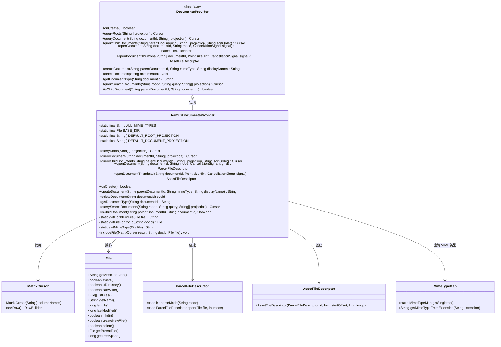
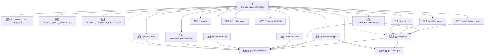

# 基础信息

|      |      |
|------|------|
| 名称 | TermuxDocumentsProvider |
| 编码语言 | .java |
| 代码路径 | termux-app/app/src/main/java/com/termux/filepicker/TermuxDocumentsProvider.java |
| 包名 | com.termux.filepicker |
| 依赖项 | ['android.content.res.AssetFileDescriptor', 'android.database.Cursor', 'android.database.MatrixCursor', 'android.graphics.Point', 'android.os.CancellationSignal', 'android.os.ParcelFileDescriptor', 'android.provider.DocumentsContract.Document', 'android.provider.DocumentsContract.Root', 'android.provider.DocumentsProvider', 'android.webkit.MimeTypeMap', 'com.termux.R', 'com.termux.shared.termux.TermuxConstants', 'java.io.File', 'java.io.FileNotFoundException', 'java.io.IOException', 'java.util.Collections', 'java.util.LinkedList'] |
| 概述说明 | Termux文件提供器，支持文档查询、创建、删除及搜索功能。 |

# 说明

TermuxDocumentsProvider是一个继承自DocumentsProvider的类，用于管理Termux应用中的文件系统访问。它定义了默认的根目录和文档投影列，支持查询、创建、删除、搜索文件及目录等操作。通过MatrixCursor处理查询结果，提供文件打开、缩略图生成功能。包含文件类型检测、路径转换工具方法，确保文件操作在Termux主目录内进行，防止越权访问。支持文件写入、删除标志设置，并处理文件名冲突。

# 类列表 Class Summary

| 名称   | 类型  | 说明 |
|-------|------|-------------|
| TermuxDocumentsProvider | class | Termux文档提供者类，实现文件管理和查询功能。 |

## 类 TermuxDocumentsProvider

|      |      |
|------|------|
| 访问范围 | public |
| 类型 | class |
| 名称 | TermuxDocumentsProvider |
| 说明 | Termux文档提供者类，实现文件管理和查询功能。 |

### UML类图

这段类图展示了TermuxDocumentsProvider作为DocumentsProvider接口的实现类，提供了文件系统访问的核心功能。它通过MatrixCursor返回查询结果，使用File类操作文件系统，通过ParcelFileDescriptor和AssetFileDescriptor处理文件描述符，并依赖MimeTypeMap获取文件MIME类型。该类实现了完整的文档提供者功能，包括查询、创建、删除文档以及处理缩略图等操作，特别针对Termux环境进行了优化。

### 内部方法调用关系图

这段代码实现了一个Android文档提供程序，用于管理Termux应用的文件系统访问。核心功能包括查询根目录/文件信息、打开文档、创建/删除文档、搜索文档等。通过MatrixCursor构建查询结果，使用私有方法处理文件路径转换和MIME类型识别。特别注意对文件权限、冲突处理和搜索限制的实现，确保安全性和性能。

### 字段列表 Field List

| 名称  | 类型  | 说明 |
|-------|-------|------|
| DEFAULT_ROOT_PROJECTION = new String[]{        Root.COLUMN_ROOT_ID,        Root.COLUMN_MIME_TYPES,        Root.COLUMN_FLAGS,        Root.COLUMN_ICON,        Root.COLUMN_TITLE,        Root.COLUMN_SUMMARY,        Root.COLUMN_DOCUMENT_ID,        Root.COLUMN_AVAILABLE_BYTES    } | String[] | 默认根目录投影字段列表 |
| BASE_DIR = TermuxConstants.TERMUX_HOME_DIR | File | 私有静态终态文件变量BASE_DIR指向Termux主目录。 |
| DEFAULT_DOCUMENT_PROJECTION = new String[]{        Document.COLUMN_DOCUMENT_ID,        Document.COLUMN_MIME_TYPE,        Document.COLUMN_DISPLAY_NAME,        Document.COLUMN_LAST_MODIFIED,        Document.COLUMN_FLAGS,        Document.COLUMN_SIZE    } | String[] | 定义文档默认字段数组：ID、类型、名称、修改时间、标志、大小。 |
| ALL_MIME_TYPES = "*/*" | String | 定义常量ALL_MIME_TYPES，值为通配符*/*，表示所有MIME类型。 |

### 方法列表 Method List

| 名称  | 类型  | 说明 |
|-------|-------|------|
| getDocumentType | String | 重写方法，通过文档ID获取文件并返回MIME类型。 |
| openDocument | ParcelFileDescriptor | 重写openDocument方法，根据ID获取文件并以指定模式打开返回ParcelFileDescriptor。 |
| onCreate | boolean | 重写onCreate方法，返回true。 |
| queryChildDocuments | Cursor | 重写方法，查询子文档并返回游标结果。 |
| openDocumentThumbnail | AssetFileDescriptor | 重写方法，通过文档ID获取文件并创建只读ParcelFileDescriptor，返回AssetFileDescriptor。 |
| queryDocument | Cursor | 重写查询文档方法，返回包含文件信息的游标。 |
| createDocument | String | 创建文件或目录，避免重名，返回路径。失败抛出异常。 |
| deleteDocument | void | 覆盖删除文档方法，失败时抛出文件未找到异常。 |
| querySearchDocuments | Cursor | 方法查询文件，匹配名称并限制结果数50，仅搜索指定目录。 |
| queryRoots | Cursor | 查询根目录信息，设置ID、标题、空间等属性并返回结果。 |
| isChildDocument | boolean | 检查文档ID是否以父文档ID开头。 |
| getDocIdForFile | String | 获取文件绝对路径作为文档ID |
| getFileForDocId | File | 根据文档ID获取文件，不存在则抛出异常。 |
| getMimeType | String | 获取文件MIME类型：目录返回特定类型，文件根据扩展名匹配，无匹配返回默认类型。 |
| includeFile | void | 方法将文件信息加入数据库游标，处理文档ID、权限标志、名称、类型、大小等属性。 |

