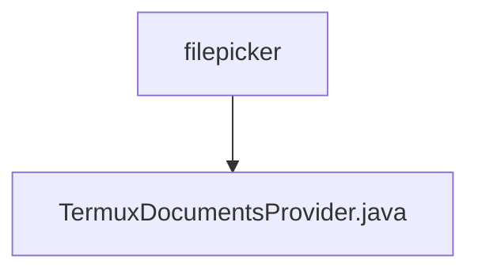

# 基础信息

|      |      |
|------|------|
| 名称 | filepicker |
| 编码语言 | .java |
| 代码路径 | termux-app/app/src/main/java/com/termux/filepicker |
| 包名 | termux-app.app.src.main.java.com.termux.filepicker |
| 概述说明 | Termux文件提供器，支持文档查询、创建、删除及搜索功能。 |

# 说明

TermuxDocumentsProvider是一个继承自DocumentsProvider的类，用于管理Termux应用中的文件系统访问。它定义了默认的根目录和文档投影列，支持查询、创建、删除、搜索文件及目录等操作。通过MatrixCursor处理查询结果，提供文件打开、缩略图生成功能。包含文件类型检测、路径转换工具方法，确保文件操作在Termux主目录内进行，防止越权访问。支持文件写入、删除标志设置，并处理文件名冲突。

### 包内部结构视图

该流程图展示了Termux应用中文件选择模块的层级结构。顶层节点为filepicker目录，其下包含一个Java文件TermuxDocumentsProvider.java。这个结构清晰地呈现了文件选择功能的单一实现，符合Android文档提供者的标准设计模式。整个结构简洁明了，体现了模块化设计思想。

# 文件列表 File List

| 名称   | 类型  | 说明 |
|-------|------|-------------|
| [TermuxDocumentsProvider.java](TermuxDocumentsProvider.md) | file | Termux文件提供器，支持文档查询、创建、删除及搜索功能。 |

