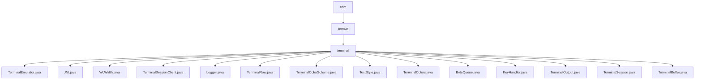

# 基础信息

|      |      |
|------|------|
| 名称 | com |
| 编码语言 | .java |
| 代码路径 | termux-app/terminal-emulator/src/main/java/com |
| 包名 | termux-app.terminal-emulator.src.main.java.com |
| 概述说明 | 终端模拟器类处理输入输出，支持控制序列、鼠标事件、编码转换等功能。 |

# 说明

```markdown
## 概述

该代码模块实现了一个完整的终端模拟器系统，主要包含以下核心组件：

1. **终端模拟核心**：通过`TerminalEmulator`类实现完整的终端控制序列处理、状态管理和输入输出功能
2. **进程管理**：通过JNI接口创建和管理子进程，建立伪终端通信通道
3. **文本处理**：包含字符宽度计算、行管理、缓冲区管理等组件
4. **样式与颜色**：提供丰富的文本样式和颜色管理功能
5. **输入输出**：处理键盘输入映射和终端输出通道
6. **辅助工具**：包括日志记录、线程安全队列等支持组件

模块采用分层设计，底层通过JNI与系统交互，中层处理终端协议和状态管理，上层提供用户交互接口，支持完整的终端模拟功能。

## 主要业务场景

1. **终端会话管理**
   - 创建和管理伪终端子进程
   - 处理进程输入输出流
   - 监控进程状态和生命周期

2. **终端显示处理**
   - 解析和执行各种终端控制序列(CSI/OSC/DCS)
   - 管理屏幕缓冲区和滚动历史
   - 处理字符编码(UTF-8)和显示宽度计算
   - 支持鼠标事件报告和跟踪

3. **文本样式与布局**
   - 管理字符属性(颜色、粗体、斜体等)
   - 处理组合字符和宽字符
   - 实现光标控制和屏幕滚动
   - 支持多种颜色方案配置

4. **用户输入处理**
   - 将键盘输入转换为终端转义序列
   - 支持各种修饰键组合
   - 处理复制粘贴操作

5. **终端状态维护**
   - 管理主/备用缓冲区切换
   - 维护DEC私有模式状态
   - 处理终端标题和响铃通知
   - 调整终端窗口大小

该模块适用于需要完整终端模拟功能的场景，如终端应用开发、远程Shell访问、命令行工具集成等，提供了从底层进程管理到高层用户交互的完整解决方案。
```


### 包内部结构视图



该流程图展示了Termux终端模拟器项目的Java源代码层级结构。从根目录com开始，依次展开termux和terminal子目录，最终显示terminal目录下的15个Java类文件。这些文件涵盖了终端模拟器的核心功能模块，包括会话管理、终端输出处理、键盘输入处理、颜色方案等组件，清晰地呈现了项目的模块化组织结构。

# 文件列表 File List

| 名称   | 类型  | 说明 |
|-------|------|-------------|
| [termux](termux/_module.md) | package | 终端模拟器类处理输入输出，支持控制序列、鼠标事件、编码转换等功能。 |


